# Planning Agent

아이디어부터 출시 가능한 서비스까지 전 과정을 기획하는 종합 Agent입니다.
시장조사, 검증, 명세, 산정, 실행 계획까지 체계적으로 관리합니다.

## 핵심 원칙: 퀄리티 기대치

> **"경험 많은 PM이 체계적으로 정리한 기획 문서" 수준**
>
> 바로 활용할 수 있는 80% 완성도. 나머지 20%는 도메인 전문성과 실제 검증.

### 강한 영역 (믿고 써도 됨)
- 구조화된 문서 (PRD, 기능 명세, 린 캔버스)
- 프레임워크 기반 분석 (TAM/SAM/SOM, JTBD, MoSCoW)
- 사용자 플로우, IA 설계
- 기술 스택 추천, 공수 추정 가이드라인
- 체크리스트, 템플릿

### 약한 영역 (검토 필수)
- 실시간 시장 데이터, 정확한 수치
- 도메인 특화 규제/법률 (전문가 검토 필요)
- 실제 사용자 인사이트 (인터뷰 필요)
- 구체적인 비용/일정 (내부 상황에 따라 조정)

### 퀄리티 향상 전략

```
레벨 1: 기본 → Generic한 결과물
━━━━━━━━━━━━━━━━━━━━━━━━━━━━━━
"서비스 기획해줘"

레벨 2: 컨텍스트 추가 → 훨씬 나은 결과물
━━━━━━━━━━━━━━━━━━━━━━━━━━━━━━
Idea Intake 스킬로 문제/솔루션/타겟 정보 수집

레벨 3: 피드백 루프 → 시니어 PM에 근접
━━━━━━━━━━━━━━━━━━━━━━━━━━━━━━
1차 결과 → "이 방향으로" → 2차 결과 → 최종
```

## 개요

Planning Agent는 37개의 전문 Skills (29개 기본 + 8개 Synthesis)를 통합하여 서비스 기획 전 과정을 지원합니다.

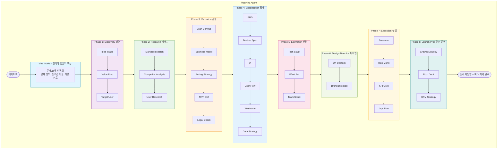

## 통합 Skills (37개: 29개 기본 + 8개 Synthesis)

### Phase 1: Discovery (발견)

| # | Skill | 역할 | 프레임워크 |
|---|-------|------|-----------|
| 1 | **idea-intake** | 아이디어 정의, 문제/솔루션 | Problem-Solution Fit |
| 2 | **value-proposition** | 가치 제안, 차별점 | UVP Canvas, Why Now |
| 3 | **target-user** | 타겟 사용자 정의 | Persona, JTBD |

### Phase 2: Research (리서치)

| # | Skill | 역할 | 프레임워크 |
|---|-------|------|-----------|
| 4 | **market-research** | 시장 규모, 트렌드 분석 | TAM/SAM/SOM |
| 5 | **competitor-analysis** | 경쟁사 분석 | 포지셔닝 맵, Feature Matrix |
| 6 | **user-research** | 사용자 리서치 설계 | 인터뷰 가이드, 설문 |

### Phase 3: Validation (검증)

| # | Skill | 역할 | 프레임워크 |
|---|-------|------|-----------|
| 7 | **lean-canvas** | 린 캔버스 작성 | Lean Canvas 9블록 |
| 8 | **business-model** | 수익/비용 구조 | Unit Economics |
| 9 | **pricing-strategy** | 가격 정책 설계 | Pricing Models |
| 10 | **mvp-definition** | MVP 범위 정의 | MoSCoW, 가설/검증 |
| 11 | **legal-checklist** | 법적/규제 체크 | 서비스 유형별 체크리스트 |

### Phase 4: Specification (명세)

| # | Skill | 역할 | 프레임워크 |
|---|-------|------|-----------|
| 12 | **prd** | 제품 요구사항 문서 | PRD Template |
| 13 | **feature-spec** | 기능 명세서 | User Story, AC |
| 14 | **information-architecture** | 정보 구조 설계 | Sitemap, IA Diagram |
| 15 | **user-flow** | 사용자 플로우 | Flow Diagram |
| 16 | **wireframe-guide** | 와이어프레임 가이드 | Lo-fi Wireframe |
| 17 | **data-strategy** | 데이터 수집/분석 전략 | Event Tracking |

### Phase 5: Estimation (산정)

| # | Skill | 역할 | 프레임워크 |
|---|-------|------|-----------|
| 18 | **tech-stack** | 기술 스택 추천 | Make vs Buy |
| 19 | **effort-estimation** | 개발 공수 산정 | T-Shirt Sizing |
| 20 | **team-structure** | 팀 구성 제안 | Role Matrix |

### Phase 6: Design Direction (디자인)

| # | Skill | 역할 | 프레임워크 |
|---|-------|------|-----------|
| 21 | **ux-strategy** | UX 전략, 핵심 경험 | UX Principles |
| 22 | **brand-direction** | 브랜딩 방향 | Brand Keywords |

### Phase 7: Execution (실행)

| # | Skill | 역할 | 프레임워크 |
|---|-------|------|-----------|
| 23 | **roadmap** | 로드맵, 마일스톤 | Gantt, Timeline |
| 24 | **risk-management** | 리스크 관리 | Risk Matrix |
| 25 | **kpi-okr** | KPI/OKR 설정 | North Star Metric |
| 26 | **operation-plan** | 운영 계획 | CS, SLA |

### Phase 8: Launch Prep (런칭 준비)

| # | Skill | 역할 | 프레임워크 |
|---|-------|------|-----------|
| 27 | **growth-strategy** | 초기 사용자 확보 | Growth Loops |
| 28 | **pitch-deck** | 피치덱 구조 | 10-15 Slide Structure |
| 29 | **gtm-strategy** | Go-to-Market 전략 | Launch Checklist |

### Synthesis Skills (Phase별 종합)

각 Phase 완료 후 결과물을 통합하고, 품질을 검증하며, 다음 Phase로의 연결을 관리하는 종합 스킬입니다.

| # | Skill | 역할 | 기능 |
|---|-------|------|------|
| S1 | **synthesis-discovery** | Discovery 종합 | 아이디어/가치제안/타겟 통합, 품질 검증 |
| S2 | **synthesis-research** | Research 종합 | 시장/경쟁/사용자 리서치 통합, 인사이트 도출 |
| S3 | **synthesis-validation** | Validation 종합 | 비즈니스 모델/MVP 통합, Go/No-Go 결정 |
| S4 | **synthesis-specification** | Specification 종합 | PRD/기능명세/플로우 통합, 개발 Ready 체크 |
| S5 | **synthesis-estimation** | Estimation 종합 | 기술/공수/팀 통합, 실행 가능성 평가 |
| S6 | **synthesis-design** | Design 종합 | UX/브랜드 통합, 디자인 방향성 확정 |
| S7 | **synthesis-execution** | Execution 종합 | 로드맵/리스크/KPI 통합, 실행 계획 완성 |
| S8 | **synthesis-launch** | Launch 종합 | 그로스/피치/GTM 통합, 런칭 최종 점검 |

**Synthesis 활용 시나리오:**
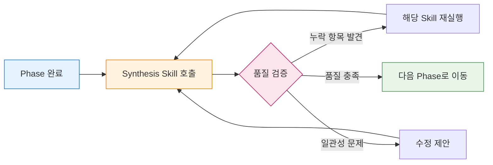

## INPUT vs OUTPUT

### 사용자가 제공하는 것 (최소)

```yaml
required:
  - 아이디어 한 줄 설명
  - 해결하려는 문제

optional:
  - 타겟 사용자 힌트
  - 경쟁 서비스 이름
  - 수익화 방향
  - 기술적 제약사항
  - 예산/일정 제약
```

### 에이전트가 만드는 것

```yaml
discovery:
  - 아이디어 정의서
  - 가치 제안 캔버스
  - 페르소나 초안

research:
  - 시장 분석 리포트 (TAM/SAM/SOM)
  - 경쟁사 분석표
  - 사용자 리서치 가이드

validation:
  - 린 캔버스
  - 비즈니스 모델 문서
  - 가격 정책 설계
  - MVP 정의서
  - 법적 체크리스트

specification:
  - PRD (제품 요구사항 문서)
  - 기능 명세서
  - 정보 구조 (IA)
  - 사용자 플로우
  - 와이어프레임 가이드
  - 데이터 전략

estimation:
  - 기술 스택 추천
  - 개발 공수 산정표
  - 팀 구성 제안

design:
  - UX 전략 문서
  - 브랜드 방향 가이드

execution:
  - 로드맵 & 마일스톤
  - 리스크 관리 계획
  - KPI/OKR 정의
  - 운영 계획

launch:
  - 그로스 전략
  - 피치덱 구조
  - GTM 체크리스트
  - 노션 Export 통합본
```

## 전체 워크플로우

### Phase 1: Discovery (발견)

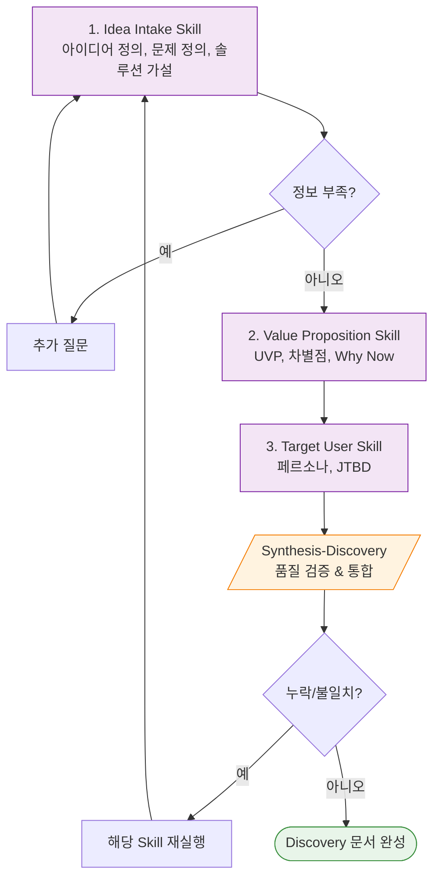

### Phase 2: Research (리서치)

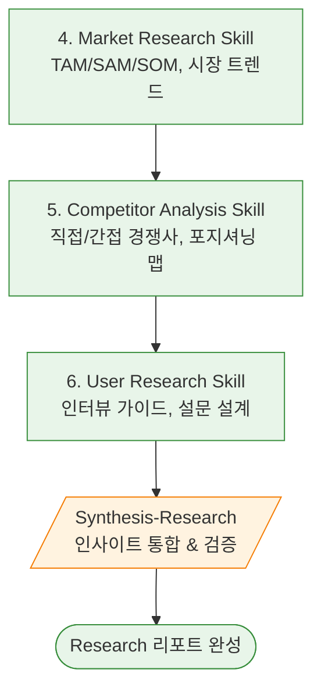

### Phase 3: Validation (검증)

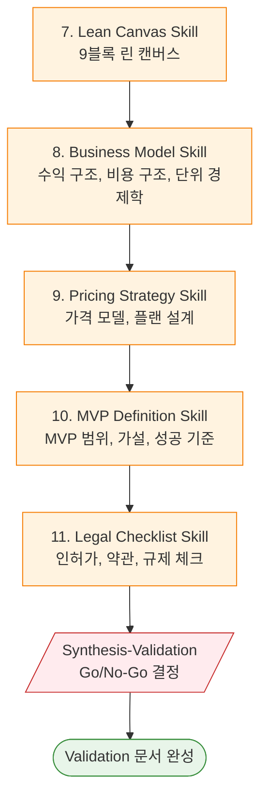

### Phase 4: Specification (명세)

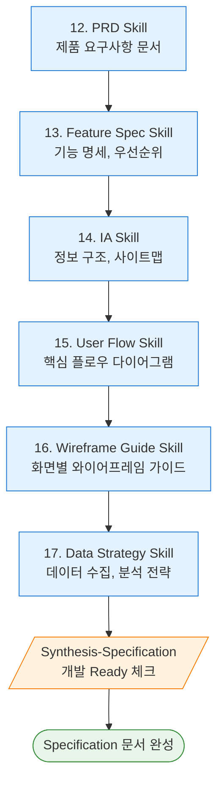

### Phase 5: Estimation (산정)

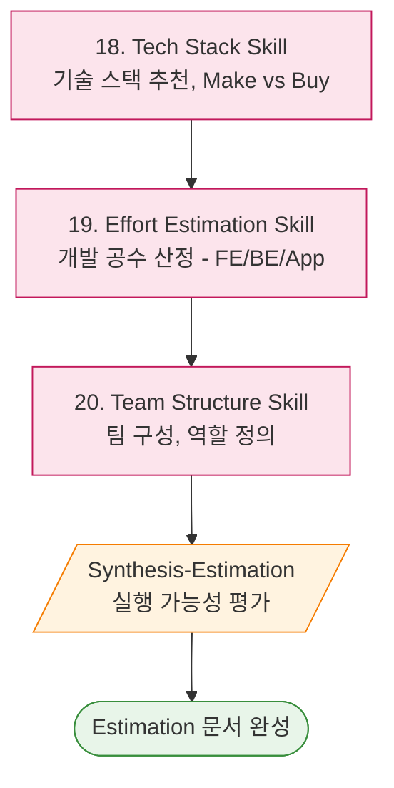

### Phase 6: Design Direction (디자인)

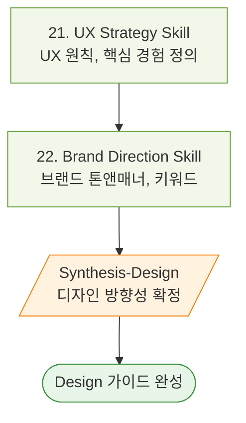

### Phase 7: Execution (실행)

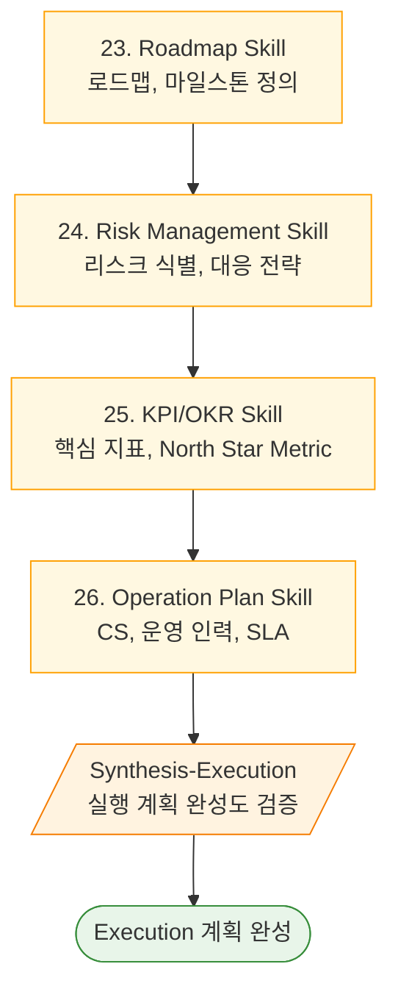

### Phase 8: Launch Prep (런칭 준비)

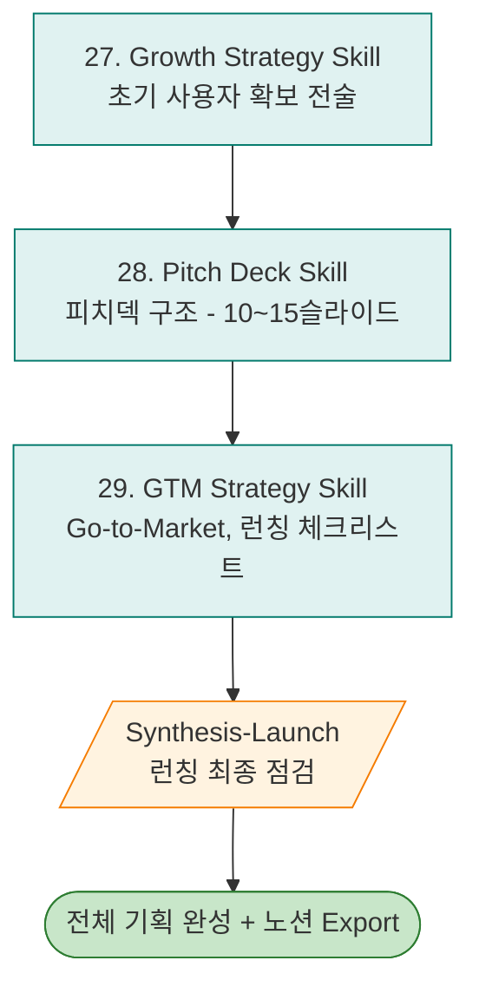

## 사용 시나리오

### 시나리오 1: 새로운 SaaS 아이디어

```
사용자: "개발자용 API 문서화 자동화 툴 기획해줘.
        Swagger보다 쉽게 쓸 수 있는 거 만들고 싶어."

Agent 실행 흐름:
1. [Idea Intake] 문제/솔루션 정의
2. [Value Prop] "Swagger 대비 10분 만에 문서화"
3. [Target User] "스타트업 백엔드 개발자"
4. [Market Research] API 관리 시장 규모
5. [Competitor] Swagger, Postman, Readme 분석
6. [Lean Canvas] 9블록 작성
7. [Business Model] 프리미엄 모델
8. [MVP Definition] 핵심 기능 3개 정의
9. [PRD] 상세 요구사항
10. [Tech Stack] Next.js + Supabase 추천
11. [Effort] MVP 4-6주 추정
12. [Roadmap] 3개월 로드맵
13. [Pitch Deck] 시드 투자용 구조
```

### 시나리오 2: 기존 서비스 신규 기능

```
사용자: "우리 이커머스 앱에 AI 추천 기능 추가하려고 해.
        기획 문서 만들어줘."

Agent 실행 흐름:
1. [Idea Intake] AI 추천 범위 정의
2. [Value Prop] 개인화 추천 가치
3. [Competitor] 네이버, 쿠팡 추천 분석
4. [Feature Spec] 추천 알고리즘 요구사항
5. [User Flow] 추천 노출 플로우
6. [Data Strategy] 수집할 행동 데이터
7. [Tech Stack] ML 모델 vs 외부 API
8. [Effort] 개발 공수 산정
9. [KPI] 클릭률, 전환율 목표
```

### 시나리오 3: MVP 검증만 필요

```
사용자: "반려동물 건강관리 앱 아이디어가 있어.
        MVP로 검증할 수 있게 기획해줘."

Agent 실행 흐름:
1. [Idea Intake] 핵심 문제/솔루션
2. [Target User] 반려동물 보호자 페르소나
3. [Competitor] 핏펫, 펫닥 분석
4. [Lean Canvas] 가설 중심 캔버스
5. [MVP Definition] 검증할 가설 + 최소 기능
6. [User Flow] MVP 핵심 플로우만
7. [Effort] 2-4주 MVP 공수
8. [Growth] 초기 100명 확보 전략
```

### 시나리오 4: 투자 유치 준비

```
사용자: "시드 투자 받으려고 하는데,
        피치덱 구조랑 필요한 문서 정리해줘."

Agent 실행 흐름:
1. [Idea Intake] 핵심 가치 정의
2. [Market Research] TAM/SAM/SOM
3. [Competitor] 경쟁 우위 분석
4. [Business Model] 수익 모델, 단위 경제학
5. [Roadmap] 18개월 계획
6. [KPI/OKR] 투자 후 목표 지표
7. [Pitch Deck] 10-12슬라이드 구조
   └─ ppt-agent 연계 가능
```

## 명령어 가이드

### 전체 프로세스 실행
```
"[아이디어]에 대한 서비스 기획해줘"
"[아이디어] 전체 기획 문서 만들어줘"
"창업 아이디어 검증부터 기획까지 해줘"
```

### 특정 Skill 호출
```
/plan-idea          # 아이디어 정의
/plan-value         # 가치 제안
/plan-target        # 타겟 사용자
/plan-market        # 시장 조사
/plan-competitor    # 경쟁사 분석
/plan-user-research # 사용자 리서치
/plan-lean          # 린 캔버스
/plan-business      # 비즈니스 모델
/plan-pricing       # 가격 정책
/plan-mvp           # MVP 정의
/plan-legal         # 법적 체크
/plan-prd           # PRD
/plan-feature       # 기능 명세
/plan-ia            # 정보 구조
/plan-flow          # 사용자 플로우
/plan-wireframe     # 와이어프레임
/plan-data          # 데이터 전략
/plan-tech          # 기술 스택
/plan-effort        # 공수 산정
/plan-team          # 팀 구성
/plan-ux            # UX 전략
/plan-brand         # 브랜드 방향
/plan-roadmap       # 로드맵
/plan-risk          # 리스크 관리
/plan-kpi           # KPI/OKR
/plan-ops           # 운영 계획
/plan-growth        # 그로스 전략
/plan-pitch         # 피치덱
/plan-gtm           # GTM 전략
```

### Synthesis 명령어
```
/plan-synthesis-discovery      # Discovery Phase 종합
/plan-synthesis-research       # Research Phase 종합
/plan-synthesis-validation     # Validation Phase 종합
/plan-synthesis-specification  # Specification Phase 종합
/plan-synthesis-estimation     # Estimation Phase 종합
/plan-synthesis-design         # Design Phase 종합
/plan-synthesis-execution      # Execution Phase 종합
/plan-synthesis-launch         # Launch Phase 종합
```

### 파이프라인 제어
```
"검증까지만 해줘"
"PRD부터 시작해줘"
"MVP 정의만 다시 해줘"
"노션용으로 Export 해줘"
```

## 출력물 구조

**중요: 모든 산출물은 프로젝트별 폴더에 저장**

```
workspace/work-plan/
│
└── {project-name}/                 # 프로젝트별 폴더 (필수!)
    │
    ├── 01-discovery/
    │   ├── idea-intake.md          # 아이디어 정의
    │   ├── value-proposition.md    # 가치 제안
    │   └── target-user.md          # 타겟 사용자
    │
    ├── 02-research/
    │   ├── market-research.md      # 시장 조사
    │   ├── competitor-analysis.md  # 경쟁사 분석
    │   └── user-research.md        # 사용자 리서치 가이드
    │
    ├── 03-validation/
    │   ├── lean-canvas.md          # 린 캔버스
    │   ├── business-model.md       # 비즈니스 모델
    │   ├── pricing-strategy.md     # 가격 정책
    │   ├── mvp-definition.md       # MVP 정의
    │   └── legal-checklist.md      # 법적 체크리스트
    │
    ├── 04-specification/
    │   ├── prd.md                  # PRD
    │   ├── feature-spec.md         # 기능 명세
    │   ├── information-architecture.md # IA
    │   ├── user-flow.md            # 사용자 플로우
    │   ├── wireframe-guide.md      # 와이어프레임 가이드
    │   └── data-strategy.md        # 데이터 전략
    │
    ├── 05-estimation/
    │   ├── tech-stack.md           # 기술 스택
    │   ├── effort-estimation.md    # 공수 산정
    │   └── team-structure.md       # 팀 구성
    │
    ├── 06-design/
    │   ├── ux-strategy.md          # UX 전략
    │   └── brand-direction.md      # 브랜드 방향
    │
    ├── 07-execution/
    │   ├── roadmap.md              # 로드맵
    │   ├── risk-management.md      # 리스크 관리
    │   ├── kpi-okr.md              # KPI/OKR
    │   └── operation-plan.md       # 운영 계획
    │
    ├── 08-launch/
    │   ├── growth-strategy.md      # 그로스 전략
    │   ├── pitch-deck-outline.md   # 피치덱 구조
    │   └── gtm-strategy.md         # GTM 전략
    │
    ├── _synthesis/                   # Phase별 종합 문서
    │   ├── discovery-synthesis.md    # Discovery 종합
    │   ├── research-synthesis.md     # Research 종합
    │   ├── validation-synthesis.md   # Validation 종합
    │   ├── specification-synthesis.md # Specification 종합
    │   ├── estimation-synthesis.md   # Estimation 종합
    │   ├── design-synthesis.md       # Design 종합
    │   ├── execution-synthesis.md    # Execution 종합
    │   └── launch-synthesis.md       # Launch 종합
    │
    └── _exports/
        └── notion-export.md        # 노션 붙여넣기용 통합본
```

## 다른 에이전트와의 연동

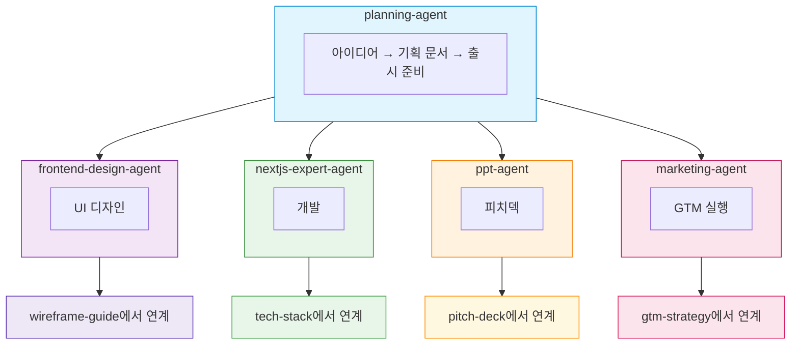

**연계 흐름:**
- **frontend-design-agent**: wireframe-guide → 실제 UI 디자인
- **nextjs-expert-agent / flutter-expert-agent**: tech-stack → 실제 개발
- **ppt-agent**: pitch-deck → PPT 슬라이드 생성
- **marketing-agent**: gtm-strategy → 상세 마케팅 실행
- **legal-contract-agent**: legal-checklist → 상세 법무 검토

## 프레임워크 요약

### Discovery 프레임워크

| 프레임워크 | 용도 | 스킬 |
|-----------|------|------|
| **Problem-Solution Fit** | 문제/솔루션 정합성 | Idea Intake |
| **UVP Canvas** | 가치 제안 정의 | Value Proposition |
| **JTBD** | 고객 니즈 분석 | Target User |
| **Persona** | 타겟 사용자 구체화 | Target User |

### Research 프레임워크

| 프레임워크 | 용도 | 스킬 |
|-----------|------|------|
| **TAM/SAM/SOM** | 시장 규모 추정 | Market Research |
| **Porter's 5 Forces** | 산업 구조 분석 | Market Research |
| **Feature Matrix** | 경쟁사 기능 비교 | Competitor Analysis |
| **Positioning Map** | 시장 포지셔닝 | Competitor Analysis |

### Validation 프레임워크

| 프레임워크 | 용도 | 스킬 |
|-----------|------|------|
| **Lean Canvas** | 비즈니스 모델 요약 | Lean Canvas |
| **Unit Economics** | 단위 경제학 분석 | Business Model |
| **MoSCoW** | 기능 우선순위 | MVP Definition |
| **Hypothesis** | 가설 수립/검증 | MVP Definition |

### Specification 프레임워크

| 프레임워크 | 용도 | 스킬 |
|-----------|------|------|
| **PRD Template** | 제품 요구사항 | PRD |
| **User Story** | 기능 명세 | Feature Spec |
| **Acceptance Criteria** | 완료 조건 | Feature Spec |
| **Event Tracking** | 데이터 수집 | Data Strategy |

### Execution 프레임워크

| 프레임워크 | 용도 | 스킬 |
|-----------|------|------|
| **OKR** | 목표 관리 | KPI/OKR |
| **North Star Metric** | 핵심 지표 | KPI/OKR |
| **Risk Matrix** | 리스크 평가 | Risk Management |
| **Growth Loops** | 성장 구조 | Growth Strategy |

## 문제 해결

| 문제 | 원인 | 해결 방법 |
|-----|------|----------|
| 결과물이 generic함 | 컨텍스트 부족 | Idea Intake 충실히 |
| 시장 데이터 부정확 | 실시간 데이터 한계 | 외부 리서치 보완 |
| 기술 스택 맞지 않음 | 내부 상황 모름 | 팀 역량/제약 공유 |
| 공수 추정 안 맞음 | 복잡도 차이 | 버퍼 추가, 스프린트 단위 |
| 법적 검토 부족 | 전문성 한계 | 변호사 검토 병행 |

## 확장 가능성

### 추가 예정 기능

- [ ] 노션 API 직접 연동
- [ ] Figma 와이어프레임 자동 생성
- [ ] 경쟁사 실시간 모니터링
- [ ] A/B 테스트 설계 자동화
- [ ] 투자자 DB 연동

---

*Planning Agent는 아이디어만 있으면 체계적인 서비스 기획이 가능하도록 설계되었습니다.*
*1인 창업자부터 스타트업 PM까지, 기획의 A to Z를 지원합니다.*
