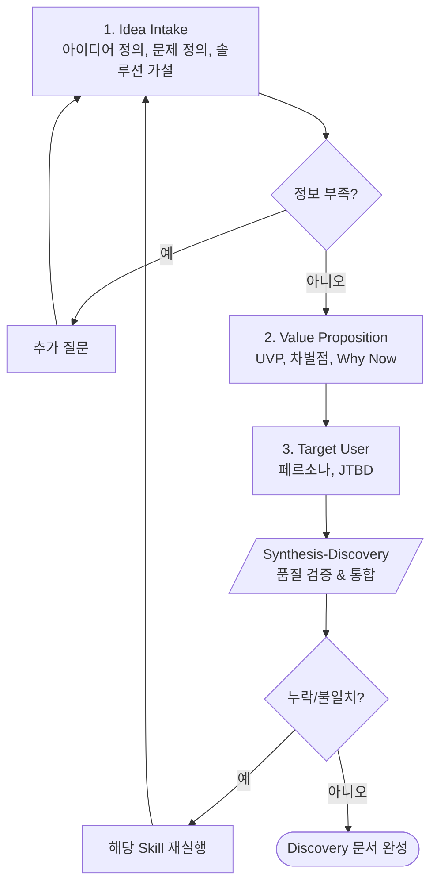

# Phase 1: Discovery (발견)

> **Version**: 3.2.0 | **Type**: Phase Reference
> 아이디어/가치제안/타겟 사용자 정의

---

## Overview

| Property | Value |
|----------|-------|
| Phase Number | 1 |
| Skills | 3 (idea-intake, value-proposition, target-user) |
| Synthesis | synthesis-discovery |
| Output Folder | `01-discovery/` |

---

## Skills

### 1. Idea Intake
- **역할**: 아이디어 정의, 문제/솔루션 가설
- **프레임워크**: Problem-Solution Fit
- **출력**: `idea-intake.md`

### 2. Value Proposition
- **역할**: 가치 제안, 차별점, Why Now
- **프레임워크**: UVP Canvas
- **출력**: `value-proposition.md`

### 3. Target User
- **역할**: 타겟 사용자 정의
- **프레임워크**: Persona, JTBD
- **출력**: `target-user.md`

---

## Execution Flow

---

## Frameworks

| Framework | Purpose | Skill |
|-----------|---------|-------|
| **Problem-Solution Fit** | 문제/솔루션 정합성 | Idea Intake |
| **UVP Canvas** | 가치 제안 정의 | Value Proposition |
| **JTBD** | 고객 니즈 분석 | Target User |
| **Persona** | 타겟 사용자 구체화 | Target User |

---

## Quality Checklist

- [ ] 문제 정의가 명확한가?
- [ ] 솔루션이 문제를 해결하는가?
- [ ] 타겟 사용자가 구체적인가?
- [ ] Why Now (왜 지금인가)가 설득력 있는가?
