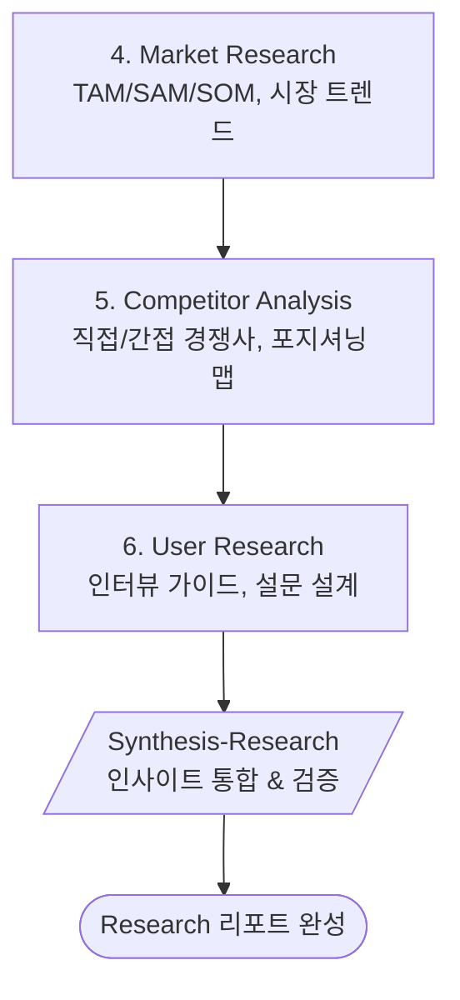

# Phase 2: Research (리서치)

> **Version**: 3.2.0 | **Type**: Phase Reference
> 시장/경쟁/사용자 리서치

---

## Overview

| Property | Value |
|----------|-------|
| Phase Number | 2 |
| Skills | 3 (market-research, competitor-analysis, user-research) |
| Synthesis | synthesis-research |
| Output Folder | `02-research/` |

---

## Skills

### 4. Market Research
- **역할**: 시장 규모, 트렌드 분석
- **프레임워크**: TAM/SAM/SOM
- **출력**: `market-research.md`

### 5. Competitor Analysis
- **역할**: 경쟁사 분석
- **프레임워크**: 포지셔닝 맵, Feature Matrix
- **출력**: `competitor-analysis.md`

### 6. User Research
- **역할**: 사용자 리서치 설계
- **프레임워크**: 인터뷰 가이드, 설문 설계
- **출력**: `user-research.md`

---

## Execution Flow

---

## Frameworks

| Framework | Purpose | Skill |
|-----------|---------|-------|
| **TAM/SAM/SOM** | 시장 규모 추정 | Market Research |
| **Porter's 5 Forces** | 산업 구조 분석 | Market Research |
| **Feature Matrix** | 경쟁사 기능 비교 | Competitor Analysis |
| **Positioning Map** | 시장 포지셔닝 | Competitor Analysis |

---

## Quality Checklist

- [ ] TAM/SAM/SOM 추정이 합리적인가?
- [ ] 경쟁사 분석이 포괄적인가?
- [ ] 사용자 리서치 가이드가 실행 가능한가?
- [ ] 시장 진입 기회가 식별되었는가?
