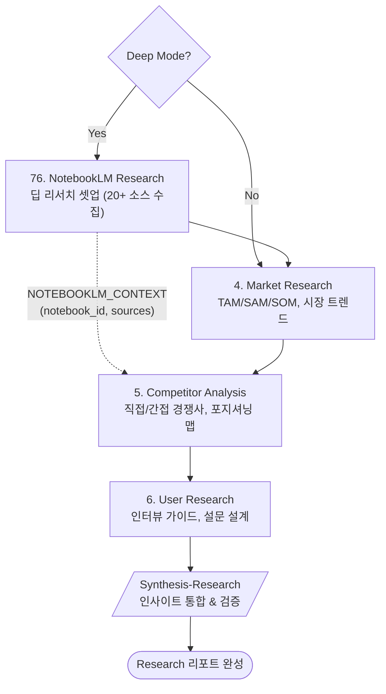

# Phase 2: Research (리서치)

> **Version**: 3.3.0 | **Type**: Phase Reference
> 시장/경쟁/사용자 리서치 (NotebookLM 딥 리서치 지원)

---

## Overview

| Property | Value |
|----------|-------|
| Phase Number | 2 |
| Skills | 4 (notebooklm-research, market-research, competitor-analysis, user-research) |
| Synthesis | synthesis-research |
| Output Folder | `02-research/` |

---

## Deep Research Mode

사용자가 `--deep` 플래그를 지정하거나 "깊이 있는 리서치"를 요청하면 NotebookLM 딥 리서치 모드를 활성화한다.

| Mode | 소스 수 | 소요 시간 | 데이터 깊이 |
|------|--------|----------|------------|
| **Standard** (기본) | WebSearch 결과 | 빠름 | 표면적 |
| **Deep** (NotebookLM) | 20+ 웹 소스 인덱싱 | 15~30분 | 심층적 |

딥 리서치 모드에서는 `notebooklm-research` 스킬이 먼저 실행되어 소스를 수집하고, 후속 스킬들이 수집된 소스를 활용한다.

---

## Skills

### 76. NotebookLM Research (Deep Mode Only)
- **역할**: 딥 리서치 인프라 셋업 — 소스 수집 및 인덱싱
- **조건**: `--deep` 플래그 또는 사용자 명시적 요청 시에만 실행
- **출력**: `notebooklm-research-setup.md`, `NOTEBOOKLM_CONTEXT`

### 4. Market Research
- **역할**: 시장 규모, 트렌드 분석
- **프레임워크**: TAM/SAM/SOM
- **데이터 소스**: NotebookLM 소스 (deep) + WebSearch (보완)
- **출력**: `market-research.md`

### 5. Competitor Analysis
- **역할**: 경쟁사 분석
- **프레임워크**: 포지셔닝 맵, Feature Matrix
- **데이터 소스**: NotebookLM 소스 (deep) + WebSearch (보완)
- **출력**: `competitor-analysis.md`

### 6. User Research
- **역할**: 사용자 리서치 설계
- **프레임워크**: 인터뷰 가이드, 설문 설계
- **출력**: `user-research.md`

---

## Execution Flow

```mermaid
flowchart TD
    mode{"Deep Mode?"}
    mode -->|Yes| s76
    mode -->|No| s4

    s76["76. NotebookLM Research<br/>딥 리서치 셋업 (20+ 소스 수집)"]
    s76 --> s4
    s76 -.->|"NOTEBOOKLM_CONTEXT<br/>(notebook_id, sources)"| s5

    s4["4. Market Research<br/>TAM/SAM/SOM, 시장 트렌드"]
    s4 --> s5

    s5["5. Competitor Analysis<br/>직접/간접 경쟁사, 포지셔닝 맵"]
    s5 --> s6

    s6["6. User Research<br/>인터뷰 가이드, 설문 설계"]
    s6 --> syn2

    syn2[/"Synthesis-Research<br/>인사이트 통합 & 검증"/]
    syn2 --> done2([Research 리포트 완성])
```

---

## Frameworks

| Framework | Purpose | Skill |
|-----------|---------|-------|
| **TAM/SAM/SOM** | 시장 규모 추정 | Market Research |
| **Porter's 5 Forces** | 산업 구조 분석 | Market Research |
| **Feature Matrix** | 경쟁사 기능 비교 | Competitor Analysis |
| **Positioning Map** | 시장 포지셔닝 | Competitor Analysis |

---

## Quality Checklist

- [ ] TAM/SAM/SOM 추정이 합리적인가?
- [ ] 경쟁사 분석이 포괄적인가?
- [ ] 사용자 리서치 가이드가 실행 가능한가?
- [ ] 시장 진입 기회가 식별되었는가?
- [ ] (Deep Mode) NotebookLM 소스가 성공적으로 인덱싱되었는가?
- [ ] (Deep Mode) NotebookLM 소스와 WebSearch 결과가 교차 검증되었는가?
