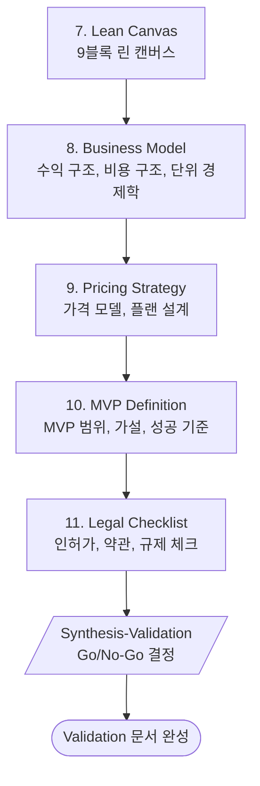

# Phase 3: Validation (검증)

> **Version**: 3.2.0 | **Type**: Phase Reference
> 비즈니스 모델/MVP/법적 검증

---

## Overview

| Property | Value |
|----------|-------|
| Phase Number | 3 |
| Skills | 5 (lean-canvas, business-model, pricing-strategy, mvp-definition, legal-checklist) |
| Synthesis | synthesis-validation |
| Output Folder | `03-validation/` |

---

## Skills

### 7. Lean Canvas
- **역할**: 린 캔버스 작성
- **프레임워크**: Lean Canvas 9블록
- **출력**: `lean-canvas.md`

### 8. Business Model
- **역할**: 수익/비용 구조
- **프레임워크**: Unit Economics
- **출력**: `business-model.md`

### 9. Pricing Strategy
- **역할**: 가격 정책 설계
- **프레임워크**: Pricing Models
- **출력**: `pricing-strategy.md`

### 10. MVP Definition
- **역할**: MVP 범위 정의
- **프레임워크**: MoSCoW, 가설/검증
- **출력**: `mvp-definition.md`

### 11. Legal Checklist
- **역할**: 법적/규제 체크
- **프레임워크**: 서비스 유형별 체크리스트
- **출력**: `legal-checklist.md`

---

## Execution Flow

---

## Frameworks

| Framework | Purpose | Skill |
|-----------|---------|-------|
| **Lean Canvas** | 비즈니스 모델 요약 | Lean Canvas |
| **Unit Economics** | 단위 경제학 분석 | Business Model |
| **MoSCoW** | 기능 우선순위 | MVP Definition |
| **Hypothesis** | 가설 수립/검증 | MVP Definition |

---

## Quality Checklist

- [ ] 린 캔버스 9블록이 모두 채워졌는가?
- [ ] Unit Economics가 양수인가?
- [ ] MVP 가설이 검증 가능한가?
- [ ] 법적 리스크가 식별되었는가?
- [ ] Go/No-Go 결정이 내려졌는가?
