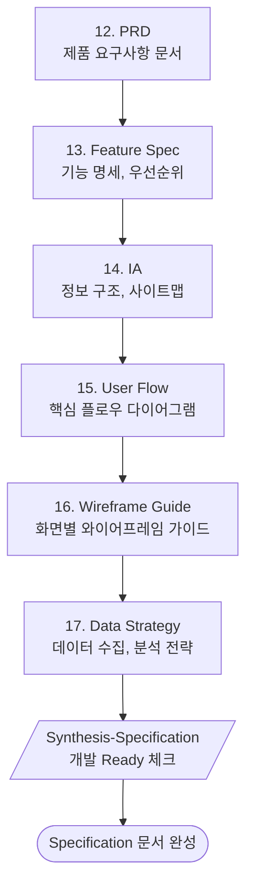

# Phase 4: Specification (명세)

> **Version**: 3.2.0 | **Type**: Phase Reference
> PRD/기능명세/IA/플로우/데이터 전략

---

## Overview

| Property | Value |
|----------|-------|
| Phase Number | 4 |
| Skills | 6 (prd, feature-spec, information-architecture, user-flow, wireframe-guide, data-strategy) |
| Synthesis | synthesis-specification |
| Output Folder | `04-specification/` |

---

## Skills

### 12. PRD
- **역할**: 제품 요구사항 문서
- **프레임워크**: PRD Template
- **출력**: `prd.md`

### 13. Feature Spec
- **역할**: 기능 명세서
- **프레임워크**: User Story, Acceptance Criteria
- **출력**: `feature-spec.md`

### 14. Information Architecture
- **역할**: 정보 구조 설계
- **프레임워크**: Sitemap, IA Diagram
- **출력**: `information-architecture.md`

### 15. User Flow
- **역할**: 사용자 플로우
- **프레임워크**: Flow Diagram
- **출력**: `user-flow.md`

### 16. Wireframe Guide
- **역할**: 와이어프레임 가이드
- **프레임워크**: Lo-fi Wireframe
- **출력**: `wireframe-guide.md`

### 17. Data Strategy
- **역할**: 데이터 수집/분석 전략
- **프레임워크**: Event Tracking
- **출력**: `data-strategy.md`

---

## Execution Flow

---

## Frameworks

| Framework | Purpose | Skill |
|-----------|---------|-------|
| **PRD Template** | 제품 요구사항 | PRD |
| **User Story** | 기능 명세 | Feature Spec |
| **Acceptance Criteria** | 완료 조건 | Feature Spec |
| **Event Tracking** | 데이터 수집 | Data Strategy |

---

## Quality Checklist

- [ ] PRD가 완전한가?
- [ ] 모든 기능에 User Story와 AC가 있는가?
- [ ] IA가 논리적인가?
- [ ] User Flow가 완전한가?
- [ ] 개발팀이 바로 시작할 수 있는가?
