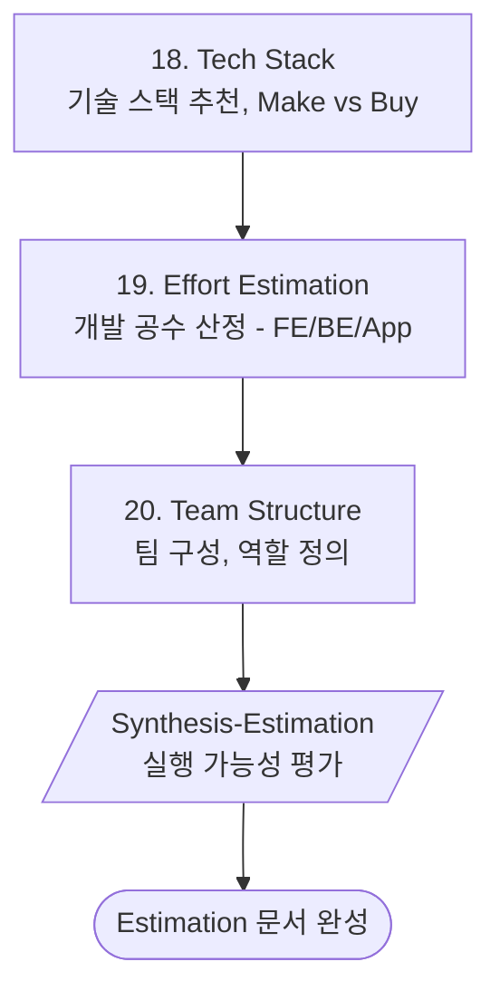

# Phase 5: Estimation (산정)

> **Version**: 3.2.0 | **Type**: Phase Reference
> 기술스택/공수/팀 구성

---

## Overview

| Property | Value |
|----------|-------|
| Phase Number | 5 |
| Skills | 3 (tech-stack, effort-estimation, team-structure) |
| Synthesis | synthesis-estimation |
| Output Folder | `05-estimation/` |

---

## Skills

### 18. Tech Stack
- **역할**: 기술 스택 추천
- **프레임워크**: Make vs Buy
- **출력**: `tech-stack.md`

### 19. Effort Estimation
- **역할**: 개발 공수 산정
- **프레임워크**: T-Shirt Sizing
- **출력**: `effort-estimation.md`

### 20. Team Structure
- **역할**: 팀 구성 제안
- **프레임워크**: Role Matrix
- **출력**: `team-structure.md`

---

## Execution Flow

---

## Tech Stack Considerations

### Frontend Options
| Option | Use Case |
|--------|----------|
| Next.js | SEO 중요, 복잡한 웹앱 |
| React + Vite | SPA, 빠른 개발 |
| Flutter Web | 크로스플랫폼 |

### Backend Options
| Option | Use Case |
|--------|----------|
| Supabase | MVP, 빠른 출시 |
| Firebase | 모바일 중심 |
| Custom API | 복잡한 비즈니스 로직 |

### Mobile Options
| Option | Use Case |
|--------|----------|
| Flutter | 크로스플랫폼 |
| React Native | 웹 팀 활용 |
| Native | 최고 성능 필요 |

---

## Estimation Guidelines

### T-Shirt Sizing

| Size | Hours | Description |
|------|-------|-------------|
| XS | 2-4h | 단순 UI, 버그 수정 |
| S | 4-8h | 기본 기능, API 연동 |
| M | 1-2d | 중간 복잡도 기능 |
| L | 3-5d | 복잡한 기능 |
| XL | 1-2w | 대규모 기능, 새 시스템 |

---

## Quality Checklist

- [ ] 기술 스택이 팀 역량에 맞는가?
- [ ] 공수 추정에 버퍼가 포함되었는가?
- [ ] 팀 구성이 현실적인가?
- [ ] Make vs Buy 결정이 합리적인가?
