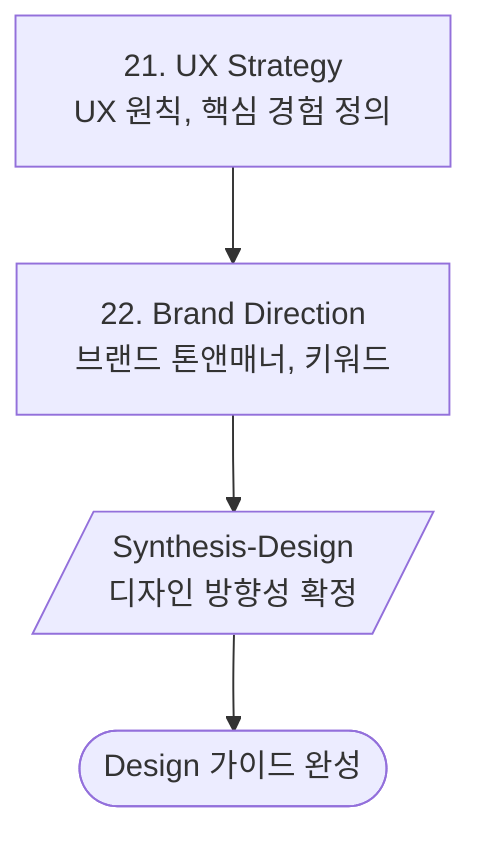

# Phase 6: Design Direction (디자인)

> **Version**: 3.2.0 | **Type**: Phase Reference
> UX 전략/브랜드 방향

---

## Overview

| Property | Value |
|----------|-------|
| Phase Number | 6 |
| Skills | 2 (ux-strategy, brand-direction) |
| Synthesis | synthesis-design |
| Output Folder | `06-design/` |

---

## Skills

### 21. UX Strategy
- **역할**: UX 전략, 핵심 경험 정의
- **프레임워크**: UX Principles
- **출력**: `ux-strategy.md`

### 22. Brand Direction
- **역할**: 브랜딩 방향
- **프레임워크**: Brand Keywords
- **출력**: `brand-direction.md`

---

## Execution Flow



---

## UX Strategy Components

### Core UX Principles
1. **Simplicity**: 복잡함 제거, 핵심에 집중
2. **Clarity**: 명확한 정보 전달
3. **Feedback**: 즉각적인 피드백 제공
4. **Consistency**: 일관된 경험

### Key Experience Definition
- **Primary Action**: 사용자의 핵심 태스크
- **Success Moment**: 가치 전달 순간
- **Aha Moment**: 서비스의 핵심 가치 인식 순간

---

## Brand Direction Components

### Brand Keywords
| Category | Examples |
|----------|----------|
| Personality | 친근한, 전문적인, 혁신적인 |
| Tone | 대화체, 격식체, 캐주얼 |
| Visual | 미니멀, 컬러풀, 모던 |

### Tone & Manner
- **Voice**: 브랜드가 말하는 방식
- **Tone**: 상황별 감정 표현
- **Language**: 사용하는 단어와 표현

---

## Agent Connection

Design Phase 완료 후 연계:

```
Design Direction
    └─→ frontend-design-agent
        - wireframe-guide 기반 UI 디자인
        - brand-direction 기반 스타일 적용
```

---

## Quality Checklist

- [ ] UX 원칙이 명확한가?
- [ ] 핵심 경험이 정의되었는가?
- [ ] 브랜드 톤앤매너가 일관적인가?
- [ ] 디자이너가 바로 작업할 수 있는가?
