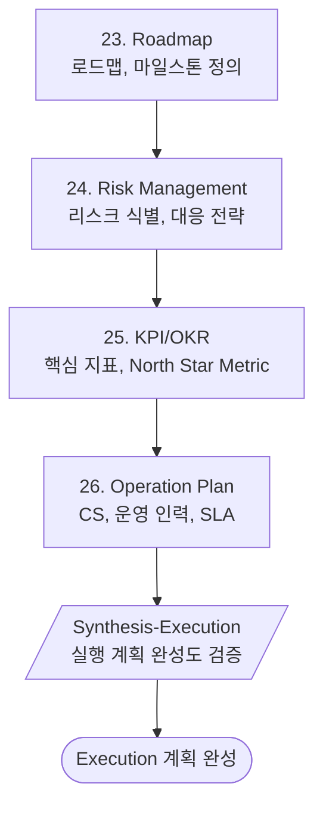

# Phase 7: Execution (실행)

> **Version**: 3.2.0 | **Type**: Phase Reference
> 로드맵/리스크/KPI/운영 계획

---

## Overview

| Property | Value |
|----------|-------|
| Phase Number | 7 |
| Skills | 4 (roadmap, risk-management, kpi-okr, operation-plan) |
| Synthesis | synthesis-execution |
| Output Folder | `07-execution/` |

---

## Skills

### 23. Roadmap
- **역할**: 로드맵, 마일스톤 정의
- **프레임워크**: Gantt, Timeline
- **출력**: `roadmap.md`

### 24. Risk Management
- **역할**: 리스크 관리
- **프레임워크**: Risk Matrix
- **출력**: `risk-management.md`

### 25. KPI/OKR
- **역할**: KPI/OKR 설정
- **프레임워크**: North Star Metric
- **출력**: `kpi-okr.md`

### 26. Operation Plan
- **역할**: 운영 계획
- **프레임워크**: CS, SLA
- **출력**: `operation-plan.md`

---

## Execution Flow



---

## Roadmap Template

### Phase Structure
| Phase | Duration | Focus |
|-------|----------|-------|
| Alpha | 2-4 weeks | 핵심 기능 개발 |
| Beta | 2-4 weeks | 테스트 & 피드백 |
| Launch | 1-2 weeks | 출시 준비 |
| Post-Launch | Ongoing | 운영 & 개선 |

### Milestone Format
```
M1: [이름] - [날짜]
    - 완료 조건 1
    - 완료 조건 2
    - 완료 조건 3
```

---

## Risk Matrix

| Impact / Probability | Low | Medium | High |
|---------------------|-----|--------|------|
| **High** | Monitor | Mitigate | Avoid |
| **Medium** | Accept | Monitor | Mitigate |
| **Low** | Accept | Accept | Monitor |

### Risk Categories
- **Technical**: 기술적 리스크
- **Market**: 시장 리스크
- **Resource**: 리소스 리스크
- **Regulatory**: 규제 리스크

---

## KPI/OKR Framework

### North Star Metric
서비스의 핵심 가치를 대표하는 단일 지표

### OKR Template
```
Objective: [목표]
    KR1: [측정 가능한 결과] (현재: X → 목표: Y)
    KR2: [측정 가능한 결과] (현재: X → 목표: Y)
    KR3: [측정 가능한 결과] (현재: X → 목표: Y)
```

---

## Quality Checklist

- [ ] 로드맵이 현실적인가?
- [ ] 리스크가 식별되고 대응책이 있는가?
- [ ] KPI가 측정 가능한가?
- [ ] 운영 계획이 지속 가능한가?
