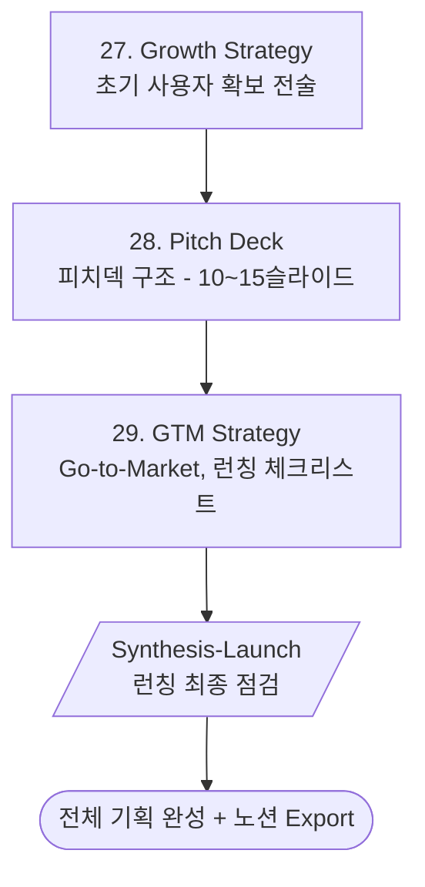

# Phase 8: Launch Prep (런칭 준비)

> **Version**: 3.2.0 | **Type**: Phase Reference
> 그로스/피치덱/GTM 전략

---

## Overview

| Property | Value |
|----------|-------|
| Phase Number | 8 |
| Skills | 3 (growth-strategy, pitch-deck, gtm-strategy) |
| Synthesis | synthesis-launch |
| Output Folder | `08-launch/` |

---

## Skills

### 27. Growth Strategy
- **역할**: 초기 사용자 확보 전술
- **프레임워크**: Growth Loops
- **출력**: `growth-strategy.md`

### 28. Pitch Deck
- **역할**: 피치덱 구조
- **프레임워크**: 10-15 Slide Structure
- **출력**: `pitch-deck-outline.md`

### 29. GTM Strategy
- **역할**: Go-to-Market 전략
- **프레임워크**: Launch Checklist
- **출력**: `gtm-strategy.md`

---

## Execution Flow



---

## Growth Strategy Framework

### Growth Loops
| Loop Type | Description |
|-----------|-------------|
| **Viral** | 사용자가 다른 사용자를 초대 |
| **Content** | 콘텐츠가 새 사용자 유입 |
| **Paid** | 광고를 통한 유입 |
| **Sales** | 영업을 통한 확보 |

### Initial User Acquisition
1. **Week 1-2**: Founding users (지인, 커뮤니티)
2. **Week 3-4**: Early adopters (베타 테스터)
3. **Month 2+**: Growth channels 활성화

---

## Pitch Deck Structure

### 10-Slide Format
| # | Slide | Content |
|---|-------|---------|
| 1 | Title | 회사명, 한 줄 소개 |
| 2 | Problem | 해결하려는 문제 |
| 3 | Solution | 제품/서비스 소개 |
| 4 | Demo | 제품 스크린샷 또는 영상 |
| 5 | Market | TAM/SAM/SOM |
| 6 | Business Model | 수익 모델 |
| 7 | Traction | 현재 성과, KPI |
| 8 | Team | 팀 소개 |
| 9 | Roadmap | 향후 계획 |
| 10 | Ask | 투자 요청, 사용 계획 |

---

## GTM Checklist

### Pre-Launch
- [ ] 랜딩 페이지 준비
- [ ] 대기자 명단 수집
- [ ] 베타 테스터 모집
- [ ] 소셜 미디어 계정 준비

### Launch Day
- [ ] 제품 공개
- [ ] 프레스 릴리즈
- [ ] 커뮤니티 공지
- [ ] 인플루언서 연락

### Post-Launch
- [ ] 사용자 피드백 수집
- [ ] 버그 대응
- [ ] 지표 모니터링
- [ ] 개선 우선순위 결정

---

## Agent Connections

Launch Phase 완료 후 연계:

```
Launch Prep
    ├─→ ppt-agent (pitch-deck → 실제 슬라이드)
    └─→ marketing-agent (gtm-strategy → 마케팅 실행)
```

---

## Quality Checklist

- [ ] 그로스 채널이 실행 가능한가?
- [ ] 피치덱 구조가 완전한가?
- [ ] GTM 체크리스트가 현실적인가?
- [ ] 런칭 후 대응 계획이 있는가?
