# Clinic Crawler Agent - Workflow Diagram

## Full Pipeline Flowchart

```mermaid
flowchart TD
    START([Hospital URL Input]) --> DUP{Step 0: DB duplicate check}
    DUP -->|"success within 7d"| CACHED([Return Cached])
    DUP -->|"partial/failed/new"| VALIDATE{URL valid?}
    VALIDATE -->|No| FAIL[status: failed]
    VALIDATE -->|Yes| NAV["Step 1: browser_navigate"]

    NAV --> LOADED{Page loaded?}
    LOADED -->|Timeout/DNS/SSL| FAIL
    LOADED -->|OK| REDIR["Check redirect: window.location.href"]

    REDIR --> I18N{i18n path? /en/ /ja/}
    I18N -->|Yes| KORVER["Navigate to /ko/ or root"]
    I18N -->|No| SNAP
    KORVER --> SNAP["browser_snapshot"]

    SNAP --> POP{Step 2: Popup?}
    POP -->|No| SPA
    POP -->|Yes| DISMISS["Dismiss max 3x"]
    DISMISS --> SPA

    SPA{Step 3: Content loaded?}
    SPA -->|"DOM >= 10 nodes"| SOCIAL
    SPA -->|"DOM < 10 nodes"| WAIT["Wait 5s + check framework"]
    WAIT --> RECHECK{Content now?}
    RECHECK -->|Yes| SOCIAL
    RECHECK -->|No| PARTIAL_SPA["status: partial, proceed"]
    PARTIAL_SPA --> SOCIAL

    SOCIAL["Step 4: Social Channel Extraction"] --> P1["Pass 1: Static DOM"]
    P1 --> P15["Pass 1.5: iframe Detection"]
    P15 --> P2["Pass 2: Dynamic JS"]
    P2 --> P3{QR/Image?}
    P3 -->|Yes| OCR_S["Gemini OCR"]
    P3 -->|No| P4
    OCR_S --> P4
    P4["Pass 4: URL Validation + Dedup"]

    P4 --> DOC["Step 5: Find Doctor Page"]
    DOC --> BRANCH{Multi-branch site?}
    BRANCH -->|Yes| MATCH["Match branch by address"]
    BRANCH -->|No| MENU
    MATCH --> MENU{Menu match?}
    MENU -->|Found| CLICK["browser_click"]
    MENU -->|Submenu| EXPAND["Expand + click"]
    MENU -->|None| MAIN{On main page?}
    EXPAND --> CLICK
    MAIN -->|Yes| DOM_M["Extract main"]
    MAIN -->|No| NO_DOC["No doctor info"]

    CLICK --> DSNAP["browser_snapshot"]
    DSNAP --> DTYPE{Image-based?}
    DTYPE -->|DOM text| DOM_EX["DOM Extract"]
    DTYPE -->|Images| OCR_F["Gemini OCR Flow"]

    OCR_F --> SHOT["screenshot"]
    SHOT --> CONV["sips PNG to JPEG"]
    CONV --> GEM["gemini -p path -y --include-directories"]
    GEM --> GOK{JSON OK?}
    GOK -->|Yes| PARSE["Parse + ocr_source:true"]
    GOK -->|Fail + retry| GEM
    GOK -->|Fail final| SKIP["Skip OCR"]

    DOM_EX --> PAGE{Pagination?}
    PAGE -->|Yes, page < 5| NEXT["Click next, extract more"]
    NEXT --> PAGE
    PAGE -->|No more| MERGE

    DOM_M --> MERGE["Step 6: Build JSON + Save"]
    NO_DOC --> MERGE
    PARSE --> MERGE
    SKIP --> MERGE
    FAIL --> MERGE

    MERGE --> SAVE["storage_manager.py save"]
    SAVE --> CLEAN["Cleanup screenshots"]
    CLEAN --> DONE([Step 7: Return Result])
```



## Step-by-Step Detail

### Step 0: Pre-flight Check

```
hospital_no --> Query DB
                  |
        +---------+---------+
        |         |         |
   success     partial    not found
   < 7 days   or failed      |
        |         |       New crawl
   Return      Re-crawl      |
   cached         |          v
                  v       Proceed
               Proceed
```

Prevents wasting time on recently crawled hospitals.

### Step 1: Navigate and Resolve

```
browser_navigate(url)
        |
   Page loaded? --No--> status: failed
        |
       Yes
        |
   browser_evaluate("window.location.href")
        |
   URL changed? --Yes--> Record final_url
        |                 Check chain match
       No
        |
   Check <html lang>
        |
   lang != "ko"? --Yes--> Find /ko/ path or language switcher
        |
       No
        |
   Continue
```

### Step 2-3: Popups + SPA Wait

```
browser_snapshot
    |
Popup? --Yes--> Dismiss (X / text / checkbox / overlay) max 3x
    |
   No
    |
Content loaded? (>= 10 meaningful DOM nodes)
    |
   No --> SPA detected
    |       |
    |     Wait 5000ms (browser_wait_for)
    |       |
    |     Re-snapshot
    |       |
    |     Still empty? --> Check #__next / #app / #root
    |       |               |
    |       |             Wait 3000ms more
    |       |               |
    |       +-------<-------+
    |       |
   Yes    Content found or give up (status: partial)
    |       |
    v       v
  Continue to Step 4
```

### Step 4: Social Channel Extraction (4-Pass)

```
Pass 1: Static DOM
  <a href> scan --> social URLs in footer/header/floating
      |
Pass 1.5: iframe Detection [NEW]
  browser_evaluate --> find all <iframe>
  Check src for: kakao, naver, channel.io, zendesk, tawk
      |
Pass 2: Dynamic JS
  browser_evaluate --> onclick handlers, SDK scripts
  Detect: Kakao.Channel, chat widgets
      |
Pass 3: QR/Images
   with qr/wechat attributes --> Gemini OCR
      |
Pass 4: URL Validation [NEW]
  For each URL:
    - Format check (valid scheme)
    - Strip tracking params (?utm_*, ?fbclid=*)
    - De-duplicate by normalized URL
    - Classify platform
    - Dead link detection
```

### Step 5: Doctor Extraction with Pagination

```
Scan nav menu --> Match labels
                     |
            +--------+--------+
            |        |        |
        Direct    Submenu   No match
        match     parent       |
            |        |     Main page?
         click    expand      |
            |     + click  +--+--+
            v        v     |     |
     Doctor page loaded  Found  None
            |               |     |
     Multi-branch? [NEW]  Extract  Skip
       /        \            |
     Yes        No           |
      |          |           |
   Match by   Continue       |
   address       |           |
      |          v           |
      +----> Content type?   |
             /         \     |
         DOM text    Image   |
            |           |    |
         Extract     OCR     |
            |        Flow    |
            v           |    |
      Pagination? [NEW] |    |
         /     \        |    |
       Yes      No      |    |
        |        |      |    |
    Next page    |      |    |
    (max 5)      |      |    |
        |        v      v    v
        +---> Merge all results
```

### Step 6-7: Save + Cleanup

```
Build result JSON
    |
storage_manager.py save --json '...' --db hospitals.db
    |
DB save OK?
    /       \
  Yes       No
   |     JSON file fallback
   |         |
   v         v
Screenshot cleanup [NEW]
    |
status == "success"?
    /           \
  Yes           No
   |         Keep for review
 Delete
 PNGs/JPGs
    |
    v
Return structured result
```

## Decision Points Summary

| Decision | Options | Criteria |
|----------|---------|----------|
| Duplicate? | skip / re-crawl / new | DB lookup by hospital_no + age |
| URL valid? | proceed / fail | http/https scheme present |
| Redirected? | record final_url / continue | window.location.href differs |
| Wrong language? | navigate to /ko/ / continue | URL path or html lang check |
| Page loaded? | proceed / fail | No timeout, DNS, SSL, HTTP error |
| SPA empty? | wait + retry / proceed | < 10 DOM nodes |
| Popup? | dismiss / skip | Modal/overlay in snapshot |
| iframe social? | extract / skip | iframe src matches platform |
| QR/Image social? | OCR / skip | img tags with QR attributes |
| Multi-branch? | match branch / extract all | Chain site with address mismatch |
| Menu match? | click / expand / main / none | Label matching from patterns |
| Image-based? | DOM extract / OCR | < 5 text nodes with doctor info |
| Pagination? | iterate / stop | "다음"/"더보기" present, max 5 pages |
| Gemini JSON valid? | parse / retry / skip | JSON parseable, has doctor name |
| DB save OK? | done / JSON fallback | No SQLite error |
| Cleanup screenshots? | delete / keep | status success vs partial |

## Edge Cases Covered

| # | Edge Case | Solution | Step |
|---|-----------|----------|------|
| 1 | URL redirect | Capture final_url, check chain match | Step 1 |
| 2 | iframe social channels | Pass 1.5 iframe detection | Step 4 |
| 3 | SPA/CSR empty DOM | Wait 5s + framework check + 3s hydration | Step 3 |
| 4 | Paginated doctor list | Iterate up to 5 pages | Step 5 |
| 5 | Multi-branch sites | Match branch by address city/district | Step 5 |
| 6 | Duplicate crawl | DB check, skip if success < 7 days | Step 0 |
| 7 | Dead social links | URL validation pass, mark as dead | Step 4 |
| 8 | i18n paths | Detect non-Korean, navigate to /ko/ | Step 1 |
| 9 | Screenshot accumulation | Delete after successful save | Step 6 |
| 10 | Gemini file scan | --include-directories flag | Step 5 OCR |
