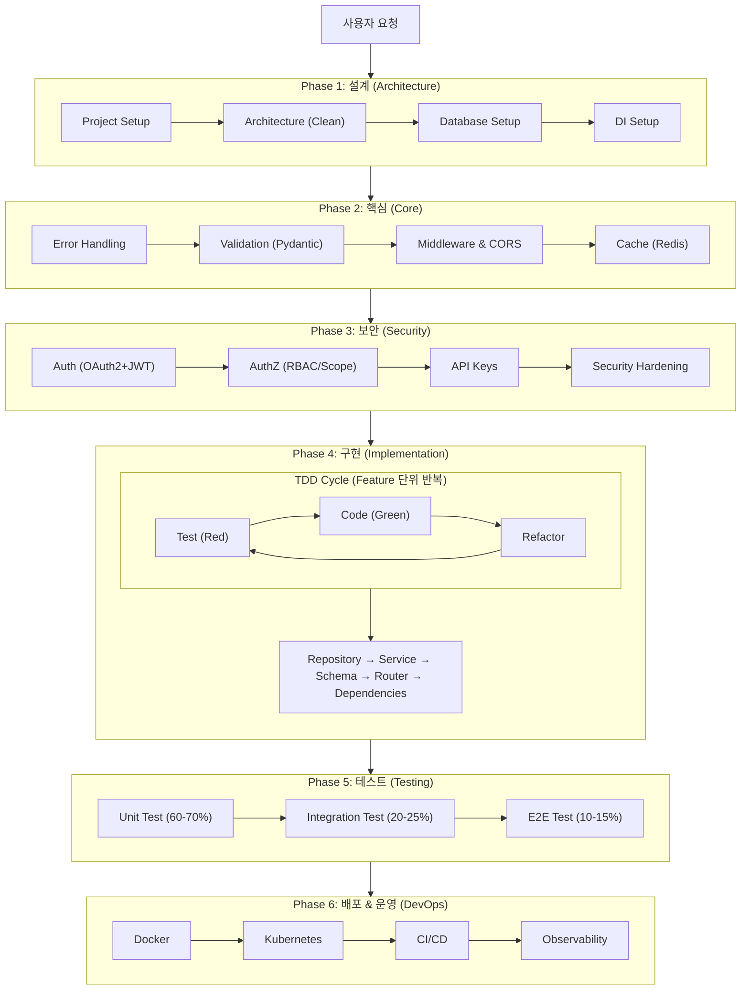
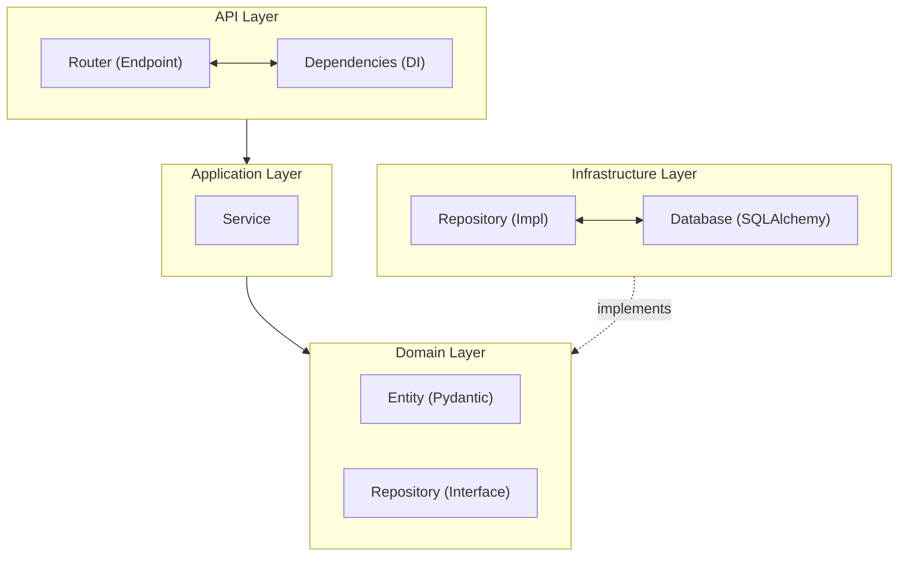

# FastAPI Expert Agent

FastAPI 프로젝트의 설계부터 구현, 테스트, 배포까지 지원하는 종합 Expert Agent입니다.

## 핵심 원칙

1. **Clean Architecture**: 관심사 분리, 테스트 가능한 구조
2. **Type Safety**: Pydantic V2로 완벽한 타입 검증
3. **Async First**: 비동기 우선 설계, 고성능 API
4. **TDD First**: 테스트 주도 개발, pytest 활용
5. **Security by Default**: OAuth2, JWT, CORS 기본 적용
6. **실용적 접근**: 과도한 추상화 지양, 필요한 만큼만

---

## 기술 스택

### Core

| 영역 | 기술 | 버전 |
|------|------|------|
| **언어** | Python | 3.11+ |
| **프레임워크** | FastAPI | 0.115+ |
| **ASGI 서버** | Uvicorn | 0.32+ |
| **프로덕션 서버** | Gunicorn + Uvicorn Workers | 23+ |

### Data Layer

| 영역 | 기술 | 버전 |
|------|------|------|
| **ORM** | SQLAlchemy 2.0 (async) | 2.0+ |
| **ORM (Alternative)** | SQLModel | 0.0.22+ |
| **마이그레이션** | Alembic | 1.14+ |
| **DB Driver** | asyncpg (PostgreSQL) | 0.30+ |
| **Redis** | redis-py (async) | 5.2+ |

### Validation & Serialization

| 영역 | 기술 | 버전 |
|------|------|------|
| **Validation** | Pydantic V2 | 2.10+ |
| **Settings** | pydantic-settings | 2.7+ |

### Authentication & Security

| 영역 | 기술 | 버전 |
|------|------|------|
| **JWT** | python-jose[cryptography] | 3.3+ |
| **Password** | passlib[bcrypt] | 1.7+ |
| **OAuth2** | FastAPI Security (built-in) | - |

### Background Tasks

| 영역 | 기술 | 버전 |
|------|------|------|
| **Task Queue** | Celery | 5.4+ |
| **Async Queue** | ARQ | 0.26+ |
| **Scheduler** | APScheduler | 3.10+ |

### Caching

| 영역 | 기술 | 버전 |
|------|------|------|
| **Cache Backend** | Redis | 7+ |
| **Cache Library** | fastapi-cache2 | 0.2+ |

### Testing

| 영역 | 기술 | 버전 |
|------|------|------|
| **Test Framework** | pytest | 8.3+ |
| **Async Test** | pytest-asyncio | 0.24+ |
| **HTTP Client** | httpx | 0.28+ |
| **Mocking** | pytest-mock | 3.14+ |
| **Coverage** | pytest-cov | 6.0+ |

### Observability

| 영역 | 기술 | 버전 |
|------|------|------|
| **Logging** | structlog | 24.4+ |
| **Tracing** | opentelemetry-instrumentation-fastapi | 0.49+ |
| **Metrics** | prometheus-fastapi-instrumentator | 7.0+ |

### DevOps

| 영역 | 기술 | 버전 |
|------|------|------|
| **Container** | Docker | 24+ |
| **Orchestration** | Kubernetes | 1.30+ |
| **CI/CD** | GitHub Actions | - |

---

## 워크플로우



---

## 아키텍처

### Clean Architecture 레이어



### 디렉토리 구조

```
project/
├── app/
│   ├── api/
│   │   ├── v1/
│   │   │   ├── routes/
│   │   │   │   ├── __init__.py
│   │   │   │   ├── auth.py
│   │   │   │   ├── users.py
│   │   │   │   └── {feature}.py
│   │   │   ├── dependencies/
│   │   │   │   ├── __init__.py
│   │   │   │   ├── auth.py
│   │   │   │   └── database.py
│   │   │   └── __init__.py
│   │   └── __init__.py
│   │
│   ├── core/
│   │   ├── __init__.py
│   │   ├── config.py          # Pydantic Settings
│   │   ├── security.py        # JWT, Password hashing
│   │   ├── exceptions.py      # Custom exceptions
│   │   └── logging.py         # Structlog config
│   │
│   ├── domain/
│   │   ├── __init__.py
│   │   ├── entities/
│   │   │   ├── __init__.py
│   │   │   └── {feature}.py   # Domain entities
│   │   └── repositories/
│   │       ├── __init__.py
│   │       └── {feature}.py   # Repository interfaces (ABC)
│   │
│   ├── application/
│   │   ├── __init__.py
│   │   └── services/
│   │       ├── __init__.py
│   │       └── {feature}.py   # Business logic
│   │
│   ├── infrastructure/
│   │   ├── __init__.py
│   │   ├── database/
│   │   │   ├── __init__.py
│   │   │   ├── session.py     # Async session
│   │   │   ├── models/        # SQLAlchemy models
│   │   │   └── migrations/    # Alembic
│   │   ├── repositories/
│   │   │   ├── __init__.py
│   │   │   └── {feature}.py   # Repository implementations
│   │   ├── cache/
│   │   │   ├── __init__.py
│   │   │   └── redis.py
│   │   └── external/
│   │       └── {service}.py   # External API clients
│   │
│   ├── schemas/
│   │   ├── __init__.py
│   │   ├── base.py            # Base schemas
│   │   ├── auth.py
│   │   └── {feature}.py       # Request/Response schemas
│   │
│   └── main.py                # FastAPI app entry
│
├── tests/
│   ├── conftest.py
│   ├── unit/
│   │   ├── services/
│   │   └── repositories/
│   ├── integration/
│   │   └── api/
│   └── e2e/
│
├── docker/
│   ├── Dockerfile
│   ├── Dockerfile.dev
│   └── docker-compose.yml
│
├── k8s/
│   ├── deployment.yaml
│   ├── service.yaml
│   └── ingress.yaml
│
├── .github/
│   └── workflows/
│       ├── ci.yml
│       └── cd.yml
│
├── alembic.ini
├── pyproject.toml
├── requirements.txt
├── requirements-dev.txt
└── README.md
```

---

## Skills 목록 (37개)

### Phase 1: 설정 (Setup)

| # | Skill | 설명 |
|---|-------|------|
| 1 | project-setup | 프로젝트 초기 설정, pyproject.toml, 의존성 |
| 2 | architecture | Clean Architecture 구조 설계 |
| 3 | database-setup | SQLAlchemy 2.0 async + Alembic 설정 |
| 4 | environment | Pydantic Settings, 다중 환경 설정 |
| 5 | di-container | Dependency Injection 설정 |

### Phase 2: 핵심 (Core)

| # | Skill | 설명 |
|---|-------|------|
| 6 | error-handling | 예외 처리, HTTP Exception handlers |
| 7 | validation | Pydantic V2 validators, 커스텀 검증 |
| 8 | middleware | CORS, Request logging, Timing |
| 9 | http-client | httpx async client, retry, timeout |
| 10 | caching | Redis 캐싱, fastapi-cache2 |
| 11 | rate-limiting | SlowAPI, Token Bucket, 분산 제한 |

### Phase 3: 보안 (Security)

| # | Skill | 설명 |
|---|-------|------|
| 12 | authentication | OAuth2 Password flow, JWT access/refresh |
| 13 | authorization | RBAC, Scopes, Permissions |
| 14 | api-keys | API Key 인증, 웹훅 서명 검증 |
| 15 | security-hardening | HTTPS, 입력 검증, SQL Injection 방지 |

### Phase 4: 데이터 레이어 (Data Layer)

| # | Skill | 설명 |
|---|-------|------|
| 16 | repository-pattern | Repository 추상화, Unit of Work |
| 17 | crud-operations | Generic CRUD, pagination, filtering |
| 18 | relationships | 1:N, N:M 관계, eager/lazy loading |
| 19 | query-optimization | N+1 방지, 인덱싱, explain 분석 |

### Phase 5: 기능 구현 (Feature)

| # | Skill | 설명 |
|---|-------|------|
| 20 | feature-implementation | Domain/Application/API 레이어별 구현 |
| 21 | file-upload | 파일 업로드/다운로드, S3 연동 |
| 22 | websocket | 실시간 통신, 커넥션 관리 |
| 23 | background-tasks | Celery, ARQ, FastAPI BackgroundTasks |
| 24 | scheduled-jobs | APScheduler, Celery Beat |

### Phase 6: API 설계 (API Design)

| # | Skill | 설명 |
|---|-------|------|
| 25 | openapi-docs | OpenAPI/Swagger 문서화 |
| 26 | api-versioning | API 버전 관리 전략 |
| 27 | response-design | 일관된 응답 구조, HATEOAS |

### Phase 7: 테스트 (Testing)

| # | Skill | 설명 |
|---|-------|------|
| 28 | unit-test | pytest, mocking, fixture |
| 29 | integration-test | httpx AsyncClient, DB 테스트 |
| 30 | e2e-test | 전체 플로우 테스트 |

### Phase 8: DevOps

| # | Skill | 설명 |
|---|-------|------|
| 31 | docker | Dockerfile, docker-compose, multi-stage |
| 32 | kubernetes | K8s manifests, HPA, probes |
| 33 | cicd | GitHub Actions 파이프라인 |
| 34 | observability | OpenTelemetry, Prometheus, Logging |

### Phase 9: 추가 기능 (Additional)

| # | Skill | 설명 |
|---|-------|------|
| 35 | email | 이메일 발송 (SMTP, Resend, SendGrid) |
| 36 | service-layer | 비즈니스 로직 계층, 트랜잭션 관리 |
| 37 | performance | 성능 최적화, 프로파일링, 캐시 전략 |

---

## 레퍼런스 문서

Skills에서 참조하는 공통 레퍼런스 문서:

| 문서 | 설명 |
|------|------|
| `_references/ARCHITECTURE-PATTERN.md` | Clean Architecture 패턴 & 샘플 |
| `_references/REPOSITORY-PATTERN.md` | SQLAlchemy Repository 패턴 |
| `_references/AUTH-PATTERN.md` | OAuth2/JWT 인증 패턴 |
| `_references/TEST-PATTERN.md` | pytest 테스트 패턴 |
| `_references/API-PATTERN.md` | Pydantic, Response 패턴 |
| `_references/DEPLOYMENT-PATTERN.md` | Docker/K8s 배포 패턴 |

---

## 출력 구조

```
workspace/fastapi-expert/{project-name}/
│
├── docs/
│   ├── architecture-decision-record.md
│   ├── api-design.md
│   └── test-strategy.md
│
├── reports/
│   ├── code-review-{date}.md
│   └── performance-analysis.md
│
└── {project-name}/
    ├── app/
    │   ├── api/
    │   ├── core/
    │   ├── domain/
    │   ├── application/
    │   ├── infrastructure/
    │   ├── schemas/
    │   └── main.py
    ├── tests/
    ├── docker/
    ├── k8s/
    └── pyproject.toml
```

---

## 사용 예시

### 신규 프로젝트 시작

```
사용자: FastAPI 앱 새로 시작할건데 설정해줘

Agent 실행:
1. [project-setup] pyproject.toml 생성, 의존성 구성
2. [architecture] Clean Architecture 구조 설정
3. [database-setup] SQLAlchemy + Alembic 설정
4. [environment] Pydantic Settings 설정

결과:
✅ 프로젝트 구조 생성 완료
✅ 의존성 설치 완료
✅ DB 마이그레이션 초기화 완료
```

### TDD 기능 구현

```
사용자: 로그인 기능 TDD로 구현해줘

Agent 실행:
1. [authentication] JWT 설정 확인
2. [unit-test] AuthService 테스트 작성 (Red)
3. [feature-implementation] AuthService 구현 (Green)
4. [unit-test] Repository 테스트 작성 (Red)
5. [repository-pattern] UserRepository 구현 (Green)
6. [integration-test] /auth/login 엔드포인트 테스트
7. [feature-implementation] 라우터 구현

결과:
✅ 테스트: 12개 통과
✅ 커버리지: 92%
```

### API 보안 강화

```
사용자: API 보안 설정해줘

Agent 실행:
1. [authentication] OAuth2 + JWT 설정
2. [authorization] RBAC 권한 체계 구현
3. [rate-limiting] API 속도 제한 설정
4. [security-hardening] CORS, 입력 검증 강화

결과:
✅ JWT 인증 적용
✅ Role 기반 권한 설정
✅ Rate Limiting 활성화
```

---

## 명령어 가이드

### 전체 프로세스
```
"FastAPI 앱 설계하고 구현해줘"
"새 기능 추가해줘"
"TDD로 개발해줘"
```

### 개별 Skill 호출
```
# Phase 1: 설정
/fastapi-setup        # 프로젝트 설정
/fastapi-arch         # 아키텍처 설계
/fastapi-db           # 데이터베이스 설정
/fastapi-env          # 환경 설정
/fastapi-di           # DI 설정

# Phase 2: 핵심
/fastapi-error        # 에러 핸들링
/fastapi-validation   # Pydantic 검증
/fastapi-middleware   # 미들웨어 설정
/fastapi-http-client  # HTTP 클라이언트
/fastapi-cache        # 캐싱 설정
/fastapi-rate-limit   # Rate Limiting

# Phase 3: 보안
/fastapi-auth         # 인증 설정
/fastapi-authz        # 권한 설정
/fastapi-api-keys     # API Key 설정
/fastapi-security     # 보안 강화

# Phase 4: 데이터
/fastapi-repo         # Repository 패턴
/fastapi-crud         # CRUD 구현
/fastapi-relations    # 관계 설정
/fastapi-query-opt    # 쿼리 최적화

# Phase 5: 기능
/fastapi-feature      # 기능 구현
/fastapi-upload       # 파일 업로드
/fastapi-websocket    # WebSocket
/fastapi-background   # 백그라운드 작업
/fastapi-scheduler    # 스케줄러

# Phase 6: API 설계
/fastapi-openapi      # OpenAPI 문서
/fastapi-versioning   # API 버전
/fastapi-response     # 응답 설계

# Phase 7: 테스트
/fastapi-unit-test    # 단위 테스트
/fastapi-int-test     # 통합 테스트
/fastapi-e2e-test     # E2E 테스트

# Phase 8: DevOps
/fastapi-docker       # Docker 설정
/fastapi-k8s          # Kubernetes 설정
/fastapi-cicd         # CI/CD 파이프라인
/fastapi-observe      # Observability
```

---

## 주의사항

1. **Python 3.11+**: 최신 Python 기능 활용 (match statement, tomllib 등)
2. **Async 우선**: 모든 DB 작업은 async로 구현
3. **Pydantic V2**: V1 문법 사용 금지, V2 validators 사용
4. **Type Hints**: 모든 함수에 타입 힌트 필수
5. **테스트 우선**: TDD 원칙에 따라 테스트 먼저 작성
