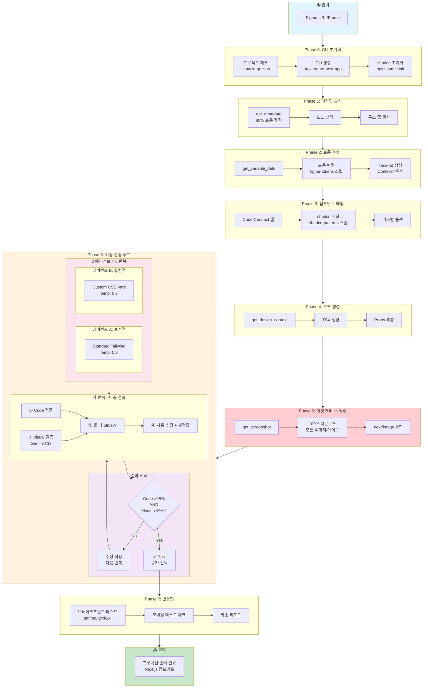
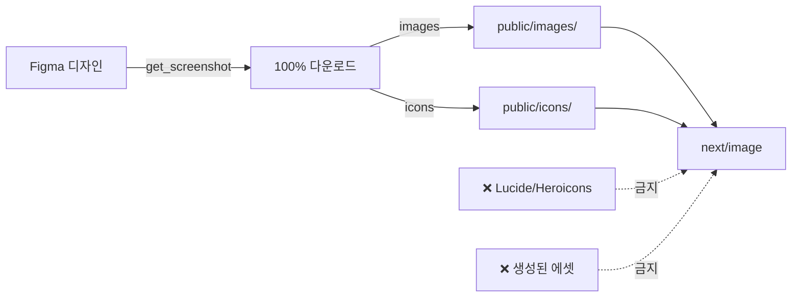
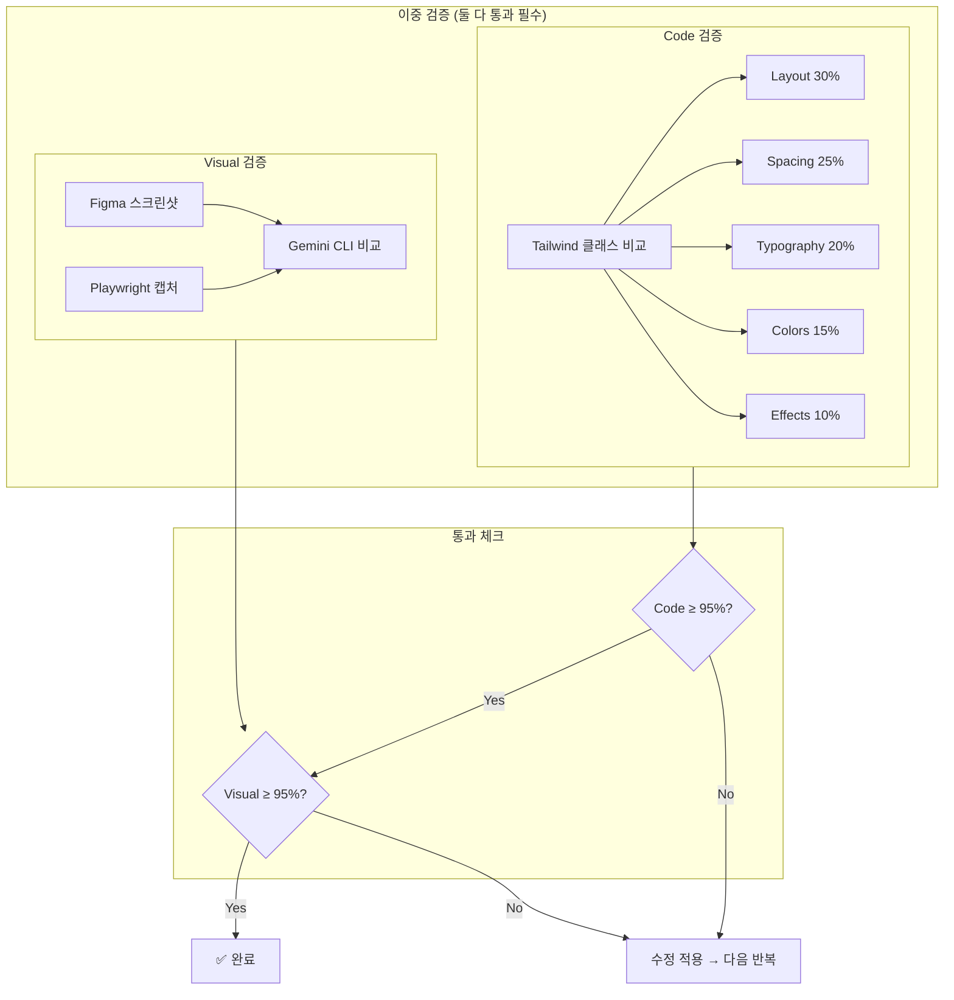
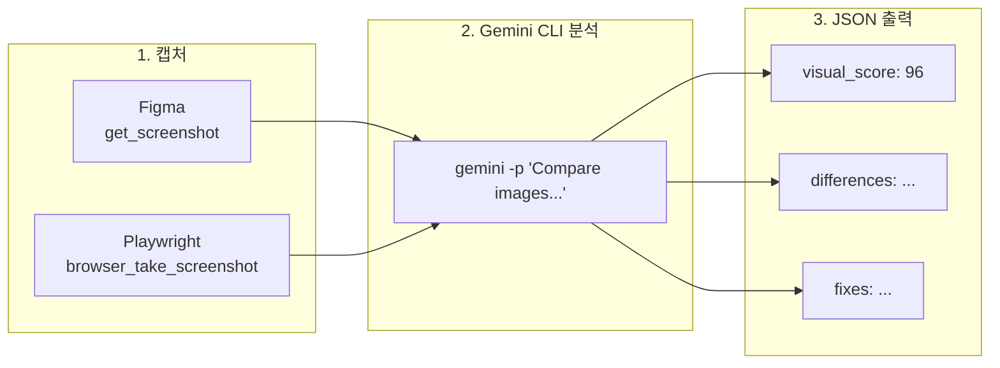
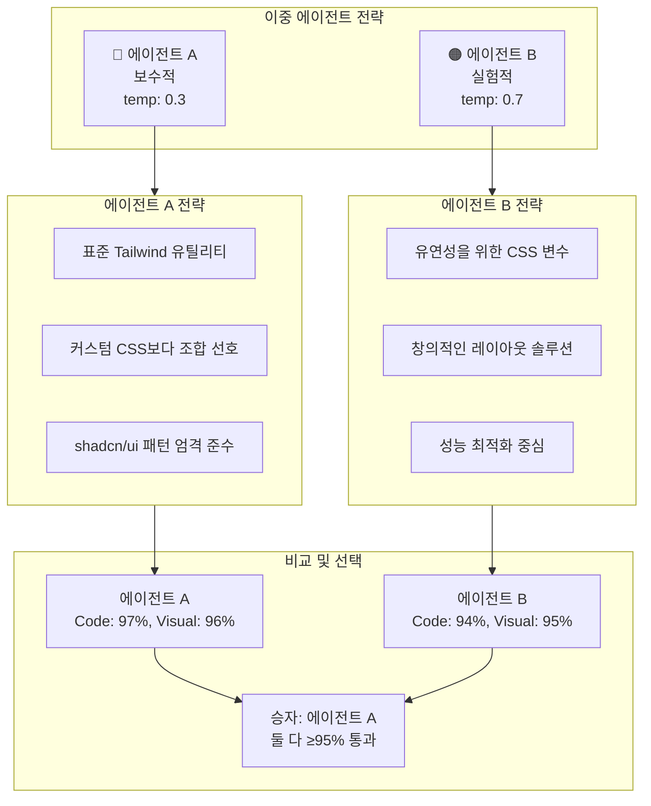

# Figma → Next.js Pro 컨버터 플로우

> **버전**: 2.2.0 | **에이전트**: figma-to-nextjs-pro | **모델**: Opus

---

## 개요

8단계 파이프라인과 이중 검증 루프를 통해 Figma 디자인을 **95%+ 정확도**의 Next.js 컴포넌트로 변환합니다.

**핵심 원칙:**
- Code 검증과 Visual 검증 **둘 다 95% 이상**이어야 통과
- 모든 이미지/아이콘은 Figma에서 **100% 다운로드** 필수
- Visual 비교는 **Gemini CLI**에 위임

---

## 메인 파이프라인 플로우



---

## Phase 요약

| Phase | 이름 | 주요 작업 | 토큰 영향 |
|-------|------|----------|----------|
| **0** | CLI 초기화 | 프로젝트 체크 → CLI 생성 → shadcn 초기화 | 97% 절감 |
| **1** | 디자인 분석 | get_metadata → 노드 선택 → 구조 맵 | 80% 절감 |
| **2** | 토큰 추출 | get_variable_defs → 변환 → Tailwind 생성 | 중간 |
| **3** | 컴포넌트 매핑 | Code Connect → shadcn 매칭 → 커스텀 플랜 | 낮음 |
| **4** | 코드 생성 | get_design_context → TSX → Props 추출 | 높음 |
| **5** | 에셋 처리 | get_screenshot → **100% 다운로드** → next/image | 중간 |
| **6** | 이중 검증 | 2 에이전트 × 5 반복 → 둘 다 ≥95% → 승자 선택 | 가변 |
| **7** | 반응형 | 브레이크포인트 테스트 → 모바일 퍼스트 → 리포트 | 낮음 |

---

## Phase 5: 에셋 다운로드 규칙

> **⚠️ CRITICAL**: 모든 이미지/아이콘은 반드시 Figma에서 100% 다운로드해야 합니다.

### 반드시 해야 할 것

- Figma에서 모든 이미지 에셋 다운로드
- Figma에서 모든 아이콘 다운로드 (SVG/PNG)
- `public/images/` 또는 `public/icons/`에 저장
- `next/image` 컴포넌트로 최적화 적용

### 절대 금지

- Lucide, Heroicons 등 대체 아이콘 라이브러리 사용 금지
- 임의로 이미지/아이콘 생성 금지
- Placeholder 이미지 사용 금지
- Figma 에셋 다운로드 스킵 금지



---

## Phase 6: 이중 검증 (Code + Visual)

**모든 반복에서 Code와 Visual 검증을 동시에 실행합니다** - Fallback이 아닌 필수입니다.

### 통과 조건 (둘 다 통과해야 함)

```
┌────────────────────────────────────────────────────┐
│              둘 다 95% 이상이어야 통과              │
├────────────────────────────────────────────────────┤
│                                                    │
│   Code ≥ 95%  AND  Visual ≥ 95%  →  ✅ 통과      │
│   Code < 95%  OR   Visual < 95%  →  ❌ 계속 반복  │
│                                                    │
└────────────────────────────────────────────────────┘
```

### 예시 시나리오

| Code | Visual | 결과 |
|------|--------|------|
| 97% | 96% | ✅ 통과 - 둘 다 ≥95% |
| 98% | 92% | ❌ 계속 (Visual 미달) |
| 93% | 97% | ❌ 계속 (Code 미달) |
| 94% | 94% | ❌ 계속 (둘 다 미달) |

---

### 이중 검증 플로우



---

### 왜 Visual 비교에 Gemini CLI를 사용하나요?

| 항목 | Claude | Gemini |
|------|--------|--------|
| 이미지 diff 정확도 | 좋음 | **우수** |
| 픽셀 단위 분석 | 제한적 | **강력** |
| 색상 매칭 | 근사치 | **정확** |
| 이미지 비용 | 높음 | **낮음** |

---

### Gemini CLI 명령어

```bash
gemini -p "이 두 UI 이미지를 비교하고 모든 차이점을 식별하세요:
1. 레이아웃/위치 차이
2. Spacing/padding/margin 이슈
3. 색상 불일치 (정확한 hex 값)
4. 타이포그래피 차이
5. 누락되거나 잘못된 요소
6. Border/shadow/effect 차이

각 카테고리를 0-100으로 점수화하고 구체적인 CSS 수정안을 제시하세요.

Reference: ./comparison/figma-reference.png
Implemented: ./comparison/implemented.png

JSON 형식으로 출력:
{
  \"visual_score\": number,
  \"categories\": {...},
  \"differences\": [...],
  \"fixes\": [...]
}"
```

---

### 검증 플로우 상세



---

## 자동 수정 레벨

| 레벨 | 카테고리 | 자동 수정 | 예시 |
|------|----------|----------|------|
| L1 | Spacing | ✅ 즉시 | p-5 → p-6 |
| L1 | Colors | ✅ 즉시 | blue-500 → blue-600 |
| L2 | Typography | ✅ 로그 | text-base → text-lg |
| L2 | Shadows | ✅ 로그 | shadow-sm → shadow-md |
| L3 | Layout | ⚠️ 승인 필요 | flex → grid |
| L4 | Structure | ❌ 수동 | 컴포넌트 분리 |

---

## 병렬 검증 상세



---

## 사용된 MCP 도구

| 도구 | Phase | 용도 |
|------|-------|------|
| `get_metadata` | P1 | 구조 분석 (토큰 절감) |
| `get_variable_defs` | P2 | 디자인 토큰 추출 |
| `get_code_connect_map` | P3 | 기존 매핑 조회 |
| `add_code_connect_map` | P3 | 새 매핑 등록 |
| `get_design_context` | P4 | 코드 생성용 전체 컨텍스트 |
| `get_screenshot` | P5, P6 | 이미지 & 시각적 비교 |
| `resolve-library-id` | P2, P4 | Context7 라이브러리 조회 |
| `get-library-docs` | P2, P4 | Context7 문서 |
| `browser_navigate` | P6 | Playwright: 개발 서버로 이동 |
| `browser_snapshot` | P6 | Playwright: DOM 스냅샷 |
| `browser_take_screenshot` | P6 | Playwright: 구현된 UI 캡처 |
| `browser_click` | P6 | Playwright: 인터랙션 테스트 |

---

## 빠른 명령어

```bash
# 전체 변환
@figma-to-nextjs-pro convert [FIGMA_URL]

# 개별 Phase 실행
@figma-to-nextjs-pro phase:0 init      # CLI 초기화
@figma-to-nextjs-pro phase:1 analyze   # 디자인 분석
@figma-to-nextjs-pro phase:2 tokens    # 토큰 추출
@figma-to-nextjs-pro phase:3 map       # 컴포넌트 매핑
@figma-to-nextjs-pro phase:4 generate  # 코드 생성
@figma-to-nextjs-pro phase:5 assets    # 에셋 처리
@figma-to-nextjs-pro phase:6 verify    # 이중 검증
@figma-to-nextjs-pro phase:7 responsive # 반응형 체크
```

---

## 출력 구조

```
src/
├── components/
│   ├── ui/              # shadcn/ui 컴포넌트
│   ├── layout/          # Header, Footer, Nav
│   ├── sections/        # 페이지 섹션
│   └── [feature]/       # 기능별 컴포넌트
├── app/
│   ├── layout.tsx
│   ├── page.tsx
│   └── globals.css
├── public/
│   ├── images/          # Figma에서 다운로드한 이미지
│   └── icons/           # Figma에서 다운로드한 아이콘
├── styles/
│   └── variables.css    # Figma 토큰
└── lib/
    └── utils.ts         # cn() 유틸리티
```

---

## PRO vs Modular 비교

| 기능 | Modular | PRO |
|------|---------|-----|
| **모델** | Sonnet | Opus |
| **검증** | 단일 에이전트 | 이중 에이전트 (병렬) |
| **최대 반복** | 5 | 5 × 2 에이전트 |
| **전략** | 표준만 | 보수적 + 실험적 |
| **결과 선택** | 단일 결과 | 둘 중 최고 |
| **사용 사례** | 간단한 컴포넌트 | 복잡한 페이지, 프로덕션 |

---

## 종료 조건

```yaml
success:
  - code_score >= 95% AND visual_score >= 95%  # 둘 다 통과 필수
  - all_categories >= 90%
  - completion_marker: "## ✓ VERIFICATION COMPLETE"

stop:
  - 두 에이전트 모두 최대 반복 도달 (각 5회)
  - 두 에이전트 모두 2회 연속 개선 없음
```

---

*figma-to-nextjs-pro.md v2.2.0에서 생성됨 | 최종 업데이트: 2026-01-23*
