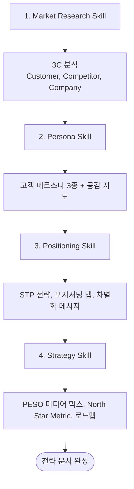

# Phase 1: 전략 수립 (Research & Strategy)

## 개요

Phase 1은 마케팅의 기반을 다지는 단계입니다. 시장 분석부터 전략 수립까지 4개의 스킬이 순차적으로 실행됩니다.



## Skill 1: Market Research

### 프레임워크: 3C 분석

| 요소 | 분석 내용 | 산출물 |
|------|----------|--------|
| **Customer** | 시장 규모, 성장률, 고객 니즈 | 시장 개요 문서 |
| **Competitor** | 경쟁사 분석, 가격/기능 비교 | 경쟁사 매트릭스 |
| **Company** | 자사 강점/약점, 차별화 요소 | SWOT 분석 |

### 산출물

```yaml
output:
  - 3C 분석 리포트
  - 경쟁사 비교표
  - 시장 기회 영역
  - SWOT 분석
```

## Skill 2: Persona

### 프레임워크: 공감 지도 (Empathy Map)

```
┌─────────────────────────────────────────┐
│                생각과 느낌                │
│    무엇을 중요하게 생각하는가?              │
│    무엇이 걱정되는가?                      │
├───────────────────┬─────────────────────┤
│      듣는 것       │       보는 것        │
│   친구/동료/미디어  │    환경/시장/경쟁사   │
├───────────────────┼─────────────────────┤
│      말과 행동     │                     │
│   태도/외적 행동   │    Pain / Gain      │
└───────────────────┴─────────────────────┘
```

### 페르소나 템플릿

```yaml
persona:
  name: "김OO"
  age: "30-35세"
  job: "스타트업 개발자"

  goals:
    - 빠른 문제 해결
    - 업무 효율화

  frustrations:
    - 기존 솔루션 비용
    - 복잡한 설정

  quote: "간단하고 저렴한 게 최고야"

  channels:
    - GitHub
    - 기술 블로그
    - 슬랙 커뮤니티
```

### 산출물

```yaml
output:
  - 메인 페르소나 3종
  - 각 페르소나별 공감 지도
  - 구매 여정 요약
  - 메시징 우선순위
```

## Skill 3: Positioning

### 프레임워크: STP

| 단계 | 활동 | 산출물 |
|-----|------|--------|
| **Segmentation** | 시장 세분화 | 세그먼트 정의 |
| **Targeting** | 타겟 선정 | 우선순위 세그먼트 |
| **Positioning** | 포지셔닝 | 차별화 메시지 |

### 포지셔닝 맵

```
         높은 가격
             │
    프리미엄   │   엔터프라이즈
    복잡함     │   복잡함
             │
───────────────┼───────────────
             │
    저가형     │   ★ 우리 제품
    단순함     │   합리적 가격 + 단순함
             │
         낮은 가격
```

### 포지셔닝 스테이트먼트 템플릿

```
[타겟 고객]을 위한
[제품/서비스 카테고리]로서
[핵심 차별점]을 제공합니다.

[경쟁사]와 달리
우리는 [고유한 가치]를 제공합니다.
```

### 산출물

```yaml
output:
  - STP 분석 문서
  - 포지셔닝 맵
  - 포지셔닝 스테이트먼트
  - 차별화 메시지 3가지
```

## Skill 4: Strategy

### 프레임워크: PESO 미디어 믹스

| 미디어 유형 | 설명 | 예시 |
|-----------|------|------|
| **Paid** | 유료 광고 | Google Ads, Meta Ads |
| **Earned** | 획득 미디어 | PR, 리뷰, 입소문 |
| **Shared** | 공유 미디어 | 소셜미디어, 커뮤니티 |
| **Owned** | 자사 미디어 | 블로그, 뉴스레터 |

### North Star Metric (NSM)

```yaml
nsm:
  metric: "주간 활성 사용자(WAU)"
  target: "런칭 후 3개월 내 1,000 WAU"

  supporting_metrics:
    - 신규 가입률
    - 활성화율 (첫 핵심 액션)
    - 리텐션율 (7일)
    - 추천율 (NPS)
```

### 로드맵 템플릿

```yaml
roadmap:
  month_1:
    focus: "인지도"
    activities:
      - Product Hunt 런칭
      - 개발자 커뮤니티 소개
    kpi: "1,000명 웹사이트 방문"

  month_2:
    focus: "전환"
    activities:
      - 무료체험 최적화
      - 온보딩 이메일
    kpi: "100명 무료체험 가입"

  month_3:
    focus: "유료 전환"
    activities:
      - 유료 전환 캠페인
      - 케이스 스터디
    kpi: "30명 유료 고객"
```

### 산출물

```yaml
output:
  - PESO 미디어 믹스 전략
  - North Star Metric 정의
  - 3개월 마케팅 로드맵
  - 채널별 예산 배분
  - 핵심 KPI 목록
```

## Phase 1 체크리스트

- [ ] 3C 분석 완료
- [ ] 페르소나 3종 생성
- [ ] 포지셔닝 스테이트먼트 확정
- [ ] NSM 정의
- [ ] 3개월 로드맵 수립
- [ ] 채널별 예산 배분
