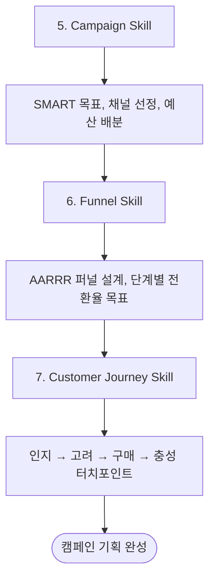

# Phase 2: 캠페인 기획 (Campaign Planning)

## 개요

Phase 2는 전략을 실행 가능한 캠페인으로 변환하는 단계입니다. 캠페인 설계, 퍼널 구축, 고객 여정 맵핑을 통해 구체적인 실행 계획을 수립합니다.



## Skill 5: Campaign

### 프레임워크: SMART Goals

| 요소 | 설명 | 예시 |
|-----|------|------|
| **Specific** | 구체적 | "웹사이트 트래픽 증가"가 아닌 "유기적 검색 트래픽 30% 증가" |
| **Measurable** | 측정 가능 | Google Analytics로 추적 가능 |
| **Achievable** | 달성 가능 | 현재 대비 현실적인 목표 |
| **Relevant** | 관련성 | 비즈니스 목표와 연결 |
| **Time-bound** | 기한 설정 | 3개월 내 달성 |

### 캠페인 기획서 템플릿

```yaml
campaign:
  name: "Q1 런칭 캠페인"
  period: "2025.01.01 - 2025.03.31"

  goals:
    primary: "신규 가입자 500명"
    secondary: "브랜드 인지도 30% 상승"

  target_audience:
    primary: "스타트업 개발자"
    secondary: "DevOps 엔지니어"

  channels:
    paid:
      - platform: "Google Ads"
        budget: "$1,000/월"
        objective: "검색 전환"
      - platform: "LinkedIn Ads"
        budget: "$500/월"
        objective: "B2B 리드"

    organic:
      - platform: "Product Hunt"
        objective: "런칭 노출"
      - platform: "Dev.to"
        objective: "콘텐츠 마케팅"

  budget:
    total: "$5,000"
    breakdown:
      paid_ads: "60%"
      content: "25%"
      tools: "15%"
```

### 채널 선정 매트릭스

| 채널 | 목적 | 타겟 적합도 | 비용 | 우선순위 |
|-----|------|-----------|------|---------|
| Google Ads | 검색 의도 캡처 | 높음 | 중간 | 1순위 |
| LinkedIn | B2B 타겟팅 | 높음 | 높음 | 2순위 |
| Product Hunt | 얼리어답터 | 높음 | 무료 | 1순위 |
| Twitter/X | 커뮤니티 | 중간 | 무료 | 3순위 |

### 산출물

```yaml
output:
  - SMART 목표 정의서
  - 캠페인 기획서
  - 채널별 예산 배분표
  - 캠페인 캘린더
```

## Skill 6: Funnel (AARRR)

### 프레임워크: Pirate Metrics (AARRR)

```
┌─────────────────────────────────────────────────┐
│  Acquisition (획득)                              │
│  사용자를 어떻게 찾는가?                          │
│  → 웹사이트 방문, 앱 설치                         │
├─────────────────────────────────────────────────┤
│  Activation (활성화)                             │
│  첫 번째 "아하!" 경험                             │
│  → 회원가입, 첫 핵심 기능 사용                     │
├─────────────────────────────────────────────────┤
│  Retention (유지)                                │
│  사용자가 돌아오는가?                             │
│  → 주간/월간 활성 사용                            │
├─────────────────────────────────────────────────┤
│  Revenue (수익)                                  │
│  어떻게 수익을 창출하는가?                         │
│  → 유료 전환, 구독                               │
├─────────────────────────────────────────────────┤
│  Referral (추천)                                 │
│  사용자가 다른 사람을 데려오는가?                   │
│  → 친구 초대, 리뷰 작성                           │
└─────────────────────────────────────────────────┘
```

### 퍼널 설계 템플릿

```yaml
funnel:
  acquisition:
    channels:
      - "Google 검색 (SEO)"
      - "Google Ads"
      - "Product Hunt"
    metrics:
      - "웹사이트 방문자 수"
      - "채널별 트래픽"
    target: "월 10,000 방문자"
    conversion_rate: "100%"

  activation:
    triggers:
      - "회원가입 완료"
      - "첫 API 키 생성"
      - "첫 모니터링 데이터 수신"
    metrics:
      - "가입 전환율"
      - "활성화율"
    target: "500 가입자/월"
    conversion_rate: "5%"

  retention:
    triggers:
      - "7일 후 재방문"
      - "주간 리포트 확인"
    metrics:
      - "D7 리텐션"
      - "WAU"
    target: "40% D7 리텐션"
    conversion_rate: "40%"

  revenue:
    triggers:
      - "유료 플랜 업그레이드"
      - "추가 기능 구매"
    metrics:
      - "유료 전환율"
      - "ARPU"
    target: "10% 유료 전환"
    conversion_rate: "10%"

  referral:
    triggers:
      - "친구 초대"
      - "리뷰 작성"
      - "소셜 공유"
    metrics:
      - "K-factor"
      - "NPS"
    target: "NPS 50+"
    conversion_rate: "20%"
```

### 산출물

```yaml
output:
  - AARRR 퍼널 설계서
  - 단계별 전환율 목표
  - 핵심 이벤트 정의
  - 퍼널 최적화 우선순위
```

## Skill 7: Customer Journey

### 프레임워크: 고객 여정 맵

```
인지 → 고려 → 결정 → 구매 → 사용 → 충성
```

### 고객 여정 맵 템플릿

```yaml
journey:
  awareness:
    stage: "인지"
    user_goal: "문제 인식"
    touchpoints:
      - "검색 결과"
      - "소셜미디어 광고"
      - "블로그 콘텐츠"
    emotions: "호기심, 불편함"
    actions:
      - "검색"
      - "광고 클릭"
    opportunities:
      - "SEO 콘텐츠 최적화"
      - "페인포인트 타겟 광고"

  consideration:
    stage: "고려"
    user_goal: "솔루션 비교"
    touchpoints:
      - "랜딩페이지"
      - "가격 페이지"
      - "리뷰 사이트"
    emotions: "비교, 평가"
    actions:
      - "경쟁사 비교"
      - "리뷰 읽기"
    opportunities:
      - "비교 콘텐츠"
      - "케이스 스터디"

  decision:
    stage: "결정"
    user_goal: "최종 선택"
    touchpoints:
      - "무료체험"
      - "데모"
      - "영업팀 상담"
    emotions: "확신, 불안"
    actions:
      - "무료체험 시작"
      - "데모 요청"
    opportunities:
      - "리스크 제거 (환불 보장)"
      - "사회적 증거"

  purchase:
    stage: "구매"
    user_goal: "결제 완료"
    touchpoints:
      - "결제 페이지"
      - "환영 이메일"
    emotions: "기대, 흥분"
    actions:
      - "결제"
      - "계정 설정"
    opportunities:
      - "원클릭 결제"
      - "즉각적 가치 전달"

  usage:
    stage: "사용"
    user_goal: "가치 경험"
    touchpoints:
      - "제품 대시보드"
      - "온보딩 가이드"
      - "고객 지원"
    emotions: "성취감, 좌절"
    actions:
      - "핵심 기능 사용"
      - "문제 해결"
    opportunities:
      - "프로그레시브 온보딩"
      - "인앱 가이드"

  loyalty:
    stage: "충성"
    user_goal: "지속적 가치"
    touchpoints:
      - "뉴스레터"
      - "커뮤니티"
      - "로열티 프로그램"
    emotions: "만족, 소속감"
    actions:
      - "추천"
      - "업그레이드"
    opportunities:
      - "VIP 프로그램"
      - "앰배서더 프로그램"
```

### 터치포인트 매트릭스

| 여정 단계 | 온라인 터치포인트 | 오프라인 터치포인트 | 핵심 감정 |
|----------|------------------|-------------------|----------|
| 인지 | 검색, 소셜, 광고 | 컨퍼런스, 밋업 | 호기심 |
| 고려 | 랜딩페이지, 블로그 | 세미나 | 비교/평가 |
| 결정 | 데모, 무료체험 | 상담 | 확신/불안 |
| 구매 | 결제 페이지 | - | 기대 |
| 사용 | 제품, 온보딩 | - | 성취/좌절 |
| 충성 | 커뮤니티, 뉴스레터 | 유저 모임 | 만족/소속 |

### 산출물

```yaml
output:
  - 고객 여정 맵
  - 터치포인트 매트릭스
  - 단계별 콘텐츠 전략
  - 감정 곡선 분석
  - 개선 기회 리스트
```

## Phase 2 체크리스트

- [ ] SMART 목표 정의 완료
- [ ] 캠페인 기획서 작성
- [ ] 채널별 예산 배분
- [ ] AARRR 퍼널 설계
- [ ] 단계별 전환율 목표 설정
- [ ] 고객 여정 맵 완성
- [ ] 터치포인트별 콘텐츠 계획
