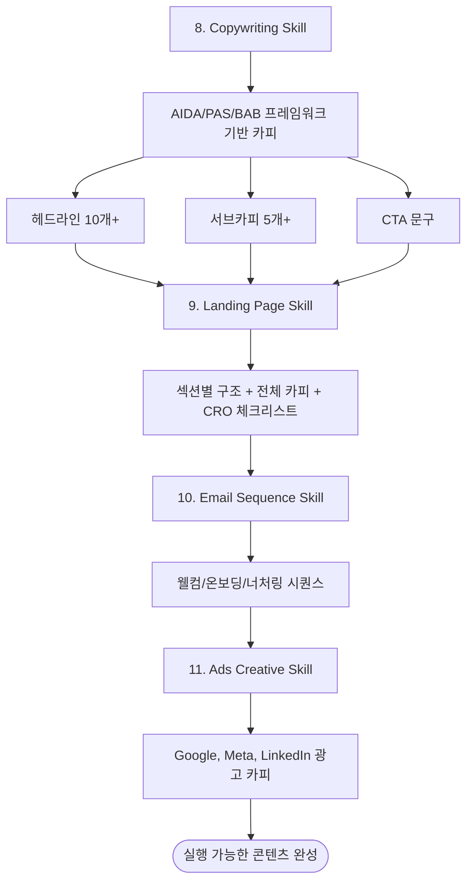

# Phase 3: 콘텐츠 제작 (Content Creation)

## 개요

Phase 3은 실제 마케팅 콘텐츠를 제작하는 단계입니다. 카피라이팅, 랜딩페이지, 이메일 시퀀스, 광고 크리에이티브를 생성합니다.



## Skill 8: Copywriting

### 프레임워크 비교

| 프레임워크 | 구조 | 적합한 용도 |
|-----------|------|------------|
| **AIDA** | Attention → Interest → Desire → Action | 랜딩페이지, 이메일, 긴 광고 |
| **PAS** | Problem → Agitation → Solution | 짧은 광고, 긴급 제안 |
| **BAB** | Before → After → Bridge | 변화 강조, 케이스 스터디 |
| **FAB** | Features → Advantages → Benefits | 제품 설명, 기능 소개 |
| **4P's** | Promise → Picture → Proof → Push | 세일즈 레터 |

### AIDA 프레임워크 상세

```yaml
aida:
  attention:
    purpose: "주의 끌기"
    techniques:
      - "충격적인 통계"
      - "도발적인 질문"
      - "대담한 주장"
    example: "당신의 서버 다운타임이 매년 $50,000를 날리고 있습니다"

  interest:
    purpose: "관심 유발"
    techniques:
      - "스토리텔링"
      - "관련성 연결"
      - "문제 공감"
    example: "3AM에 알림이 울릴 때마다 심장이 뛰지 않나요?"

  desire:
    purpose: "욕구 자극"
    techniques:
      - "혜택 나열"
      - "사회적 증거"
      - "미래 비전"
    example: "실시간 모니터링으로 문제를 10분 전에 감지하세요"

  action:
    purpose: "행동 유도"
    techniques:
      - "명확한 CTA"
      - "긴급성"
      - "리스크 제거"
    example: "14일 무료 체험 시작하기 (신용카드 불필요)"
```

### PAS 프레임워크 상세

```yaml
pas:
  problem:
    purpose: "문제 제시"
    example: "서버 모니터링에 Datadog 월 $300 쓰고 계신가요?"

  agitation:
    purpose: "문제 확대"
    example: "스타트업에게 그 돈이면 개발자 1명 점심값입니다"

  solution:
    purpose: "해결책 제시"
    example: "월 $29로 동일한 기능. 10배 저렴한 API 모니터링"
```

### 헤드라인 템플릿 (10가지)

```yaml
headline_templates:
  - type: "숫자형"
    template: "[숫자]가지 방법으로 [결과]를 달성하세요"
    example: "5분 만에 API 모니터링 설정 완료"

  - type: "질문형"
    template: "[타겟]이라면 [문제]에 지치셨죠?"
    example: "개발자라면 3AM 알림에 지치셨죠?"

  - type: "도발형"
    template: "[기존 방식]을 버리세요"
    example: "비싼 모니터링 툴을 버리세요"

  - type: "비교형"
    template: "[경쟁사] vs [우리]: [차이점]"
    example: "Datadog 가격의 10%로 핵심 기능 전부"

  - type: "증거형"
    template: "[숫자명]이 선택한 [제품]"
    example: "1,000개 스타트업이 선택한 API 모니터링"

  - type: "혜택형"
    template: "[시간] 만에 [혜택]"
    example: "5분 설정으로 서버 다운타임 70% 감소"

  - type: "두려움형"
    template: "[부정적 결과]가 걱정되시나요?"
    example: "고객 이탈이 걱정되시나요?"

  - type: "스토리형"
    template: "어떻게 [주체]가 [결과]를 달성했는가"
    example: "어떻게 우리가 모니터링 비용을 90% 절감했는가"

  - type: "단순형"
    template: "[제품]: [한 줄 가치]"
    example: "ApiWatch: 개발자를 위한 합리적인 모니터링"

  - type: "긴급형"
    template: "[기한] 전에 [행동]하세요"
    example: "이번 주까지 가입하면 평생 50% 할인"
```

### CTA 문구 템플릿

```yaml
cta_templates:
  primary:
    - "무료로 시작하기"
    - "14일 체험 시작"
    - "지금 가입하기"
    - "무료 데모 신청"

  secondary:
    - "더 알아보기"
    - "가격 확인하기"
    - "사례 보기"

  urgency:
    - "오늘만 50% 할인"
    - "남은 자리 [X]개"
    - "이번 주까지만"
```

### 산출물

```yaml
output:
  - 헤드라인 10개 (프레임워크별)
  - 서브카피 5개
  - CTA 문구 5개
  - 본문 카피 (AIDA 구조)
```

## Skill 9: Landing Page

### CRO 체크리스트

```yaml
cro_checklist:
  above_the_fold:
    - "3초 내 가치 제안 명확"
    - "메인 헤드라인 주목도"
    - "CTA 버튼 가시성"
    - "히어로 이미지/영상 품질"

  trust:
    - "고객사 로고"
    - "사용자 리뷰/평점"
    - "케이스 스터디"
    - "보안 인증 배지"
    - "언론 노출"

  cta:
    - "단일 CTA (여러 개 X)"
    - "버튼 색상 대비"
    - "액션 지향 문구"
    - "페이지 내 반복"

  form:
    - "필드 최소화 (3-5개)"
    - "실시간 유효성 검사"
    - "프라이버시 정책 링크"

  technical:
    - "3초 이내 로딩"
    - "모바일 최적화"
    - "브라우저 호환성"

  psychology:
    - "긴급성/희소성 요소"
    - "손실 회피 메시지"
    - "사회적 증거"
```

### 랜딩페이지 섹션 구조

```yaml
lp_structure:
  hero:
    elements:
      - headline: "메인 가치 제안"
      - subheadline: "보조 설명"
      - cta: "메인 CTA 버튼"
      - visual: "제품 스크린샷/데모 영상"

  problem:
    elements:
      - headline: "이런 문제 겪고 계시죠?"
      - pain_points: "3가지 페인포인트"

  solution:
    elements:
      - headline: "이렇게 해결합니다"
      - features: "3가지 핵심 기능"
      - benefits: "각 기능의 혜택"

  social_proof:
    elements:
      - testimonials: "고객 후기 3개"
      - logos: "고객사 로고"
      - stats: "성과 수치"

  how_it_works:
    elements:
      - steps: "3단계 프로세스"
      - visuals: "각 단계 시각화"

  pricing:
    elements:
      - plans: "가격 플랜"
      - comparison: "플랜 비교표"
      - guarantee: "환불 보장"

  faq:
    elements:
      - questions: "자주 묻는 질문 5-7개"

  final_cta:
    elements:
      - headline: "지금 시작하세요"
      - cta: "메인 CTA 반복"
      - reassurance: "리스크 제거 문구"
```

### 산출물

```yaml
output:
  - 랜딩페이지 와이어프레임
  - 섹션별 전체 카피
  - CRO 체크리스트 완료본
  - 모바일 버전 고려사항
```

## Skill 10: Email Sequence

### 이메일 시퀀스 유형

| 유형 | 목적 | 이메일 수 | 기간 |
|-----|------|----------|------|
| 웰컴 시퀀스 | 신규 가입자 온보딩 | 3-5통 | 1주 |
| 온보딩 시퀀스 | 활성화 유도 | 5-7통 | 2주 |
| 너처링 시퀀스 | 리드 교육 | 5-10통 | 4주 |
| 판매 시퀀스 | 전환 유도 | 3-5통 | 1주 |
| 장바구니 리마인더 | 이탈 복구 | 3통 | 3일 |

### 온보딩 이메일 시퀀스 템플릿

```yaml
onboarding_sequence:
  email_1:
    timing: "가입 직후"
    subject: "환영합니다! 시작하기 가이드"
    goal: "첫 인상 & 빠른 성공"
    content:
      - "환영 메시지"
      - "빠른 시작 가이드 (3단계)"
      - "CTA: 대시보드로 이동"

  email_2:
    timing: "D+1"
    subject: "첫 [핵심 액션] 완료하셨나요?"
    goal: "활성화 촉진"
    content:
      - "핵심 기능 소개"
      - "단계별 가이드"
      - "CTA: 첫 액션 완료하기"

  email_3:
    timing: "D+3"
    subject: "[기능명]으로 [혜택] 달성하기"
    goal: "가치 발견"
    content:
      - "고급 기능 소개"
      - "사용 사례"
      - "CTA: 기능 사용해보기"

  email_4:
    timing: "D+5"
    subject: "[고객명]은 이렇게 성공했습니다"
    goal: "사회적 증거"
    content:
      - "성공 사례 스토리"
      - "구체적 성과 수치"
      - "CTA: 나도 시작하기"

  email_5:
    timing: "D+7"
    subject: "무료체험 며칠 남았어요"
    goal: "전환 유도"
    content:
      - "체험 기간 알림"
      - "지금까지 사용 요약"
      - "업그레이드 혜택"
      - "CTA: 지금 업그레이드"
```

### 이메일 카피 공식

```yaml
email_formula:
  subject_line:
    techniques:
      - "호기심 유발: '이것 때문에 개발자들이..'"
      - "개인화: '[이름]님, 특별 제안'"
      - "긴급성: '오늘까지만 50% 할인'"
      - "질문형: '아직도 수동으로 하시나요?'"

  preview_text:
    purpose: "열람률 향상"
    example: "5분이면 설정 끝 →"

  body:
    structure:
      - "인사/연결고리"
      - "핵심 메시지"
      - "증거/사례"
      - "CTA"
      - "P.S. (선택)"
```

### 산출물

```yaml
output:
  - 시퀀스 타임라인
  - 이메일별 전체 카피 (제목, 본문, CTA)
  - A/B 테스트 변형 제안
  - 발송 최적 시간 제안
```

## Skill 11: Ads Creative

### 플랫폼별 광고 규격

| 플랫폼 | 광고 유형 | 헤드라인 | 설명문 |
|-------|----------|---------|--------|
| Google Search | 검색 광고 | 30자 x 3 | 90자 x 2 |
| Google Display | 디스플레이 | 30자 | 90자 |
| Meta (FB/IG) | 피드 광고 | 40자 | 125자 |
| LinkedIn | 스폰서드 콘텐츠 | 70자 | 150자 |

### Google Ads 템플릿

```yaml
google_ads:
  responsive_search:
    headlines:  # 30자 이내, 15개까지
      - "API 모니터링 월 $29"
      - "5분 설정 완료"
      - "Datadog 대안"
      - "14일 무료 체험"
      - "실시간 알림 시스템"

    descriptions:  # 90자 이내, 4개까지
      - "스타트업을 위한 합리적인 API 모니터링. 복잡한 설정 없이 5분 만에 시작하세요."
      - "서버 다운타임 70% 감소. 1,000개 스타트업이 선택한 모니터링 솔루션."

    keywords:
      - "api monitoring"
      - "server monitoring tool"
      - "datadog alternative"
      - "cheap api monitoring"
```

### Meta Ads 템플릿

```yaml
meta_ads:
  feed_ad:
    primary_text:  # 125자
      hook: "3AM 서버 다운 알림에 지치셨나요?"
      body: "월 $29로 실시간 API 모니터링. 문제 발생 10분 전 알림으로 야근 끝."
      cta: "14일 무료 체험 →"

    headline: "합리적인 API 모니터링"  # 40자

    link_description: "무료로 시작하기"

    creative_direction:
      - "제품 대시보드 스크린샷"
      - "Before/After 비교"
      - "숫자 강조 (70% 감소)"
```

### LinkedIn Ads 템플릿

```yaml
linkedin_ads:
  sponsored_content:
    intro_text:  # 150자
      "DevOps 팀의 야근을 줄이는 방법. 월 $29의 API 모니터링으로 서버 장애를 미리 감지하세요. 1,000개 스타트업이 선택했습니다."

    headline: "스타트업을 위한 합리적인 API 모니터링"  # 70자

    targeting:
      job_titles:
        - "DevOps Engineer"
        - "Backend Developer"
        - "CTO"
      company_size: "1-200"
      industries:
        - "Software & Tech"
        - "Startups"
```

### 산출물

```yaml
output:
  - Google Ads 카피 (헤드라인 15개 + 설명문 4개)
  - Meta Ads 카피 (피드용 3세트)
  - LinkedIn Ads 카피 (2세트)
  - 키워드 리스트
  - 타겟팅 제안
```

## Phase 3 체크리스트

- [ ] 헤드라인 10개+ 생성
- [ ] 랜딩페이지 전체 카피 완료
- [ ] CRO 체크리스트 검토
- [ ] 온보딩 이메일 시퀀스 5통
- [ ] Google/Meta/LinkedIn 광고 카피
- [ ] A/B 테스트 변형 준비
