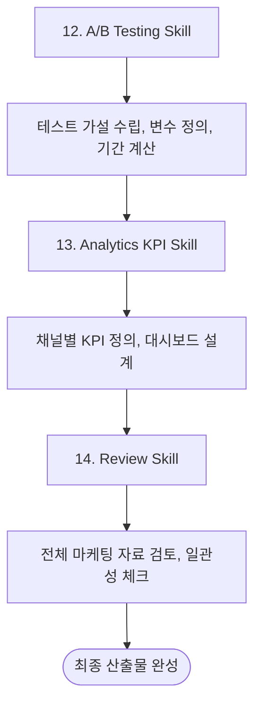

# Phase 4: 최적화 & 분석 (Optimization & Analytics)

## 개요

Phase 4는 마케팅 성과를 측정하고 최적화하는 단계입니다. A/B 테스트 설계, KPI 대시보드 구축, 전체 리뷰를 통해 지속적인 개선을 추진합니다.



## Skill 12: A/B Testing

### 프레임워크: 가설 기반 테스트

```yaml
hypothesis_template:
  format: "만약 [변수]를 [변경]하면, [지표]가 [예상 변화]할 것이다. 왜냐하면 [근거]이기 때문이다."

  example:
    hypothesis: "만약 CTA 버튼 색상을 파란색에서 주황색으로 변경하면, 클릭률이 15% 상승할 것이다. 왜냐하면 주황색이 페이지에서 더 눈에 띄기 때문이다."

    variables:
      independent: "CTA 버튼 색상"
      dependent: "클릭률"

    control: "파란색 버튼"
    variant: "주황색 버튼"
```

### A/B 테스트 설계 템플릿

```yaml
ab_test:
  name: "CTA 문구 테스트"

  hypothesis:
    statement: "명확한 혜택 중심 CTA가 일반적인 CTA보다 전환율이 높을 것이다"
    expected_lift: "15%"

  variants:
    control:
      name: "A (현재)"
      element: "무료로 시작하기"
    variant:
      name: "B (테스트)"
      element: "14일 무료 체험 시작"

  metrics:
    primary: "버튼 클릭률"
    secondary:
      - "가입 완료율"
      - "이탈률"

  traffic:
    split: "50/50"
    sample_size: "각 변형당 1,000명"
    duration: "2주"

  statistical:
    confidence_level: "95%"
    minimum_detectable_effect: "10%"
```

### 테스트 우선순위 매트릭스

| 테스트 요소 | 영향도 | 구현 난이도 | 우선순위 |
|-----------|--------|-----------|---------|
| 헤드라인 | 높음 | 낮음 | 1순위 |
| CTA 버튼 | 높음 | 낮음 | 1순위 |
| 가격 표시 | 높음 | 낮음 | 2순위 |
| 이미지/비디오 | 중간 | 중간 | 3순위 |
| 폼 필드 수 | 높음 | 낮음 | 2순위 |
| 색상 | 낮음 | 낮음 | 4순위 |
| 레이아웃 | 중간 | 높음 | 4순위 |

### 샘플 사이즈 계산

```yaml
sample_size_calculator:
  inputs:
    baseline_conversion_rate: "3%"
    minimum_detectable_effect: "20%"  # 3% → 3.6%
    statistical_power: "80%"
    confidence_level: "95%"

  output:
    sample_per_variant: "~5,000"
    total_sample: "~10,000"

  duration_estimate:
    daily_traffic: "500 방문자"
    required_days: "20일"
```

### 테스트 실행 체크리스트

```yaml
test_checklist:
  pre_test:
    - "가설 문서화 완료"
    - "성공 기준 정의"
    - "샘플 사이즈 계산"
    - "테스트 기간 설정"
    - "변형 디자인/개발 완료"
    - "트래킹 코드 설치"

  during_test:
    - "동일한 트래픽 분배 확인"
    - "외부 요인 영향 모니터링"
    - "중간 결과 Peeking 금지"
    - "기술적 이슈 모니터링"

  post_test:
    - "통계적 유의성 확인"
    - "세그먼트별 분석"
    - "결과 문서화"
    - "승자 구현"
    - "다음 테스트 계획"
```

### 산출물

```yaml
output:
  - A/B 테스트 계획서 (가설, 변형, 지표)
  - 샘플 사이즈 계산
  - 테스트 일정
  - 결과 분석 템플릿
```

## Skill 13: Analytics KPI

### 채널별 KPI 정의

```yaml
channel_kpis:
  paid_search:
    acquisition:
      - "노출수 (Impressions)"
      - "클릭수 (Clicks)"
      - "CTR (Click-Through Rate)"
    cost:
      - "CPC (Cost Per Click)"
      - "CPA (Cost Per Acquisition)"
      - "ROAS (Return on Ad Spend)"
    conversion:
      - "전환수"
      - "전환율"

  paid_social:
    reach:
      - "도달 (Reach)"
      - "빈도 (Frequency)"
    engagement:
      - "좋아요/댓글/공유"
      - "참여율"
    conversion:
      - "링크 클릭"
      - "랜딩페이지 전환"
      - "CPL (Cost Per Lead)"

  email:
    delivery:
      - "발송수"
      - "도달율"
      - "바운스율"
    engagement:
      - "오픈율"
      - "클릭율"
      - "구독 취소율"
    conversion:
      - "이메일 전환율"
      - "매출 기여"

  organic:
    traffic:
      - "세션수"
      - "페이지뷰"
      - "체류시간"
    seo:
      - "검색 노출"
      - "평균 순위"
      - "백링크 수"
    conversion:
      - "목표 완료수"
      - "전환율"
```

### 퍼널별 KPI

```yaml
funnel_kpis:
  acquisition:
    metrics:
      - "웹사이트 방문자"
      - "신규 방문자 비율"
      - "트래픽 소스별 분포"
    benchmark:
      visitor_growth: "월 10%+"

  activation:
    metrics:
      - "가입 전환율"
      - "첫 핵심 액션 완료율"
      - "시간 to 첫 액션"
    benchmark:
      signup_rate: "3-5%"
      activation_rate: "40%+"

  retention:
    metrics:
      - "D1/D7/D30 리텐션"
      - "WAU/MAU 비율"
      - "이탈율"
    benchmark:
      d7_retention: "30%+"
      wau_mau_ratio: "25%+"

  revenue:
    metrics:
      - "유료 전환율"
      - "ARPU"
      - "LTV"
      - "MRR/ARR"
    benchmark:
      paid_conversion: "5-10%"

  referral:
    metrics:
      - "NPS"
      - "추천율 (K-factor)"
      - "바이럴 계수"
    benchmark:
      nps: "50+"
```

### KPI 대시보드 설계

```yaml
dashboard:
  overview:
    title: "마케팅 대시보드"
    refresh: "실시간/일간"

    key_metrics:
      row_1:
        - metric: "총 방문자"
          type: "숫자"
          comparison: "전주 대비"
        - metric: "가입자"
          type: "숫자"
          comparison: "전주 대비"
        - metric: "전환율"
          type: "퍼센트"
          comparison: "전주 대비"
        - metric: "CAC"
          type: "금액"
          comparison: "목표 대비"

    charts:
      - title: "일별 트래픽 추이"
        type: "라인 차트"
        dimensions: ["날짜"]
        metrics: ["방문자", "가입자"]

      - title: "채널별 트래픽"
        type: "파이 차트"
        dimensions: ["소스/미디엄"]
        metrics: ["세션"]

      - title: "퍼널 전환율"
        type: "퍼널 차트"
        stages: ["방문", "가입", "활성화", "결제"]

      - title: "채널별 ROI"
        type: "막대 차트"
        dimensions: ["채널"]
        metrics: ["비용", "매출", "ROAS"]
```

### 추적 구현 가이드

```yaml
tracking:
  google_analytics:
    events:
      - name: "sign_up"
        parameters:
          method: "email/google/github"
      - name: "first_action"
        parameters:
          action_type: "api_key_created"
      - name: "purchase"
        parameters:
          plan: "starter/pro/enterprise"
          value: "금액"

    goals:
      - name: "가입 완료"
        type: "이벤트"
        event: "sign_up"
      - name: "무료체험 시작"
        type: "이벤트"
        event: "first_action"
      - name: "유료 전환"
        type: "이벤트"
        event: "purchase"

  utm_parameters:
    required:
      - "utm_source"
      - "utm_medium"
      - "utm_campaign"
    optional:
      - "utm_content"
      - "utm_term"

    examples:
      - url: "?utm_source=google&utm_medium=cpc&utm_campaign=q1_launch"
        description: "Google 검색 광고"
      - url: "?utm_source=linkedin&utm_medium=social&utm_campaign=devops_tips"
        description: "LinkedIn 포스트"
```

### 산출물

```yaml
output:
  - 채널별 KPI 정의서
  - 대시보드 설계 문서
  - 추적 이벤트 정의
  - UTM 파라미터 가이드
  - 리포트 템플릿
```

## Skill 14: Review

### 마케팅 자료 검토 체크리스트

```yaml
review_checklist:
  brand_consistency:
    - "로고 사용 가이드라인 준수"
    - "컬러 팔레트 일관성"
    - "폰트 사용 일관성"
    - "톤앤매너 통일"
    - "메시지 일관성"

  copy_quality:
    - "타겟 고객 언어 사용"
    - "혜택 중심 메시지"
    - "명확한 CTA"
    - "오타/문법 오류 없음"
    - "가독성 (간결함)"

  technical:
    - "모든 링크 동작 확인"
    - "모바일 최적화"
    - "로딩 속도"
    - "트래킹 코드 설치"
    - "A/B 테스트 설정"

  legal:
    - "개인정보처리방침 링크"
    - "이용약관 링크"
    - "수신 동의 체크박스"
    - "저작권 문제 없음"
```

### 최종 리뷰 리포트 템플릿

```yaml
review_report:
  summary:
    title: "[프로젝트명] 마케팅 최종 리뷰"
    date: "YYYY-MM-DD"
    reviewer: "Marketing Agent"

  deliverables:
    strategy:
      items:
        - "3C 분석 리포트"
        - "페르소나 3종"
        - "포지셔닝 문서"
        - "마케팅 전략서"
      status: "완료/검토필요"
      notes: ""

    campaign:
      items:
        - "캠페인 기획서"
        - "AARRR 퍼널 설계"
        - "고객 여정 맵"
      status: "완료/검토필요"
      notes: ""

    content:
      items:
        - "랜딩페이지 카피"
        - "이메일 시퀀스"
        - "광고 카피"
      status: "완료/검토필요"
      notes: ""

    analytics:
      items:
        - "KPI 대시보드 설계"
        - "A/B 테스트 계획"
      status: "완료/검토필요"
      notes: ""

  recommendations:
    high_priority:
      - "우선순위 높은 개선 사항"
    medium_priority:
      - "중간 우선순위 개선 사항"
    low_priority:
      - "낮은 우선순위 개선 사항"

  next_steps:
    immediate:
      - "즉시 실행해야 할 항목"
    short_term:
      - "1주 내 실행 항목"
    long_term:
      - "1개월 내 실행 항목"
```

### 피어 리뷰 가이드

```yaml
peer_review:
  perspective_1:
    role: "타겟 고객 시점"
    questions:
      - "이 메시지가 나에게 와닿는가?"
      - "CTA가 명확한가?"
      - "신뢰가 가는가?"

  perspective_2:
    role: "경쟁사 시점"
    questions:
      - "차별점이 명확한가?"
      - "경쟁 우위가 있는가?"

  perspective_3:
    role: "신규 방문자 시점"
    questions:
      - "3초 내 이해 가능한가?"
      - "다음 행동이 명확한가?"
```

### 산출물

```yaml
output:
  - 브랜드 일관성 체크 결과
  - 카피 품질 검토 결과
  - 기술적 검토 결과
  - 최종 리뷰 리포트
  - 개선 권장 사항
  - 다음 단계 액션 플랜
```

## Phase 4 체크리스트

- [ ] A/B 테스트 가설 3개 이상 수립
- [ ] 테스트 우선순위 결정
- [ ] 채널별 KPI 정의
- [ ] 대시보드 설계 완료
- [ ] 추적 이벤트 정의
- [ ] 전체 브랜드 일관성 검토
- [ ] 최종 리뷰 리포트 작성
- [ ] 다음 단계 액션 플랜 수립
