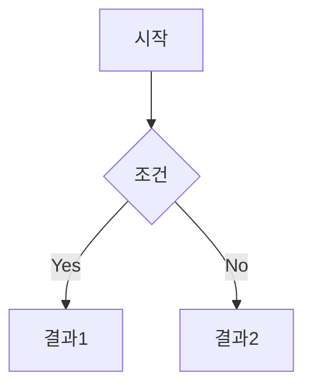

# Obsidian Core Formatting

Obsidian 문서 작성의 핵심 원칙과 포맷팅 규칙.

## Core Principles

1. **Atomic Notes**: 하나의 노트 = 하나의 아이디어 (Zettelkasten)
2. **Linked Thinking**: [[Wikilinks]]로 노트 간 연결 적극 활용
3. **Future-Proof**: 플레인 마크다운 기반, 특정 앱 종속 최소화
4. **Searchable**: Properties와 Tags로 검색 가능성 극대화

## Properties (Frontmatter)

모든 노트 최상단에 YAML Properties 포함:

```yaml
---
title: 노트 제목
date: 2026-01-30
tags:
  - tag1
  - tag2
aliases:
  - 별칭1
  - 별칭2
status: draft | in-progress | done | archived
author: woogi | wife
related:
  - "[[관련 노트]]"
---
```

### Property 필드 가이드

| 필드 | 용도 | 예시 |
|------|------|------|
| `title` | 노트 제목 (파일명과 다를 때) | `title: API 설계 원칙` |
| `date` | 생성일 | `date: 2026-01-30` |
| `tags` | 분류 태그 (리스트) | `tags: [개발, Flutter]` |
| `aliases` | 검색용 별칭 | `aliases: [옵시디언, Obsidian]` |
| `status` | 문서 상태 | `status: done` |
| `author` | 작성자 | `author: woogi` |

## Wikilinks

### 기본 문법

```markdown
[[노트 이름]]                    # 기본 링크
[[노트 이름|표시 텍스트]]        # 별칭 링크
[[노트 이름#헤딩]]               # 특정 헤딩 링크
[[노트 이름#^block-id]]          # 블록 ID 링크
```

### Embed (임베드)

```markdown
![[노트 이름]]                   # 전체 노트 임베드
![[이미지.png]]                  # 이미지 임베드
![[이미지.png|300]]              # 너비 지정
![[노트 이름#헤딩]]              # 특정 섹션 임베드
```

## Callouts

```markdown
> [!note] 제목
> 일반 정보

> [!tip] 팁
> 유용한 팁

> [!warning] 주의
> 주의사항

> [!danger] 위험
> 치명적 경고

> [!example] 예시
> 예시 내용

> [!quote] 인용
> 인용문

> [!question] 질문
> 확인 필요 사항
```

### Callout 용도 가이드

| 타입 | 용도 | 색상 |
|------|------|------|
| `note` | 일반 정보, 부연 설명 | 파랑 |
| `tip` | 유용한 팁, 권장사항 | 청록 |
| `warning` | 주의사항, 경고 | 노랑 |
| `danger` | 금지, 치명적 오류 | 빨강 |
| `example` | 예시, 샘플 | 보라 |
| `quote` | 인용, 참조 | 회색 |
| `question` | 질문, 확인 필요 | 노랑 |

### Foldable Callout

```markdown
> [!tip]- 접힌 상태 (기본)
> 클릭하면 펼쳐짐

> [!tip]+ 펼친 상태 (기본)
> 클릭하면 접힘
```

## Tags

```markdown
#태그                   # 인라인 태그
#상위/하위              # 중첩 태그
#2026/01/30            # 날짜 태그
```

### 태그 vs Properties 태그

| 구분 | 위치 | 용도 |
|------|------|------|
| `#태그` | 본문 어디서나 | 문맥상 강조, 임시 마킹 |
| `tags:` | Properties | 노트 분류, 검색 필터 |

**권장**: 분류용은 Properties, 문맥 강조는 인라인 태그

## Code Blocks

````markdown
```python
# 파일: src/example.py
def hello():
    return "Hello, Obsidian!"
```
````

**지원 언어**: `python`, `javascript`, `typescript`, `dart`, `bash`, `sql`, `json`, `yaml`, `markdown` 등

## Tables

```markdown
| 헤더1 | 헤더2 | 헤더3 |
|:------|:-----:|------:|
| 왼쪽  | 가운데 | 오른쪽 |
```

## Heading Hierarchy

```markdown
# H1: 노트 제목 (1개만, Properties의 title과 일치 권장)
## H2: 주요 섹션
### H3: 하위 섹션
#### H4: 세부 항목 (가급적 사용 지양)
```

## Block References

```markdown
이것은 참조 가능한 블록입니다. ^block-id

다른 노트에서 참조:
[[노트 이름#^block-id]]
```

## Comments

```markdown
%%
이 내용은 편집 모드에서만 보이고
프리뷰/출력에서는 숨겨집니다.
%%
```

## Math (LaTeX)

```markdown
인라인: $E = mc^2$

블록:
$$
\frac{-b \pm \sqrt{b^2 - 4ac}}{2a}
$$
```

## Mermaid Diagrams

````markdown

````

## Quick Reference

```
링크:     [[노트]] / [[노트|별칭]] / [[노트#헤딩]]
임베드:   ![[노트]] / ![[이미지.png|300]]
콜아웃:   > [!tip] 제목
태그:     #태그 / #상위/하위
블록ID:   텍스트 ^block-id
숨김:     %% 주석 %%
수식:     $인라인$ / $$블록$$
```
