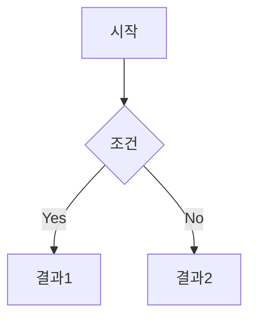
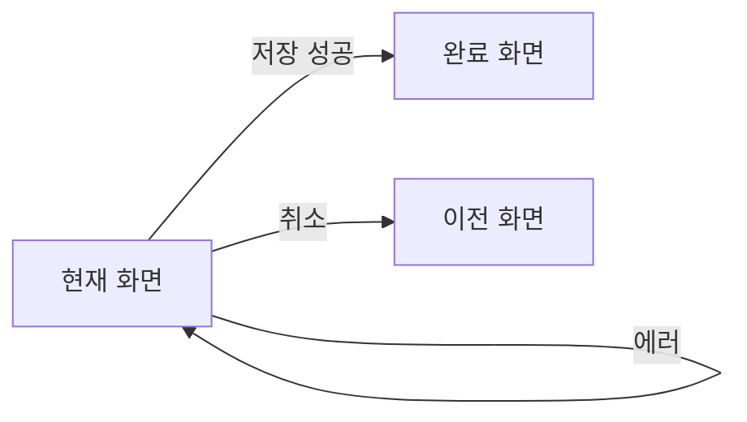
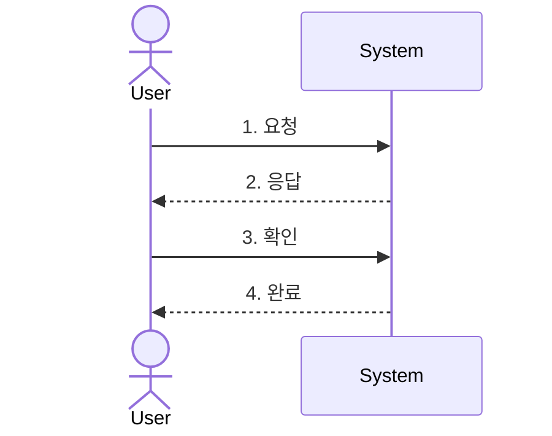

# Personal Vault - IT 기획자용 구조

IT 기획자를 위한 Personal Vault 구조 및 템플릿.

## Folder Structure

```
Personal-Vault (Planner)/
├── 00-Inbox/                 # 빠른 캡처
│
├── 10-Projects/              # 진행 중인 프로젝트
│   ├── project-alpha/
│   │   ├── _index.md         # 프로젝트 허브
│   │   ├── PRD/              # 요구사항 문서
│   │   ├── Screens/          # 화면설계서
│   │   ├── Stories/          # 유저스토리
│   │   ├── UseCases/         # 유즈케이스
│   │   ├── Meetings/         # 회의록
│   │   └── References/       # 참고자료
│   └── project-beta/
│
├── 20-Areas/                 # 지속 관리 영역
│   ├── Career/               # 커리어 관리
│   ├── Learning/             # 학습 (UX, 트렌드 등)
│   ├── Templates/            # 자주 쓰는 템플릿 원본
│   └── Processes/            # 업무 프로세스 정리
│
├── 30-Resources/             # 참조 자료
│   ├── Design-Patterns/      # UI/UX 패턴
│   ├── Competitors/          # 경쟁사 분석
│   ├── Articles/             # 아티클 스크랩
│   └── Tools/                # 도구 가이드
│
├── 40-Archives/              # 완료/보관
│   ├── 2025/
│   └── 2026/
│
├── 50-Daily/                 # 일간 노트
│   └── 2026/
│
├── 60-Journal/               # 개인 일기
│
├── 90-Meta/
│   ├── Templates/
│   └── Attachments/
│
└── _Dashboard.md
```

---

## 핵심 템플릿

### PRD (Product Requirements Document)

```markdown
---
title: "{{project}} PRD - {{feature}}"
date: {{date:YYYY-MM-DD}}
tags:
  - type/prd
  - project/{{project}}
  - status/draft
author: {{author}}
version: 1.0
stakeholders:
  -
reviewers:
  -
---

# {{feature}} PRD

## Document Info

| 항목 | 내용 |
|------|------|
| 프로젝트 | {{project}} |
| 작성자 | {{author}} |
| 버전 | 1.0 |
| 상태 | Draft / Review / Approved |
| 최종 수정 | {{date:YYYY-MM-DD}} |

---

## 1. Overview

### 1.1 Background
> 이 기능이 필요한 배경과 맥락

### 1.2 Problem Statement
> 해결하려는 문제

### 1.3 Goals
- [ ] Goal 1
- [ ] Goal 2

### 1.4 Non-Goals (Scope Out)
- 이번 범위에서 제외되는 것

---

## 2. User Stories

| ID | As a... | I want to... | So that... | Priority |
|----|---------|--------------|------------|----------|
| US-001 | 사용자 | 기능 | 가치 | P0 |
| US-002 | | | | P1 |

---

## 3. Requirements

### 3.1 Functional Requirements

| ID | 요구사항 | 우선순위 | 비고 |
|----|----------|----------|------|
| FR-001 | | P0 | |
| FR-002 | | P1 | |

### 3.2 Non-Functional Requirements

| 항목 | 요구사항 |
|------|----------|
| 성능 | |
| 보안 | |
| 접근성 | |

---

## 4. User Flow



또는: `[Diagram: User Flow 다이어그램 필요]`

---

## 5. Screen Specifications

| 화면 | 링크 | 상태 |
|------|------|------|
| 메인 화면 | [[Screens/main-screen]] | Draft |
| 상세 화면 | [[Screens/detail-screen]] | Draft |

---

## 6. Data Requirements

### 6.1 Input
| 필드 | 타입 | 필수 | 설명 |
|------|------|------|------|
| | | | |

### 6.2 Output
| 필드 | 타입 | 설명 |
|------|------|------|
| | | |

---

## 7. Dependencies

| 의존성 | 담당팀 | 상태 |
|--------|--------|------|
| API 개발 | Backend | 대기 |
| 디자인 | Design | 진행중 |

---

## 8. Timeline

| 마일스톤 | 예정일 | 상태 |
|----------|--------|------|
| PRD 승인 | | |
| 디자인 완료 | | |
| 개발 완료 | | |
| QA | | |
| 배포 | | |

---

## 9. Risks & Mitigations

| 리스크 | 영향도 | 대응 방안 |
|--------|--------|----------|
| | High/Medium/Low | |

---

## 10. Open Questions

- [ ] 질문 1
- [ ] 질문 2

---

## Appendix

### A. References
- [[관련 문서]]

### B. Revision History

| 버전 | 날짜 | 작성자 | 변경 내용 |
|------|------|--------|----------|
| 1.0 | {{date}} | {{author}} | 초안 작성 |
```

---

### 화면설계서 (Screen Specification)

```markdown
---
title: "{{screen-name}} 화면설계서"
date: {{date:YYYY-MM-DD}}
tags:
  - type/screen-spec
  - project/{{project}}
  - status/draft
author: {{author}}
related-prd: "[[PRD 링크]]"
figma: ""
---

# {{screen-name}} 화면설계서

## Overview

| 항목 | 내용 |
|------|------|
| 화면명 | {{screen-name}} |
| 화면 ID | SCR-001 |
| 관련 PRD | [[PRD 링크]] |
| Figma | [링크]() |
| 상태 | Draft / Review / Approved |

---

## 1. 화면 목적
> 이 화면의 목적과 사용자가 수행할 핵심 태스크

---

## 2. 화면 구성

### 2.1 Layout
`[Image: 화면 와이어프레임/목업]`

### 2.2 Components

| 영역 | 컴포넌트 | 설명 |
|------|----------|------|
| Header | Navigation | 메인 네비게이션 |
| Body | List | 항목 목록 |
| Footer | Button | 저장 버튼 |

---

## 3. UI Elements

### 3.1 입력 필드

| 필드명 | 타입 | 필수 | Validation | Placeholder |
|--------|------|:----:|------------|-------------|
| 이름 | Text | O | 2-20자 | "이름 입력" |
| 이메일 | Email | O | 이메일 형식 | "email@example.com" |
| 연락처 | Tel | X | 숫자만 | "010-0000-0000" |

### 3.2 버튼

| 버튼명 | 타입 | 동작 | 조건 |
|--------|------|------|------|
| 저장 | Primary | 데이터 저장 | 필수 입력 완료 시 활성화 |
| 취소 | Secondary | 이전 화면 | 항상 활성화 |

### 3.3 상태별 UI

| 상태 | 표시 내용 |
|------|----------|
| Loading | Spinner + "로딩 중..." |
| Empty | 빈 상태 일러스트 + "데이터가 없습니다" |
| Error | 에러 메시지 + 재시도 버튼 |

---

## 4. Interaction

### 4.1 사용자 액션

| 액션 | 트리거 | 결과 |
|------|--------|------|
| 저장 클릭 | 버튼 탭 | API 호출 → 성공 시 토스트 |
| 스와이프 | 좌→우 | 삭제 옵션 표시 |

### 4.2 화면 전환



---

## 5. Validation & Error

| 케이스 | 메시지 | 표시 위치 |
|--------|--------|----------|
| 필수 입력 누락 | "필수 항목입니다" | 필드 하단 |
| 형식 오류 | "올바른 형식이 아닙니다" | 필드 하단 |
| 서버 에러 | "잠시 후 다시 시도해주세요" | 토스트 |

---

## 6. API Mapping

| 기능 | Endpoint | Method |
|------|----------|--------|
| 목록 조회 | `/api/v1/items` | GET |
| 저장 | `/api/v1/items` | POST |
| 삭제 | `/api/v1/items/{id}` | DELETE |

---

## 7. Accessibility

- [ ] 키보드 네비게이션 지원
- [ ] 스크린리더 라벨 적용
- [ ] 색상 대비 4.5:1 이상
- [ ] 터치 타겟 44x44px 이상

---

## 8. Notes

> [!question] 확인 필요
> - 질문 사항

> [!tip] 디자인 참고
> - 참고 사항

---

## Revision History

| 버전 | 날짜 | 작성자 | 변경 내용 |
|------|------|--------|----------|
| 1.0 | {{date}} | {{author}} | 초안 |
```

---

### User Story

```markdown
---
title: "US-{{id}}: {{story-title}}"
date: {{date:YYYY-MM-DD}}
tags:
  - type/user-story
  - project/{{project}}
  - status/draft
  - priority/{{priority}}
author: {{author}}
epic: "[[Epic 링크]]"
acceptance-criteria: 0/0
story-points:
---

# US-{{id}}: {{story-title}}

## Story

> **As a** {{persona}}
> **I want to** {{action}}
> **So that** {{benefit}}

---

## Context
> 배경 및 맥락 설명

---

## Acceptance Criteria

- [ ] **Given** 초기 조건
  **When** 사용자 액션
  **Then** 예상 결과

- [ ] **Given**
  **When**
  **Then**

- [ ] **Given**
  **When**
  **Then**

---

## UI/UX Notes

`[Image: 관련 화면 또는 와이어프레임]`

- 관련 화면: [[Screen Spec 링크]]

---

## Technical Notes

> [!note] 개발 참고사항
> - API:
> - 의존성:

---

## Out of Scope

- 이 스토리에서 제외되는 것

---

## Related

- Epic: [[Epic 링크]]
- PRD: [[PRD 링크]]
- Design: [Figma 링크]()

---

## Discussion

> 논의 사항 기록

---

| 항목 | 값 |
|------|-----|
| Priority | P0 / P1 / P2 |
| Story Points | |
| Sprint | |
| Assignee | |
```

---

### Use Case

```markdown
---
title: "UC-{{id}}: {{usecase-title}}"
date: {{date:YYYY-MM-DD}}
tags:
  - type/use-case
  - project/{{project}}
  - status/draft
author: {{author}}
actors:
  - Primary Actor
preconditions:
  -
postconditions:
  -
---

# UC-{{id}}: {{usecase-title}}

## Overview

| 항목 | 내용 |
|------|------|
| Use Case ID | UC-{{id}} |
| Use Case Name | {{usecase-title}} |
| Actor(s) | |
| 목적 | |
| 우선순위 | High / Medium / Low |

---

## Preconditions
1. 사전 조건 1
2. 사전 조건 2

## Postconditions
1. 사후 조건 (성공 시)

---

## Basic Flow (Happy Path)

| Step | Actor | System |
|:----:|-------|--------|
| 1 | 사용자가 ~ 한다 | |
| 2 | | 시스템이 ~ 한다 |
| 3 | 사용자가 ~ 한다 | |
| 4 | | 시스템이 ~ 한다 |
| 5 | | Use Case 종료 |

---

## Alternative Flows

### AF-1: {{대안 시나리오 이름}}

> Step 2에서 분기

| Step | Actor | System |
|:----:|-------|--------|
| 2a | | 조건 발생 시 |
| 2b | | 대안 처리 |
| | | Basic Flow로 복귀 또는 종료 |

---

## Exception Flows

### EF-1: {{예외 시나리오 이름}}

> Step 3에서 발생 가능

| Step | Actor | System |
|:----:|-------|--------|
| 3a | | 에러 발생 |
| 3b | | 에러 메시지 표시 |
| 3c | 사용자가 확인 | Use Case 종료 |

---

## Business Rules

| Rule ID | 설명 |
|---------|------|
| BR-001 | |
| BR-002 | |

---

## UI Reference

- 관련 화면: [[Screen Spec 링크]]
- Figma: [링크]()

---

## Diagram



---

## Related

- PRD: [[PRD 링크]]
- User Stories: [[US-001]], [[US-002]]

---

## Notes

> [!question] 확인 필요
> - 질문 사항
```

---

## Dashboard (기획자용)

```markdown
---
title: Planner Dashboard
tags:
  - type/moc
---

# My Dashboard

## Quick Links

| 바로가기 | 설명 |
|----------|------|
| [[00-Inbox/]] | 빠른 캡처 |
| [[10-Projects/]] | 진행 중인 프로젝트 |
| [[50-Daily/]] | 일간 노트 |

---

## Active Projects

```dataview
TABLE
  status as "상태",
  file.mtime as "최근 수정"
FROM "10-Projects"
WHERE contains(file.name, "_index")
SORT file.mtime DESC
```

---

## Recent PRDs

```dataview
TABLE
  status as "상태",
  version as "버전",
  file.mtime as "수정일"
FROM #type/prd
SORT file.mtime DESC
LIMIT 10
```

---

## Open Questions

```dataview
TASK
FROM #type/prd OR #type/screen-spec
WHERE !completed AND contains(text, "확인")
LIMIT 10
```

---

## This Week

```dataview
LIST
FROM "50-Daily"
WHERE file.ctime >= date(today) - dur(7 days)
SORT file.name DESC
```
```
