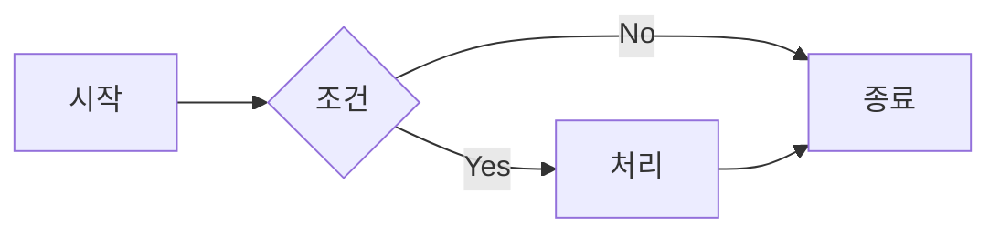

# PPT Visual Skill

2025 최신 데이터 시각화 트렌드를 반영한 차트, 다이어그램, 인포그래픽 생성 Skill입니다.

## 2025 데이터 시각화 Best Practices

### 1. 차트 유형 선택 가이드
> 출처: Tableau, University at Buffalo - Data Visualization Best Practices

| 목적 | 추천 차트 | 설명 | 사용 예시 |
|------|----------|------|----------|
| **비교** | Bar Chart, Bullet Chart | 카테고리 간 비교에 효과적 | 부서별 매출 비교 |
| **추세** | Line Graph | 시간에 따른 변화 표현 | 월별 성장률 추이 |
| **분포** | Histogram, Box Plot | 데이터 클러스터링 표현 | 고객 연령 분포 |
| **구성** | Stacked Bar (Pie 대체) | 부분과 전체 관계 | 시장 점유율 |
| **관계** | Scatter Plot | 변수 간 상관관계 | 광고비 vs 매출 |
| **지리** | Maps | 위치 기반 데이터 | 지역별 판매량 |
| **흐름** | Alluvial Diagram, Sankey | 시간에 따른 변화/전환 | 고객 여정 |
| **진행** | Bullet Chart | 목표 대비 진행률 | KPI 달성률 |

**Pie Chart 주의사항:**
```
Pie Chart는 가급적 피하고 대안 사용:
├── 2-3개 카테고리만 있을 때만 사용
├── 대안 1: Stacked Bar Chart
├── 대안 2: Donut Chart (중앙에 수치 표시)
└── 대안 3: Waffle Chart (100개 격자)
```

### 2. 2025 데이터 시각화 트렌드
> 출처: Infogram, Pew Research - Data Visualization Trends 2025

#### AI 기반 자동화
```
활용 방법:
├── 데이터 준비 자동화 (정리, 구성, 포맷팅)
├── 개인화된 차트 추천
├── 이상치/트렌드 자동 감지
└── AI 차트 메이커 활용
```

#### 실시간 데이터 시각화
```
적용 가능한 경우:
├── 라이브 데시보드 연동
├── 실시간 이벤트 트래킹
├── 동적 KPI 표시
└── 발표 중 업데이트 (API 연동)
```

#### 고급 차트 유형 (Pew Research 2025)

| 차트 | 용도 | 특징 |
|-----|------|------|
| **Alluvial Diagram** | 유권자 이동, 종교 전환 등 흐름 | 시간에 따른 그룹 간 이동 표현 |
| **Bullet Chart** | 압축된 공간에 다중 비교 | 목표 vs 실제 + 범위 표시 |
| **Rose Plot** | 방향과 규모 표현 | 극좌표 기반, 계절성 데이터 |
| **Beeswarm Chart** | 데이터셋 내 분포 | 개별 데이터 포인트 표시 |
| **Lollipop Chart** | Bar Chart 대안 | 깔끔하고 모던한 느낌 |

### 3. 인포그래픽 디자인 트렌드
> 출처: Venngage - Infographic Design Trends 2025

| 트렌드 | 설명 | 적용 방법 |
|--------|------|----------|
| **Bold Typography** | 텍스트가 시각적 초점 | 큰 숫자, 굵은 키워드 |
| **Playful Layouts** | 그리드 탈피 | 대각선, 역동적 배치 |
| **Doodle Style** | 손그림 스타일 | 아이콘, 일러스트 |
| **AI Collaboration** | AI 도구 활용 | 요소 생성, 레이아웃 개선 |
| **Hierarchy through Type** | 폰트로 우선순위 표현 | 크기, 무게 변화 |

### 4. 시각화 Best Practices
> 출처: TimeTackle, Explo - Data Visualization Tips

**DO (권장):**
```
✅ 선언적 제목 사용
   - Bad:  "매출 추이"
   - Good: "매출 40% 증가 (YoY)"

✅ 모든 축에 명확한 라벨과 단위 표기
   - 예: "매출 (백만 원)", "기간 (2024 Q1-Q4)"

✅ 전략적 주석으로 핵심 포인트 강조
   - 최고점, 변곡점, 목표선 표시

✅ 접근성을 위한 컬러 팔레트
   - ColorBrewer2.org 활용
   - 충분한 대비

✅ 청중 수준에 맞는 복잡도 조절
   - 경영진: 단순화
   - 분석가: 상세 데이터 제공
```

**DON'T (피해야 할 것):**
```
❌ 불필요한 격자선, 과도한 라벨
❌ 3D 효과, 장식적 요소
❌ 빨강-초록 대비 (색맹 고려)
❌ 한 차트에 너무 많은 데이터 포인트 (7개 이하 권장)
❌ 0에서 시작하지 않는 Y축 (왜곡 가능)
❌ 불필요한 범례 (직접 라벨링 권장)
```

## 차트 선택 의사결정 트리

```
데이터 유형 확인
    │
    ├─ 시계열 데이터?
    │   └─ 연속적 변화 → Line Graph
    │   └─ 이산적 비교 → Bar Chart (시간 순)
    │
    ├─ 카테고리 비교?
    │   └─ 5개 이하 → Bar Chart (수평)
    │   └─ 5개 초과 → Bar Chart (수직) 또는 Lollipop
    │   └─ 목표 대비 → Bullet Chart
    │
    ├─ 부분과 전체?
    │   └─ 2-3개 → Donut Chart
    │   └─ 4개 이상 → Stacked Bar
    │   └─ 100% 표현 → Waffle Chart
    │
    ├─ 상관관계?
    │   └─ 2변수 → Scatter Plot
    │   └─ 3변수 → Bubble Chart
    │
    ├─ 분포?
    │   └─ 연속 데이터 → Histogram
    │   └─ 비교 필요 → Box Plot
    │   └─ 개별 포인트 → Beeswarm
    │
    ├─ 흐름/전환?
    │   └─ 단계별 → Funnel Chart
    │   └─ 그룹 간 → Alluvial / Sankey
    │
    └─ 지리 데이터?
        └─ 지역별 → Choropleth Map
        └─ 위치 점 → Dot Map
```

## 핵심 기능

### 1. chart_recommend (차트 추천)
데이터 특성에 맞는 최적의 차트 유형을 추천합니다.

**입력:**
- 데이터 유형 (시계열, 카테고리, 수치 등)
- 분석 목적 (비교, 추세, 분포 등)
- 데이터 포인트 수
- 청중 특성

**출력:**
```json
{
  "chart_recommendation": {
    "primary": {
      "type": "Line Chart",
      "reason": "시계열 데이터의 추세 표현에 최적",
      "config": {
        "show_markers": true,
        "show_area": false,
        "smooth_line": true
      }
    },
    "alternatives": [
      {
        "type": "Area Chart",
        "reason": "누적 효과 강조 시"
      }
    ]
  }
}
```

### 2. chart_generate (차트 생성)
데이터를 기반으로 차트 사양을 생성합니다.

**출력 구조 (Vega-Lite 호환):**
```json
{
  "chart_spec": {
    "type": "bar",
    "data": [...],
    "encoding": {
      "x": {"field": "category", "type": "nominal"},
      "y": {"field": "value", "type": "quantitative"},
      "color": {"field": "group", "type": "nominal"}
    },
    "title": "분기별 매출 비교",
    "annotations": [
      {"type": "line", "value": 100, "label": "목표"}
    ]
  }
}
```

### 3. diagram_create (다이어그램 생성)
프로세스, 조직도, 관계도 등 다이어그램을 생성합니다.

**다이어그램 유형:**

| 유형 | 용도 | 형식 |
|-----|------|------|
| **Flowchart** | 프로세스, 워크플로우 | 순차적 흐름 |
| **Org Chart** | 조직 구조 | 계층적 |
| **Mind Map** | 아이디어 맵핑 | 방사형 |
| **Timeline** | 시간순 이벤트 | 선형 |
| **Venn Diagram** | 집합 관계 | 원형 교차 |
| **Matrix** | 2x2 분석 | 4분면 |
| **Cycle** | 순환 프로세스 | 원형 |

**Mermaid 출력 예시:**


### 4. infographic_design (인포그래픽 디자인)
데이터 스토리를 인포그래픽으로 구성합니다.

**인포그래픽 유형:**

| 유형 | 구조 | 적합한 데이터 |
|-----|------|-------------|
| **Statistical** | 숫자/차트 중심 | 통계, KPI |
| **Timeline** | 시간순 배열 | 역사, 로드맵 |
| **Process** | 단계별 흐름 | 가이드, How-to |
| **Comparison** | 좌우/상하 비교 | Before/After |
| **Geographic** | 지도 기반 | 지역 데이터 |
| **Hierarchical** | 피라미드/트리 | 조직, 분류 |

### 5. icon_select (아이콘 선택)
콘텐츠에 맞는 아이콘을 추천합니다.

**아이콘 스타일:**
```
├── Line Icons (미니멀)
├── Filled Icons (강조)
├── Duotone (모던)
├── 3D Icons (트렌디)
└── Hand-drawn (친근)
```

**아이콘 라이브러리 추천:**
- Lucide Icons (오픈소스)
- Phosphor Icons (유연성)
- Heroicons (Tailwind 호환)
- Feather Icons (미니멀)

## 차트 스타일 가이드

### 컬러 적용

```
데이터 컬러링 원칙:
├── 강조 항목: Primary Color
├── 일반 항목: Secondary/Neutral
├── 비교 시: 대비되는 색상 쌍
├── 순서 있는 데이터: 단일 색상의 농도 변화
└── 범주형 데이터: 구분되는 색상 (최대 7개)
```

### 레이블 및 주석

```
차트 필수 요소:
├── 제목: 인사이트 포함 (선언적)
├── 축 레이블: 단위 포함
├── 데이터 레이블: 핵심 수치만
├── 범례: 4개 이하일 때만, 차트 내 직접 라벨링 권장
└── 출처: 우하단에 표기
```

### 반응형 고려

```
화면 크기별 조정:
├── 프레젠테이션: 단순화, 큰 라벨
├── 인쇄물: 상세 데이터 포함 가능
├── 웹: 인터랙티브 요소 추가
└── 모바일: 수직 스크롤 고려
```

## 시각화 템플릿

### KPI 대시보드
```
┌──────────┬──────────┬──────────┐
│   KPI 1  │   KPI 2  │   KPI 3  │
│   [수치]  │   [수치]  │   [수치]  │
│   [변화]  │   [변화]  │   [변화]  │
├──────────┴──────────┴──────────┤
│                                 │
│        [메인 차트]              │
│                                 │
├─────────────────┬───────────────┤
│   [서브 차트 1]  │  [서브 차트 2] │
└─────────────────┴───────────────┘
```

### 비교 슬라이드
```
┌─────────────────────────────────┐
│  [비교 헤드라인]                 │
├────────────────┬────────────────┤
│                │                │
│   [차트 A]      │   [차트 B]     │
│                │                │
├────────────────┴────────────────┤
│  [핵심 인사이트]                 │
└─────────────────────────────────┘
```

### 프로세스 다이어그램
```
┌─────────────────────────────────┐
│  [프로세스 제목]                 │
├─────────────────────────────────┤
│                                 │
│   ┌───┐    ┌───┐    ┌───┐      │
│   │ 1 │ → │ 2 │ → │ 3 │       │
│   └───┘    └───┘    └───┘      │
│   [설명]   [설명]   [설명]       │
│                                 │
└─────────────────────────────────┘
```

## 시각화 워크플로우

```
콘텐츠/데이터 수신
         │
         ▼
   데이터 분석 & 목적 파악
         │
         ▼
   차트 유형 추천 (chart_recommend)
         │
         ▼
   차트/다이어그램 생성
         │
         ▼
   디자인 시스템 스타일 적용
         │
         ▼
   접근성 검증
         │
         ├─ 실패 → 컬러/라벨 조정
         │
         ▼
   Review Skill로 전달
```

## 사용 예시

### 예시 1: 차트 생성 요청
```
사용자: "분기별 매출 데이터로 차트 만들어줘"

수행:
1. 데이터 분석: 시계열 + 비교
2. chart_recommend: Bar Chart 또는 Line Chart 추천
3. chart_generate: 차트 사양 생성
4. 디자인 시스템 컬러 적용
5. 인사이트 포함 제목 생성
```

### 예시 2: 프로세스 다이어그램
```
사용자: "고객 온보딩 프로세스 다이어그램 만들어줘"

수행:
1. 단계 분석
2. diagram_create: Flowchart 유형
3. Mermaid 코드 생성
4. 아이콘 추가 (icon_select)
5. 시각적 스타일 적용
```

## 차트 품질 체크리스트

```
□ 차트 유형이 데이터에 적합한가?
□ 제목이 인사이트를 포함하는가?
□ 축 레이블과 단위가 명확한가?
□ 색상이 접근성 기준을 충족하는가?
□ 데이터 포인트가 7개 이하인가?
□ 불필요한 장식 요소가 없는가?
□ 출처가 표기되어 있는가?
□ Y축이 0에서 시작하는가? (Bar Chart)
□ 범례 대신 직접 라벨링을 사용했는가?
```

## 다음 단계 연결

시각화 완료 후:
1. 생성된 차트/다이어그램은 **Review Skill**에서 품질 검토
2. 전체 PPT와 일관성 확인

## 주의사항

- 데이터 왜곡 방지 (Y축 조작, 비율 왜곡 등)
- 색맹 사용자 고려 (빨강-초록 대비 피하기)
- 한 슬라이드에 차트 2개 이하 권장
- 복잡한 차트는 단순화하거나 분할
- 모든 차트에 데이터 출처 명시
- 3D 효과 사용 자제
