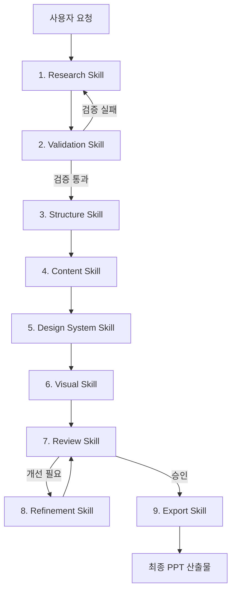

# PPT Agent Skills 종합 설계 문서

> 📅 작성일: 2025-01-04  
> 🎯 목적: 전문적인 PPT 제작 Agent를 위한 Skills 체계 설계

---

## 📊 전체 아키텍처

```
ppt-agent/
├── 1-research/           # 리서치 & 자료 수집
├── 2-validation/         # ⭐ 데이터 검증 (NEW)
├── 3-structure/          # 구조 설계 & 스토리라인
├── 4-content/            # 콘텐츠 작성
├── 5-design-system/      # 디자인 시스템
├── 6-visual/             # 시각 자료 생성
├── 7-review/             # 검토 & QA
├── 8-refinement/         # 피드백 반영 & 개선
└── 9-export/             # 최종 출력 & 배포
```

---

## 1️⃣ Research Skill (리서치 & 자료 수집)

### SKILL.md Frontmatter

```yaml
---
name: ppt-research
description: |
  PPT 제작을 위한 리서치 및 자료 수집 Skill.
  웹 검색, 문서 분석, 경쟁사 조사, 통계 데이터 수집 시 활성화.
  "자료 조사해줘", "트렌드 분석해줘", "경쟁사 PPT 분석" 등의 요청에 반응.
---
```

### 핵심 기능

| 기능 | 설명 | 출력 |
|------|------|------|
| `topic_deep_dive` | 주제 키워드 확장, 관련 개념 맵핑 | 개념 맵, 키워드 목록 |
| `web_research` | 최신 트렌드, 통계, 사례 수집 | 출처 포함 리서치 노트 |
| `competitor_analysis` | 경쟁사/유사 발표자료 분석 | 벤치마킹 리포트 |
| `data_extraction` | PDF, 문서에서 핵심 데이터 추출 | 정형화된 데이터셋 |
| `source_tracking` | 모든 출처 관리 및 신뢰도 태깅 | 출처 메타데이터 |

### 수집 데이터 구조

```json
{
  "research_item": {
    "id": "R001",
    "content": "수집된 내용",
    "source": {
      "url": "https://...",
      "title": "출처 제목",
      "date": "2025-01-04",
      "type": "article|study|statistics|report"
    },
    "credibility_score": 0.85,
    "tags": ["트렌드", "통계", "사례"],
    "validation_status": "pending"
  }
}
```

---

## 2️⃣ Validation Skill (데이터 검증) ⭐ NEW

### SKILL.md Frontmatter

```yaml
---
name: ppt-validation
description: |
  리서치 단계에서 수집한 데이터의 신뢰성과 정확성을 검증하는 Skill.
  팩트체크, 출처 검증, 최신성 확인, 교차 검증 시 활성화.
  "데이터 검증해줘", "팩트체크 해줘", "출처 확인해줘" 등의 요청에 반응.
  Structure Skill 이전에 반드시 실행되어 탄탄한 기반 확보.
---
```

### 검증 프레임워크

#### 1. 출처 신뢰도 검증 (Source Credibility Check)

```
신뢰도 레벨:
├── Level 5 (최고): 정부기관, 학술논문, 공인기관 보고서
├── Level 4 (높음): 주요 언론사, 산업 리서치 기관
├── Level 3 (보통): 전문 블로그, 기업 공식 자료
├── Level 2 (낮음): 일반 블로그, 커뮤니티 글
└── Level 1 (미검증): 출처 불명, 익명 자료
```

#### 2. 팩트체크 프로세스

| 단계 | 검증 항목 | 방법 |
|------|----------|------|
| **1차** | 출처 존재 여부 | URL 접근성, 원문 확인 |
| **2차** | 데이터 최신성 | 발행일 기준 6개월 이내 권장 |
| **3차** | 교차 검증 | 최소 2개 이상 독립 출처 확인 |
| **4차** | 맥락 검증 | 인용이 원문 맥락과 일치하는지 |
| **5차** | 수치 검증 | 통계 데이터의 산출 방법 확인 |

#### 3. 검증 결과 태깅

```json
{
  "validation_result": {
    "item_id": "R001",
    "status": "verified|partially_verified|unverified|disputed",
    "credibility_score": 0.92,
    "checks_passed": [
      "source_exists",
      "recent_data",
      "cross_verified"
    ],
    "checks_failed": [],
    "warnings": [
      "Single source - recommend additional verification"
    ],
    "recommendation": "safe_to_use|use_with_caveat|do_not_use"
  }
}
```

#### 4. 검증 기준 매트릭스

| 발표 유형 | 최소 신뢰도 | 교차검증 필수 | 최신성 요구 |
|----------|------------|--------------|------------|
| 투자 피치 | Level 4+ | ✅ 3개 이상 | 3개월 이내 |
| 기술 세미나 | Level 3+ | ✅ 2개 이상 | 6개월 이내 |
| 내부 보고 | Level 3+ | ❌ 선택적 | 12개월 이내 |
| 교육 자료 | Level 4+ | ✅ 2개 이상 | 24개월 이내 |

---

## 3️⃣ Structure Skill (구조 설계 & 스토리라인)

### SKILL.md Frontmatter

```yaml
---
name: ppt-structure
description: |
  검증된 데이터를 바탕으로 PPT의 스토리라인과 논리 구조를 설계하는 Skill.
  청중 분석, 핵심 메시지 도출, 슬라이드 아웃라인 구성 시 활성화.
  "구조 잡아줘", "스토리라인 만들어줘", "아웃라인 설계해줘" 등의 요청에 반응.
---
```

### 스토리텔링 프레임워크

#### 📚 출처 기반 검증된 프레임워크

**1. SCQA Framework (McKinsey/BCG 컨설팅 표준)**
> 출처: [The Analyst Academy - PowerPoint Storytelling](https://www.theanalystacademy.com/powerpoint-storytelling/)

```
S - Situation (상황): 현재 상태 설명
C - Complication (문제): 직면한 과제/위기
Q - Question (질문): 해결해야 할 핵심 질문 (암묵적)
A - Answer (해답): 제안하는 솔루션
```

**적용 예시:**
```
[S] "우리 회사는 지난 5년간 연평균 15% 성장을 달성했습니다."
[C] "그러나 올해 신규 경쟁사 진입으로 시장 점유율이 5% 하락했습니다."
[Q] (암묵적: 어떻게 시장 점유율을 회복할 것인가?)
[A] "3가지 전략적 이니셔티브를 제안합니다..."
```

**2. SCR Framework (McKinsey 3-Step)**
> 출처: [SlidesPilot - McKinsey's 3-Step SCR Framework](https://blog.slidespilot.com/mastering-storytelling-in-presentations-mckinseys-3-step-scr-framework/)

```
S - Situation: 컨텍스트와 배경 설정
C - Complication: 긴장감과 문제 제기  
R - Resolution: 명확한 해결책과 액션 플랜
```

**3. Pyramid Principle (Minto/McKinsey)**
> 출처: [Product Mindset - McKinsey's Pyramid Framework](https://productmindset.substack.com/p/2836-mckinseys-pyramid-framework)

```
           [핵심 메시지]
          /      |      \
    [근거 1]  [근거 2]  [근거 3]
     /  \      /  \      /  \
  [세부] [세부] [세부] [세부] [세부] [세부]
```

**4. Hero's Journey (영웅의 여정)**
> 출처: [Storydoc - Presentation Storytelling](https://www.storydoc.com/blog/presentation-storytelling-examples)

```
1. 일상 세계 → 2. 모험의 소명 → 3. 소명의 거부
4. 멘토와의 만남 → 5. 첫 관문 통과 → 6. 시험과 동맹
7. 가장 깊은 동굴 → 8. 시련 → 9. 보상
10. 귀환의 길 → 11. 부활 → 12. 영약과 함께 귀환
```

**5. Sparklines (Nancy Duarte)**
> 출처: [Videoscribe - 8 Classic Storytelling Techniques](https://blog.videoscribe.co/8-classic-storytelling-techniques-for-engaging-presentations)

```
현실(What is) ←→ 이상(What could be)의 반복적 대조
      ↓
   변화에 대한 열망 생성
      ↓
   행동으로의 동기 부여
```

### 청중 분석 매트릭스

| 청중 유형 | 관심사 | 선호 구조 | 슬라이드 특성 |
|----------|--------|----------|--------------|
| **경영진** | ROI, 전략적 영향 | SCQA, Pyramid | 핵심 먼저, 상세는 Appendix |
| **투자자** | 성장성, 시장규모 | Hero's Journey | 비전 중심, 숫자로 증명 |
| **기술팀** | How-to, 구현 방법 | 순차적 구조 | 다이어그램, 코드 예시 |
| **일반 대중** | 이해하기 쉬운 설명 | Sparklines | 비유, 시각화 강조 |

### 슬라이드 맵핑 템플릿

```yaml
slide_map:
  - slide: 1
    type: "title"
    message: "핵심 가치 제안 한 줄"
    duration: 30sec
    
  - slide: 2
    type: "agenda"
    message: "발표 흐름 안내"
    duration: 30sec
    
  - slide: 3-5
    type: "situation"
    message: "현재 상황/배경 설명"
    duration: 2min
    
  - slide: 6-8
    type: "complication"
    message: "문제점/기회 제시"
    duration: 2min
    
  - slide: 9-15
    type: "solution"
    message: "핵심 제안 상세"
    duration: 5min
    
  - slide: 16
    type: "cta"
    message: "명확한 Call-to-Action"
    duration: 1min
```

---

## 4️⃣ Content Skill (콘텐츠 작성)

### SKILL.md Frontmatter

```yaml
---
name: ppt-content
description: |
  슬라이드별 텍스트 콘텐츠를 최적화하는 Skill.
  헤드라인 작성, 불릿 포인트 압축, 발표 스크립트 생성 시 활성화.
  "내용 작성해줘", "헤드라인 만들어줘", "스크립트 써줘" 등의 요청에 반응.
---
```

### 콘텐츠 작성 원칙

**1. 헤드라인 공식**
```
[숫자/수치] + [혜택/결과] + [기간/방법]

예시:
- "3가지 전략으로 매출 40% 성장 달성"
- "6개월 만에 고객 이탈률 50% 감소"
- "1시간 안에 마스터하는 AI 프롬프팅"
```

**2. 슬라이드 텍스트 규칙**
- 헤드라인: 최대 10단어
- 불릿 포인트: 3-5개, 각 2줄 이내
- 전체 텍스트: 슬라이드당 50단어 이하
- 폰트 크기: 제목 36pt+, 본문 24pt+

**3. 발표자 노트 구조**
```
[오프닝 훅] - 청중 주의 집중 (10초)
[핵심 메시지] - 슬라이드의 요점 (20초)
[부연 설명] - 예시, 사례, 데이터 (30초)
[전환 문구] - 다음 슬라이드로 연결 (10초)
```

---

## 5️⃣ Design System Skill (디자인 시스템)

### SKILL.md Frontmatter

```yaml
---
name: ppt-design-system
description: |
  2025 최신 디자인 트렌드를 반영한 PPT 디자인 시스템 Skill.
  테마 선택, 컬러 팔레트, 타이포그래피, 레이아웃 패턴 적용 시 활성화.
  "현대적인 디자인", "트렌디한 템플릿", "디자인 시스템 적용" 등의 요청에 반응.
---
```

### 📚 2025 프레젠테이션 디자인 트렌드 (출처 기반)

#### 1. 미니멀리즘 & 여백의 미
> 출처: [Microsoft 365 - 4 Presentation Trends for 2025](https://www.microsoft.com/en-us/microsoft-365-life-hacks/presentations/four-presentation-trends-for-2025)

```
핵심 원칙:
- 슬라이드 과부하 금지
- 요소를 최소화하여 핵심 메시지 강조
- 헤드라인, 불릿, 수치 등 기본 요소 강화
- 산만한 애니메이션/멀티미디어 자제
```

#### 2. Bold Typography (대담한 타이포그래피)
> 출처: [Design Shack - 25+ Presentation Design Trends](https://designshack.net/articles/trends/presentation-design-trends/)

```
특징:
- 크고 대담한 타이틀로 즉각적 주의 집중
- 콘텐츠는 큰 텍스트 요소 주변에 배치
- 서체 조합: Serif(클래식) vs Sans-serif(모던/기술)
- 계층 구조를 통한 정보 우선순위 전달
```

#### 3. 컬러 팔레트 트렌드
> 출처: [SketchBubble - 8 Emerging Trends](https://www.sketchbubble.com/blog/8-emerging-trends-in-presentation-design-for-2025/), [INK PPT - Design Trends 2025](https://www.inkppt.com/post/15-must-know-presentation-design-trends-for-2024)

| 트렌드 | 설명 | 적용 상황 |
|--------|------|----------|
| **Gradient (그라데이션)** | 배경과 도형에 그라데이션 적용, 에너지와 창의성 전달 | 스타트업, 크리에이티브 |
| **Dark Mode** | 보라, 네이비 등 어두운 톤, 대비 강조 | 테크, 프리미엄 브랜드 |
| **Monotone/Grey** | 올 그레이 미학, 우아하고 차분한 느낌 | 럭셔리, 미니멀 브랜드 |
| **Soft Pastels** | 부드러운 파스텔 톤, 친근하고 따뜻한 느낌 | 라이프스타일, 뷰티 |
| **High Colors** | 밝고 대담한 다중 컬러 | 활기찬 브랜드, 이벤트 |
| **Retro/Nostalgia** | 90s/80s/70s 레트로 컬러 팔레트 | 마케팅, 크리에이티브 |

#### 4. 모던 지오메트릭 & 플로잉 쉐이프
> 출처: [SketchBubble - Emerging Trends](https://www.sketchbubble.com/blog/8-emerging-trends-in-presentation-design-for-2025/)

```
Modern Geometric:
- 추상적이고 독특한 기하학적 배열
- 아트적이고 대담한 슬라이드 연출

Flowing Shapes:
- 박스/직사각형 탈피
- 원형, 타원형 등 유기적 형태
- 텍스트와 메시지 요소 간 시각적 흐름 생성
```

#### 5. AI 생성 비주얼
> 출처: [24Slides - Upcoming Trends 2025](https://24slides.com/presentbetter/best-presentation-design-trends), [Microsoft 365](https://www.microsoft.com/en-us/microsoft-365-life-hacks/presentations/four-presentation-trends-for-2025)

```
활용 방법:
- 커스텀 이미지 프롬프트로 맞춤 비주얼 생성
- 3D 그래픽으로 워크플로우/프로세스 표현
- 추상 이미지로 텍스트 박스 강조
- 스톡 이미지 대체로 차별화된 비주얼
```

#### 6. Semi-Flat Design 2.0
> 출처: [INK PPT - Design Trends 2025](https://www.inkppt.com/post/15-must-know-presentation-design-trends-for-2024)

```
특징:
- 기존 플랫 디자인 + 부드러운 그림자 추가
- 단순함 유지하면서 깊이감과 복잡성 부여
- 모던하면서도 세련된 느낌
```

#### 7. 인터랙티브 & 게이미피케이션
> 출처: [Graphic Design Eye - Top 17 Trends](https://graphicdesigneye.com/presentation-design-trends/)

```
게이미피케이션 요소:
- 포인트, 배지, 레벨 시스템
- 퀴즈 슬라이드
- 리더보드 (팀 미팅, 교육용)
- 수동적 청중을 능동적 참여자로 전환
```

#### 8. 모션 그래픽 & 마이크로 애니메이션
> 출처: [Visual Best - Corporate Presentation Ideas 2025](https://www.visualbest.co/blogs/corporate-presentation-design-ideas-2025/)

```
Kinetic Typography:
- 움직이는 타이포그래피로 동적 효과

Animated Icons:
- 아이콘에 미세한 움직임 추가

Progressive Transitions:
- 부드러운 전환으로 시청 경험 향상
- 주의: 메시지 보완 목적, 산만함 방지
```

#### 9. 접근성 우선 디자인
> 출처: [Visual Best](https://www.visualbest.co/blogs/corporate-presentation-design-ideas-2025/), [Infogram - Data Viz Trends 2025](https://infogram.com/blog/data-visualization-trends-2025/)

```
필수 체크리스트:
- 고대비 컬러 팔레트
- 충분한 폰트 크기 (본문 24pt+)
- 이미지 대체 텍스트 (Alt-text)
- 스크린 리더 지원
- 색맹 친화적 팔레트 (ColorBrewer2.org 활용)
```

### 디자인 시스템 적용 매트릭스

| 발표 유형 | 추천 스타일 | 컬러 톤 | 폰트 스타일 |
|----------|------------|---------|------------|
| 투자 피치 | 미니멀 + Bold Type | Dark/Gradient | Sans-serif |
| 기술 세미나 | Semi-flat + 다이어그램 | Monotone/Dark | Sans-serif |
| 마케팅 제안 | 인터랙티브 + High Colors | Gradient/Retro | Mix |
| 기업 보고서 | 미니멀 + 데이터 중심 | Monotone/Grey | Serif |
| 교육/워크샵 | 게이미피케이션 | Pastels/High | Sans-serif |

---

## 6️⃣ Visual Skill (시각 자료 생성)

### SKILL.md Frontmatter

```yaml
---
name: ppt-visual
description: |
  2025 최신 데이터 시각화 트렌드를 반영한 차트, 다이어그램, 인포그래픽 생성 Skill.
  데이터 시각화, 차트 추천, 다이어그램 생성, 아이콘 선택 시 활성화.
  "차트 만들어줘", "인포그래픽 디자인", "프로세스 다이어그램" 등의 요청에 반응.
---
```

### 📚 2025 데이터 시각화 Best Practices (출처 기반)

#### 1. 차트 유형 선택 가이드
> 출처: [Tableau - Data Visualization Best Practices](https://www.tableau.com/visualization/data-visualization-best-practices), [University at Buffalo - Data Viz Guide](https://research.lib.buffalo.edu/dataviz/best-practices)

| 목적 | 추천 차트 | 설명 |
|------|----------|------|
| **비교** | Bar Chart, Bullet Chart | 카테고리 간 비교에 효과적 |
| **추세** | Line Graph | 시간에 따른 변화 표현 |
| **분포** | Histogram, Box Plot | 데이터 클러스터링 표현 |
| **구성** | (피하기) Pie Chart | 단독 사용 비권장, 보조적 활용 |
| **관계** | Scatter Plot | 변수 간 상관관계 |
| **지리** | Maps | 위치 기반 데이터 |
| **흐름** | Alluvial Diagram | 시간에 따른 변화/전환 |
| **진행** | Bullet Chart | 목표 대비 진행률 |

#### 2. 2025 데이터 시각화 트렌드
> 출처: [Infogram - Data Visualization Trends 2025](https://infogram.com/blog/data-visualization-trends-2025/), [Pew Research - Top Visualizations 2025](https://www.pewresearch.org/short-reads/2025/12/15/our-favorite-data-visualizations-of-2025/)

**AI 기반 자동화**
```
- 데이터 준비 자동화 (정리, 구성, 포맷팅)
- 개인화된 차트 추천
- AI 차트 메이커 활용
```

**실시간 데이터 시각화**
```
- 라이브 데이터 스트림 연동
- 선거, 주가 등 실시간 이벤트 트래킹
```

**접근성 강화**
```
- 명확하고 간결한 라벨링
- 대비 컬러 스킴
- 스크린 리더용 대체 텍스트
```

**고급 차트 유형 (Pew Research 2025)**
```
- Alluvial Diagrams: 유권자 이동, 종교 전환 등 흐름 표현
- Bullet Charts: 압축된 공간에 다중 비교 정보
- Rose Plots: 방향과 규모 표현
- Beeswarm Charts: 데이터셋 내 분포 표현
```

#### 3. 인포그래픽 디자인 트렌드
> 출처: [Venngage - Infographic Design Trends 2025](https://venngage.com/blog/infographic-design-trends/)

| 트렌드 | 설명 |
|--------|------|
| **Bold Typography** | 텍스트가 시각적 초점이 되는 디자인 |
| **Playful Layouts** | 그리드 탈피, 대각선/역동적 배치 |
| **Doodle Style** | 손그림 스타일 아이콘과 일러스트 |
| **AI Collaboration** | AI 도구로 요소 생성 및 레이아웃 개선 |
| **Hierarchy through Type** | 폰트 크기/무게로 정보 우선순위 표현 |

#### 4. 시각화 Best Practices
> 출처: [TimeTackle - Data Visualization Best Practices](https://www.timetackle.com/data-visualization-best-practices/), [Explo - Data Visualization Tips](https://www.explo.co/blog/data-visualization-tips)

```
✅ DO:
- 선언적 제목 사용 ("매출 40% 증가" vs "매출 추이")
- 모든 축에 명확한 라벨과 단위 표기
- 전략적 주석으로 핵심 포인트 강조
- 접근성을 위한 컬러 팔레트 (ColorBrewer2.org)
- 청중 수준에 맞는 복잡도 조절

❌ DON'T:
- 불필요한 격자선, 과도한 라벨
- 3D 효과, 장식적 요소
- 빨강-초록 대비 (색맹 고려)
- 한 차트에 너무 많은 데이터 포인트
```

### 차트 선택 의사결정 트리

```
데이터 유형 확인
    │
    ├─ 시계열 데이터? → Line Graph
    │
    ├─ 카테고리 비교? → Bar Chart / Bullet Chart
    │
    ├─ 부분과 전체? → (가급적 피하기) → Stacked Bar 권장
    │
    ├─ 상관관계? → Scatter Plot
    │
    ├─ 분포? → Histogram / Box Plot / Beeswarm
    │
    ├─ 흐름/전환? → Alluvial / Sankey Diagram
    │
    └─ 지리 데이터? → Map Visualization
```

---

## 7️⃣ Review Skill (검토 & QA)

### SKILL.md Frontmatter

```yaml
---
name: ppt-review
description: |
  완성된 PPT의 품질을 검토하고 개선점을 도출하는 Skill.
  맞춤법 검사, 논리 흐름 검증, 디자인 감사, 접근성 체크 시 활성화.
  "PPT 검토해줘", "품질 체크", "리뷰해줘" 등의 요청에 반응.
---
```

### QA 체크리스트

#### 1. 콘텐츠 품질

| 항목 | 체크 포인트 | 합격 기준 |
|------|------------|----------|
| 맞춤법/문법 | 오탈자, 문법 오류 | 0건 |
| 일관성 | 용어, 숫자 표기 통일 | 100% |
| 정확성 | 데이터, 수치 검증 | Validation 통과 |
| 분량 | 슬라이드당 단어 수 | ≤ 50단어 |

#### 2. 스토리라인 검증

```
□ 핵심 메시지가 3개 이내로 명확한가?
□ SCQA/SCR 프레임워크가 일관되게 적용되었는가?
□ 각 슬라이드가 전체 스토리에 기여하는가?
□ 논리적 흐름이 자연스러운가?
□ CTA가 명확하고 실행 가능한가?
```

#### 3. 디자인 감사

```
□ 컬러 팔레트 일관성 (3-5색 이내)
□ 폰트 일관성 (제목/본문 2종 이내)
□ 정렬 및 간격 일관성
□ 이미지 품질 (해상도, 크기)
□ 접근성 (대비, 폰트 크기)
```

#### 4. 슬라이드별 점수화

```json
{
  "slide_score": {
    "slide_number": 5,
    "clarity_score": 8.5,    // 메시지 명확성
    "design_score": 9.0,     // 디자인 품질
    "data_score": 8.0,       // 데이터 정확성
    "engagement_score": 7.5, // 청중 참여도 예상
    "overall": 8.25,
    "recommendations": [
      "헤드라인을 더 구체적인 수치로 보강",
      "차트 라벨 폰트 크기 증가 권장"
    ]
  }
}
```

---

## 8️⃣ Refinement Skill (피드백 반영 & 개선)

### SKILL.md Frontmatter

```yaml
---
name: ppt-refinement
description: |
  피드백을 분석하고 PPT를 반복적으로 개선하는 Skill.
  피드백 파싱, 버전 관리, A/B 대안 제시 시 활성화.
  "피드백 반영해줘", "수정해줘", "대안 보여줘" 등의 요청에 반응.
---
```

### 피드백 처리 워크플로우

```
피드백 수신
    │
    ▼
피드백 분류
├── Critical (즉시 수정)
├── Major (권장 수정)
└── Minor (선택적 수정)
    │
    ▼
액션 아이템 추출
    │
    ▼
변경 사항 적용
    │
    ▼
버전 기록
    │
    ▼
검토 요청
```

### A/B 대안 제시

```yaml
alternatives:
  slide_5:
    version_a:
      headline: "매출 40% 성장 달성"
      style: "숫자 강조"
    version_b:
      headline: "역대 최고 분기 실적 기록"
      style: "성과 강조"
    recommendation: "version_a"
    reason: "구체적 수치가 투자자에게 더 효과적"
```

---

## 9️⃣ Export Skill (최종 출력 & 배포)

### SKILL.md Frontmatter

```yaml
---
name: ppt-export
description: |
  완성된 PPT를 다양한 포맷으로 출력하고 배포하는 Skill.
  PPTX 생성, PDF 변환, 핸드아웃 제작 시 활성화.
  "PPT 만들어줘", "PDF로 변환", "핸드아웃 제작" 등의 요청에 반응.
---
```

### 출력 포맷 옵션

| 포맷 | 용도 | 특징 |
|------|------|------|
| `.pptx` | 편집 가능 프레젠테이션 | 표준 PowerPoint |
| `.pdf` (발표용) | 화면 공유/프레젠테이션 | 16:9, 고품질 |
| `.pdf` (인쇄용) | 출력물 | 노트 포함, A4 |
| `Google Slides` | 협업/공유 | 실시간 편집 |
| 핸드아웃 | 참석자 배포용 | 3-6슬라이드/페이지 |

---

## 🔄 전체 워크플로우



---

## 📚 참고 출처

### 프레젠테이션 디자인 트렌드
1. [Design Shack - 25+ Presentation Design Trends for 2025](https://designshack.net/articles/trends/presentation-design-trends/)
2. [24Slides - Upcoming Trends in Presentation Design for 2025](https://24slides.com/presentbetter/best-presentation-design-trends)
3. [Microsoft 365 - 4 Presentation Trends for 2025](https://www.microsoft.com/en-us/microsoft-365-life-hacks/presentations/four-presentation-trends-for-2025)
4. [SketchBubble - 8 Emerging Trends in Presentation Design for 2025](https://www.sketchbubble.com/blog/8-emerging-trends-in-presentation-design-for-2025/)
5. [INK PPT - 15 Must-Know Presentation Design Trends](https://www.inkppt.com/post/15-must-know-presentation-design-trends-for-2024)
6. [Graphic Design Eye - Top 17 Presentation Design Trends](https://graphicdesigneye.com/presentation-design-trends/)
7. [Visual Best - Corporate Presentation Design Ideas 2025](https://www.visualbest.co/blogs/corporate-presentation-design-ideas-2025/)
8. [Pixeldarts - Presentation Design in 2025](https://www.pixeldarts.com/post/presentation-design-in-2025-whats-new-and-next)

### 데이터 시각화 Best Practices
9. [Tableau - Data Visualization Best Practices](https://www.tableau.com/visualization/data-visualization-best-practices)
10. [TimeTackle - 10 Essential Data Visualization Best Practices](https://www.timetackle.com/data-visualization-best-practices/)
11. [Infogram - Data Visualization Trends 2025](https://infogram.com/blog/data-visualization-trends-2025/)
12. [Pew Research - Top Data Visualizations of 2025](https://www.pewresearch.org/short-reads/2025/12/15/our-favorite-data-visualizations-of-2025/)
13. [University at Buffalo - Data Visualization Best Practices](https://research.lib.buffalo.edu/dataviz/best-practices)
14. [Venngage - 2025 Infographic Design Trends](https://venngage.com/blog/infographic-design-trends/)
15. [Explo - 9 Data Visualization Tips for 2025](https://www.explo.co/blog/data-visualization-tips)
16. [Visme - 30 Best Data Visualizations](https://visme.co/blog/best-data-visualizations/)

### 스토리텔링 프레임워크
17. [Storydoc - Presentation Storytelling Examples & Techniques](https://www.storydoc.com/blog/presentation-storytelling-examples)
18. [Videoscribe - 8 Classic Storytelling Techniques](https://blog.videoscribe.co/8-classic-storytelling-techniques-for-engaging-presentations)
19. [The Analyst Academy - PowerPoint Storytelling (SCQA/Pyramid)](https://www.theanalystacademy.com/powerpoint-storytelling/)
20. [SlidesPilot - McKinsey's 3-Step SCR Framework](https://blog.slidespilot.com/mastering-storytelling-in-presentations-mckinseys-3-step-scr-framework/)
21. [Prezlab - Mastering McKinsey Presentation Storytelling](https://prezlab.com/mastering-mckinsey-presentation-storytelling/)
22. [SlideModel - The Power of Storytelling in Presentations](https://slidemodel.com/storytelling-presentations/)
23. [IxDF - Storytelling in Presentations](https://www.interaction-design.org/literature/topics/storytelling-in-presentations)

---

## 🚀 구현 우선순위 제안

### Phase 1: Core Foundation
```
1. validation/     ← 데이터 신뢰성 확보
2. structure/      ← 스토리라인 기반
3. export/         ← 실제 파일 생성
```

### Phase 2: Quality Enhancement
```
4. design-system/  ← 현대적 디자인 적용
5. visual/         ← 차트/인포그래픽
6. content/        ← 텍스트 최적화
```

### Phase 3: Polish & Iterate
```
7. research/       ← 자동 리서치
8. review/         ← QA 자동화
9. refinement/     ← 피드백 루프
```

---

*이 문서는 2025년 최신 트렌드와 검증된 방법론을 기반으로 작성되었습니다.*
