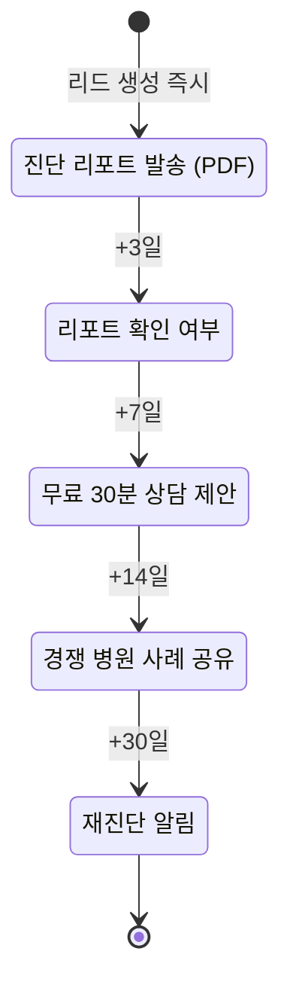
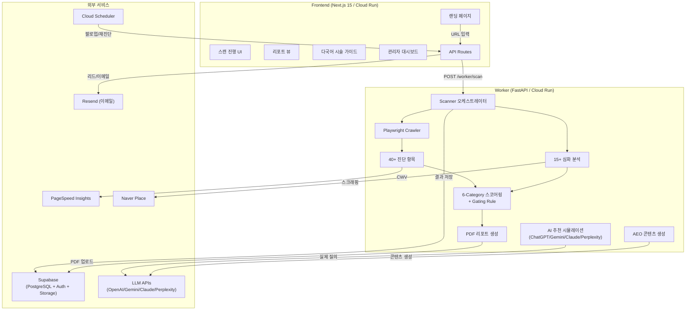
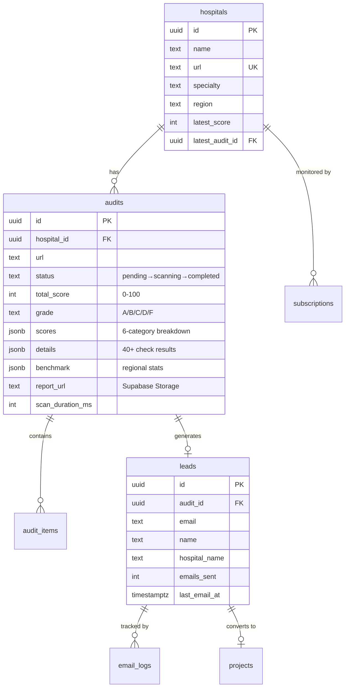

# CheckYourHospital

한국 병원(피부과/성형외과) 홈페이지를 **6개 카테고리 40+ 항목**으로 종합 진단하는 AI SEO/AEO 플랫폼.
외국인환자 유치 사이트 특화 — 의료법 §56 컴플라이언스, 다국어 hreflang, AI 검색 노출, Naver Place까지 한 번에 진단합니다.


---

## 핵심 기능

| 기능 | 설명 |
|------|------|
| **6-Category 스코어카드** | Technical SEO / Content / International / Authority / AI-AEO / Medical Compliance |
| **Medical Compliance Gating** | 의료법 위반 Critical → 전체 점수 49점 캡 (법적 리스크 우선) |
| **AI 추천 시뮬레이션** | ChatGPT, Gemini, Claude, Perplexity에 실제 질의 → 추천 여부 매트릭스 |
| **언어×페이지 매트릭스** | 6개 언어 × 4개 페이지유형 시각화 (자동번역 감지 포함) |
| **Princeton GEO 스코어** | 통계밀도, 출처인용, Q&A구조, 프로모션톤 → 콘텐츠 AEO 점수 |
| **Naver Place 연동** | 리뷰수/평점/예약 연동 스크래핑 + GBP 비교 |
| **의료법 §56 4개국어 스캔** | KR/EN/JP/ZH 금지패턴 자동 감지 (과장, 비교, 치료보장, 후기) |
| **경쟁사 레이더 차트** | SERP 기반 3-5개 경쟁사 자동 선정 → 6카테고리 비교 |
| **PDF 리포트** | Jinja2 → Playwright PDF → Supabase Storage |
| **AEO 콘텐츠 자동 생성** | 시술별 FAQ, E-E-A-T 프로필, Schema.org 코드 자동 생성 |

---

## 전체 워크플로우

### 1단계: URL 입력 → 크롤링

```
사용자가 병원 URL 입력
  → POST /api/audits
  → 24시간 캐시 확인 (동일 URL 재스캔 방지)
  → hospitals 테이블 upsert
  → audits 레코드 생성 (status: pending)
  → POST /worker/scan (fire-and-forget)
  → audit_id 반환 (202 Accepted)
```

Worker가 Playwright로 크롤링 시작:
- 최대 50페이지, 깊이 3
- SSRF 방지 (내부 IP 차단)
- 도메인당 rate limit
- robots.txt 준수

### 2단계: 6-Category 진단 (40+ 항목)

크롤링 완료 후 모든 체크를 병렬 실행:

#### A. Technical SEO (25%)

| 항목 | 가중치 | 설명 |
|------|--------|------|
| `robots_txt` | 3% | robots.txt 존재, 문법, Googlebot/Yeti 허용 |
| `ai_crawler_audit` | 3% | 14개 AI 봇 개별 감사 (GPTBot, ClaudeBot, PerplexityBot 등) |
| `sitemap` | 3% | sitemap.xml 유효성, lastmod, URL 상태 |
| `meta_tags` | 4% | title/description 길이, OG 태그, viewport |
| `headings` | 2% | H1~H6 계층 구조, 단일 H1 |
| `https` | 2% | HTTPS 적용, HTTP→HTTPS 리다이렉트 |
| `canonical` | 2% | canonical 태그 일관성, 자기참조 |
| `url_structure` | 2% | URL 소문자, trailing slash 일관성 |
| `errors_404` | 2% | 내부 404/5xx, 리다이렉트 체인 |
| `llms_txt` | 2% | /llms.txt 존재 및 포맷 검증 |

#### B. Content & On-Page (15%)

| 항목 | 가중치 | 설명 |
|------|--------|------|
| `images_alt` | 3% | 이미지 ALT 속성 커버리지 |
| `links` | 3% | 내부/외부 링크 상태, 깊이 |
| `content_clarity` | 3% | 콘텐츠 구조, 분량, 가독성 |
| `eeat_signals` | 3% | 저자 정보, 자격증, 최종수정일, 출처 인용 |
| `faq_content` | 3% | FAQ 페이지/스키마 존재 |

#### C. International / Multilingual (20%)

| 항목 | 가중치 | 설명 |
|------|--------|------|
| `hreflang` | 5% | 10가지 오류 패턴 심화 검증 (return-tag, BCP-47, x-default 등) |
| `multilingual_pages` | 5% | 외국어 페이지 존재, 콘텐츠 언어 실감지 |
| `overseas_channels` | 3% | KakaoTalk/Line/WhatsApp/WeChat 딥링크 실존 검증 |
| `international_search` | 4% | Google/Naver 국제 검색 순위 |
| `language_matrix` | 3% | 6언어×4페이지유형 매트릭스 (자동번역 감지) |

#### D. Authority / Off-Page (15%)

| 항목 | 가중치 | 설명 |
|------|--------|------|
| `structured_data` | 5% | MedicalClinic/Physician/MedicalProcedure Schema.org 검증 |
| `ai_search_mention` | 4% | Gemini/ChatGPT/Perplexity 실제 질의 → 언급 여부 |
| `naver_place` | 3% | Naver Place 리뷰수/평점/예약 + GBP 비교 |
| `eeat_sameas` | 3% | sameAs 도메인 수, Wikidata Q-ID |

#### E. AI & AEO Readiness (10%)

| 항목 | 가중치 | 설명 |
|------|--------|------|
| `geo_content_score` | 4% | Princeton GEO 논문 기반 (통계+41%, 인용+30%, Q&A+25%) |
| `ai_robots_rules` | 3% | robots.txt AI 크롤러 허용 정책 |
| `ai_meta_tags` | 3% | AI 관련 메타 태그 |

#### F. Medical Compliance (15%) — Gating Rule 적용

| 항목 | 가중치 | 설명 |
|------|--------|------|
| `kr_compliance` | 4% | 의료법 §56 과장광고/비교광고/할인광고 4개국어 스캔 |
| `jp_compliance` | 2% | 일본 의료법 체험담/비교/술전술후 규제 |
| `side_effect_disclosure` | 3% | 시술 페이지 부작용/주의사항 공시 여부 |
| `registration_numbers` | 3% | 사업자등록번호 + 외국인환자유치 등록번호 footer 감지 |
| `price_disclosure` | 2% | 비급여 가격표 (HIRA 형식) 존재 |
| `pipa_compliance` | 1% | 개인정보처리방침, 쿠키동의, CPO 공시 |

> **Gating Rule**: Medical Compliance에 Critical 이슈 1개라도 있으면 **전체 점수 49점 캡** (등급 최대 D). 의료법 위반은 최적화 이슈가 아니라 법적 리스크.

### 3단계: 스코어링

```
CategoryScore = Σ(item_score × weight) / Σ(available_weights) × 100

TotalScore = Σ(CategoryScore × category_weight)

Gating: if any compliance Critical → TotalScore = min(TotalScore, 49)
```

| 등급 | 점수 범위 |
|------|-----------|
| A | 80 ~ 100 |
| B | 60 ~ 79 |
| C | 40 ~ 59 |
| D | 20 ~ 39 |
| F | 0 ~ 19 |

- `system_limit` / `api_error` 체크는 가중치에서 제외 (정규화)
- API 키 미설정 시 해당 체크 graceful skip

### 4단계: 심화 분석 (15+ 서비스)

스코어링과 병렬로 실행되는 심화 분석:

| 서비스 | 설명 |
|--------|------|
| `medical_compliance` | 의료법 §56 위반 패턴 4개국어 스캔 |
| `multilingual_analyzer` | 언어×페이지유형 매트릭스 생성 |
| `competitor_discovery` | 동일 지역 경쟁사 발견 + 점수 비교 |
| `keyword_engine` | 시술 키워드 추출 + 다국어 검색어 생성 |
| `serp_checker` | Naver/Google SERP 순위 체크 (7일 캐싱) |
| `naver_place` | Naver Place 스크래핑 (리뷰/평점/예약) |
| `portal_scorer` | 포털별 최적화 점수 (Naver, Google, AI 검색) |
| `patient_journey_scorer` | 환자 여정 퍼널 분석 (인지→비교→결정→예약) |
| `content_freshness_analyzer` | 콘텐츠 최신성 분석 |
| `review_sentiment` | 리뷰 감정 분석 |
| `voice_search_analyzer` | 음성 검색 최적화 분석 |
| `video_presence` | 영상 콘텐츠 존재/품질 |
| `tech_stack_detector` | CMS, 프레임워크, 호스팅 감지 |
| `season_insight` | 계절별 의료관광 트렌드 |
| `benchmark` | 지역 벤치마크 (상위25%/중앙값/하위25%/백분위) |
| `cdn_latency_probe` | Tokyo/Singapore/HK/US TTFB 측정 |
| `beauty_platform` | 강남언니/바비톡/여신티켓/Xiaohongshu 리스팅 |
| `price_transparency` | 가격 투명성 스코어 (시술별 공시 비율) |

### 5단계: 리포트 생성

```
진단 결과 + 심화 분석
  → PDF 리포트 (Jinja2 HTML → Playwright PDF)
  → Supabase Storage 업로드
  → audits 테이블 업데이트 (status: completed, report_url)
```

### 6단계: 리포트 열람 + 리드 캡처

```
/report/{id} 페이지:
  ├── [무료] ScoreHero (총점 + 등급 + 백분위)
  ├── [무료] 6-Category 레이더 차트
  ├── [무료] Top 3 Critical 이슈
  ├── [무료] 지역 벤치마크 비교
  ├── [게이트] 상세 항목별 점수 + 개선 가이드
  ├── [게이트] 언어×페이지 매트릭스
  ├── [게이트] 경쟁사 레이더 차트
  ├── [게이트] 의료법 컴플라이언스 상세
  ├── [게이트] AI 추천 시뮬레이션 결과
  ├── [게이트] 콘텐츠 개선 로드맵
  └── [게이트] PDF 다운로드

이메일 입력 → POST /api/leads → 풀 리포트 해제 + PDF 이메일 발송
```

### 7단계: 후속 자동화



Cloud Scheduler로 매일 오전 9시(KST) `POST /api/cron/follow-up` 실행.

---

## 아키텍처



---

## 프로젝트 구조

```
apps/
├── web/                          # Next.js 15 (Frontend + API Gateway)
│   └── src/app/
│       ├── page.tsx              # 랜딩 (URL 입력 → 진단 시작)
│       ├── scan/[id]/            # 스캔 진행 UI (2초 폴링)
│       ├── report/[id]/          # 리포트 뷰 (레이더 차트 + 벤치마크 + 리드폼)
│       ├── guide/                # 다국어 시술 가이드 (ko/en/ja/zh)
│       ├── admin/                # 관리자 대시보드 (Supabase Auth)
│       ├── client/[id]/          # 고객 뷰 (점수 추이)
│       ├── procedures/           # 시술 목록/비교
│       ├── prices/               # 국가별 가격 비교
│       └── api/                  # 20+ API Routes
│
└── worker/                       # FastAPI (크롤링 + 진단 엔진)
    └── app/
        ├── checks/               # 진단 모듈
        │   ├── robots.py         # robots.txt + AI 크롤러 14봇 감사
        │   ├── sitemap.py        # XML sitemap 검증
        │   ├── meta_tags.py      # title/description/OG
        │   ├── headings.py       # H1~H6 계층
        │   ├── images.py         # ALT 속성
        │   ├── links.py          # 내부/외부 링크
        │   ├── https_check.py    # HTTPS + 리다이렉트
        │   ├── canonical.py      # canonical 태그
        │   ├── url_structure.py  # URL 구조
        │   ├── errors.py         # 404/5xx
        │   ├── performance.py    # CWV (LCP/INP/CLS) + CDN 레이턴시
        │   ├── mobile.py         # 모바일 반응형
        │   ├── structured_data.py # Medical Schema.org + E-E-A-T sameAs
        │   ├── geo_aeo.py        # AI 검색 노출 + GEO 콘텐츠 스코어
        │   ├── multilingual.py   # 다국어 + hreflang 10패턴 + 메신저 딥링크
        │   ├── international_search.py  # Google/Naver 국제 순위
        │   ├── conversion_elements.py   # CTA/예약폼 감지
        │   ├── ai_crawler_audit.py      # AI 봇 14개 개별 감사
        │   ├── legal_footer.py          # 등록번호 + 비급여 가격표
        │   └── base.py                  # CheckResult, Grade enum
        │
        ├── services/             # 핵심 서비스
        │   ├── scanner.py        # 오케스트레이터 (체크 실행 + 심화 분석 조합)
        │   ├── crawler.py        # Playwright 크롤러 (SSRF 방지)
        │   ├── scorer.py         # 6-Category 가중 스코어링 + Gating Rule
        │   ├── pdf_generator.py  # Jinja2 → Playwright PDF
        │   ├── benchmark.py      # 지역 벤치마크 통계
        │   ├── medical_compliance.py    # 의료법 §56 4개국어 스캔
        │   ├── multilingual_analyzer.py # 언어×페이지 매트릭스
        │   ├── competitor_discovery.py  # 경쟁사 자동 발견
        │   ├── keyword_engine.py        # 시술 키워드 추출
        │   ├── serp_checker.py          # SERP 순위 체크
        │   ├── naver_place.py           # Naver Place 스크래핑
        │   ├── content_engine.py        # AEO 콘텐츠 생성
        │   ├── portal_scorer.py         # 포털별 최적화 점수
        │   ├── patient_journey_scorer.py # 환자 여정 퍼널
        │   ├── content_freshness_analyzer.py
        │   ├── review_sentiment.py
        │   ├── voice_search_analyzer.py
        │   ├── video_presence.py
        │   ├── tech_stack_detector.py
        │   ├── season_insight.py
        │   ├── price_transparency.py    # 가격 투명성 스코어
        │   ├── beauty_platform.py       # 강남언니/바비톡/Xiaohongshu
        │   ├── japan_market.py          # 일본 시장 특화 (keigo, 税込)
        │   ├── baidu_check.py           # Baidu ICP/간체자/금지어
        │   ├── pipa_compliance.py       # 개인정보보호법
        │   ├── international_usability.py
        │   ├── monitoring.py            # 구독 모니터링
        │   └── image_generator.py       # AI 이미지 생성
        │
        ├── templates/            # PDF Jinja2 HTML 템플릿
        ├── security/             # SSRF 방지, rate limit
        └── db/                   # Supabase 클라이언트

packages/shared/supabase/migrations/  # SQL 마이그레이션
supabase/                              # Supabase 로컬 설정
```

---

## 데이터 모델



---

## API 엔드포인트

### Frontend API (`/api/*`)

| Method | Path | 설명 |
|--------|------|------|
| POST | `/api/audits` | 진단 생성 (캐시 확인 → worker 트리거) |
| GET | `/api/audits/{id}` | 진단 상태/결과 조회 |
| POST | `/api/leads` | 리드 생성 + 리포트 이메일 |
| GET | `/api/benchmark/{auditId}` | 지역 벤치마크 통계 |
| GET | `/api/competition/{auditId}` | 경쟁사 비교 데이터 |
| POST | `/api/content/generate` | AEO 콘텐츠 생성 |
| POST | `/api/subscriptions` | 모니터링 구독 |
| GET | `/api/score-history/{hospitalId}` | 점수 변동 이력 |
| POST | `/api/cron/follow-up` | 이메일 팔로업 (Cloud Scheduler) |
| POST | `/api/cron/rescan` | 구독 재진단 (Cloud Scheduler) |

### Worker API (`/worker/*`)

| Method | Path | 설명 |
|--------|------|------|
| POST | `/worker/scan` | SEO 진단 실행 (Background Task) |
| GET | `/worker/health` | 헬스 체크 |
| POST | `/worker/batch-scan` | 배치 스캔 (최대 500 URL) |
| GET | `/worker/benchmark` | 벤치마크 통계 |

---

## 환경 설정

### Frontend (`apps/web/.env.local`)

```env
NEXT_PUBLIC_SUPABASE_URL=
NEXT_PUBLIC_SUPABASE_PUBLISHABLE_KEY=
SUPABASE_SECRET_KEY=
WORKER_URL=
WORKER_API_KEY=
RESEND_API_KEY=
CRON_SECRET=
```

### Worker (`apps/worker/.env`)

```env
SUPABASE_URL=
SUPABASE_SECRET_KEY=
WORKER_API_KEY=
PAGESPEED_API_KEY=          # optional: Core Web Vitals
GEMINI_API_KEY=             # optional: AI 검색 노출 체크
PERPLEXITY_API_KEY=         # optional: AI 검색 노출 체크
OPENAI_API_KEY=             # optional: AI 추천 시뮬레이션
ANTHROPIC_API_KEY=          # optional: AI 추천 시뮬레이션
SERPER_API_KEY=             # optional: SERP 순위 체크
GOOGLE_CUSTOM_SEARCH_KEY=   # optional: 국제 검색 순위
GOOGLE_CUSTOM_SEARCH_CX=    # optional: 국제 검색 순위
```

> API 키 미설정 시 해당 체크는 graceful skip — 기본 진단은 외부 API 없이도 동작합니다.

---

## 로컬 개발

```bash
# Frontend
cd apps/web
cp .env.local.example .env.local
pnpm install && pnpm dev

# Worker
cd apps/worker
uv venv && source .venv/bin/activate
uv pip install -e .
playwright install chromium
cp .env.example .env
uvicorn app.main:app --port 8000 --reload
```

## 테스트

```bash
cd apps/worker && pytest tests/ -v
cd apps/web && npx vitest run
```

## 배포

| 서비스 | 플랫폼 | URL |
|--------|--------|-----|
| Frontend | Cloud Run | `https://cyh-web-124503144711.asia-northeast3.run.app` |
| Worker | Cloud Run | `https://cyh-worker-124503144711.asia-northeast3.run.app` |
| DB | Supabase | Managed PostgreSQL + Storage |
| Cron | Cloud Scheduler | 매일 09:00 KST follow-up + rescan |

---

## 기술 스택

| 레이어 | 기술 |
|--------|------|
| Frontend | Next.js 15, React 19, TypeScript, Tailwind CSS, Radix UI, Recharts, Framer Motion |
| Backend | FastAPI 0.115, Python 3.13, httpx, BeautifulSoup4, Playwright |
| Database | Supabase (PostgreSQL + RLS + Storage) |
| Email | Resend |
| AI/LLM | OpenAI, Gemini, Claude, Perplexity API |
| Infra | Google Cloud Run, Cloud Scheduler |
| Testing | pytest + pytest-asyncio (Worker), Vitest (Frontend) |
| Linting | ruff (Python), ESLint + TypeScript strict (Frontend) |
