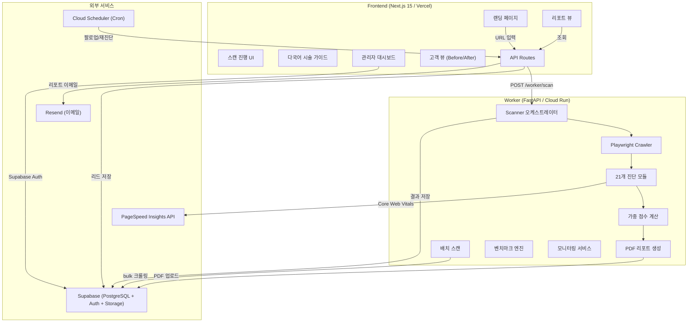
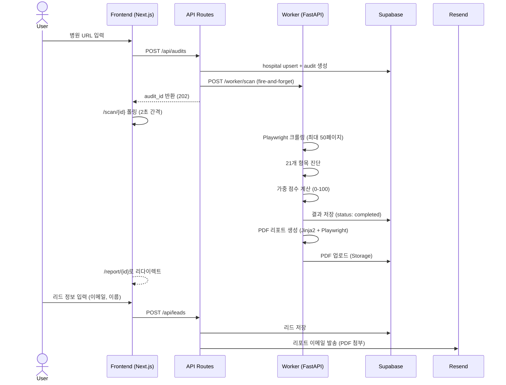
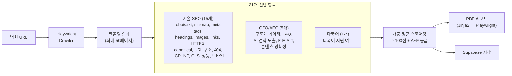
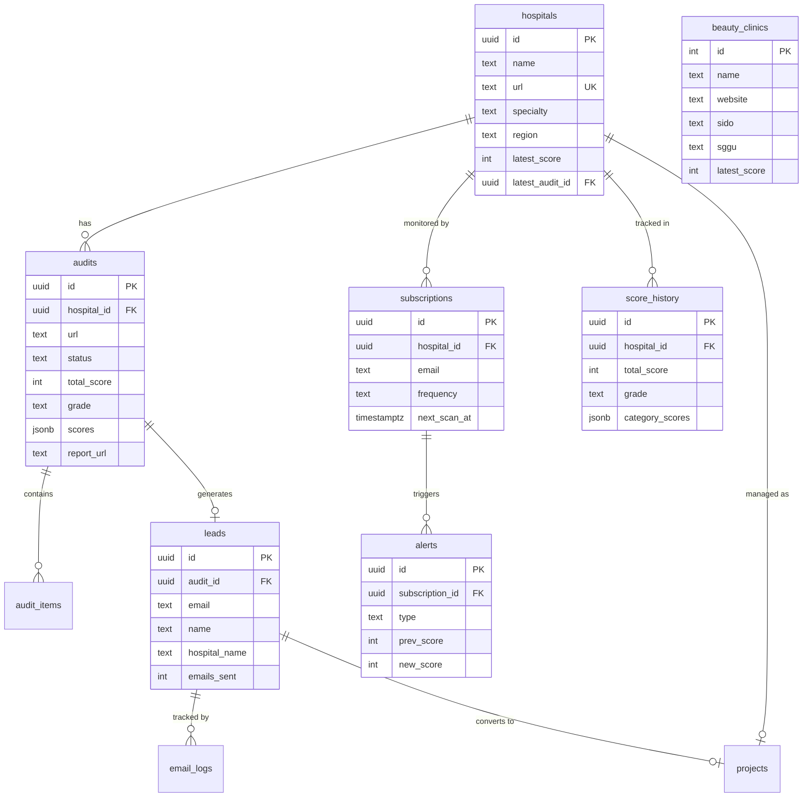
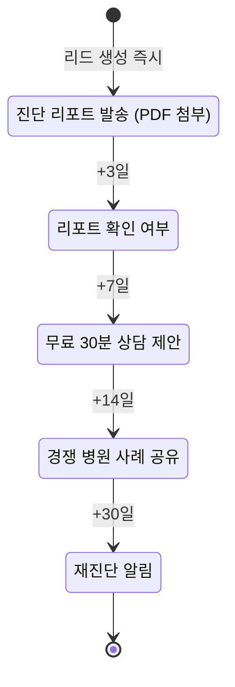

# MediScope (CheckYourHospital)

병원 홈페이지 AI SEO 진단 플랫폼 -- URL을 입력하면 21개 항목(기술 SEO + GEO/AEO + 다국어)을 종합 진단하여 리포트를 제공합니다.


## 주요 기능

- **21개 항목 자동 SEO 진단** -- 기술 SEO 15개 + GEO/AEO 5개 + 다국어 1개
- **PDF 리포트 자동 생성** -- Jinja2 HTML 렌더링 → Playwright PDF 변환 → Supabase Storage 업로드
- **지역 벤치마크** -- 동일 지역 피부과 점수 분포 대비 상대 위치 제공
- **경쟁 분석** -- 지역별 외국인유치기관 비율, 웹사이트 보유율 통계
- **모니터링 구독** -- 주간/격주/월간 재진단으로 점수 변동 알림
- **이메일 시퀀스** -- 리포트 발송 → 3/7/14/30일 후 자동 팔로업 (Resend + Cloud Scheduler)
- **다국어 시술 가이드** -- 한/영/일/중 4개 언어로 미용 시술 정보 및 국가별 가격 비교
- **관리자 대시보드** -- 진단 목록, 리드 관리, 프로젝트, 구독, 메신저 연동, 시장 현황

---

## 아키텍처

### 시스템 아키텍처



### 핵심 유저 플로우



### 진단 엔진 구조



### 데이터 모델



### 이메일 시퀀스



Cloud Scheduler로 매일 오전 9시(KST) `POST /api/cron/follow-up` 자동 실행.

---

## 프로젝트 구조

```
workspace/mediscope/
├── apps/
│   ├── web/                    # Next.js 15 (Frontend + API Gateway)
│   │   ├── src/app/
│   │   │   ├── page.tsx        # 랜딩 (URL 입력 → 진단 시작)
│   │   │   ├── scan/[id]/      # 스캔 진행 UI (폴링)
│   │   │   ├── report/[id]/    # 리포트 뷰 (차트 + 벤치마크 + 리드폼)
│   │   │   ├── guide/          # 다국어 시술 가이드 (ko/en/ja/zh)
│   │   │   ├── admin/          # 관리자 대시보드 (Supabase Auth)
│   │   │   ├── client/[id]/    # 고객 뷰 (점수 추이 + Before/After)
│   │   │   └── api/            # API Routes (15+ 엔드포인트)
│   │   └── src/lib/            # Supabase client, Resend, 유틸리티
│   └── worker/                 # FastAPI (크롤링 + 진단 엔진)
│       ├── app/
│       │   ├── api/            # routes, batch, benchmark, subscription
│       │   ├── checks/         # 17개 체크 모듈 (21개 결과 생성)
│       │   ├── services/       # scanner, crawler, scorer, pdf, monitoring, benchmark
│       │   ├── security/       # SSRF 방지, rate limit
│       │   ├── templates/      # PDF 리포트 Jinja2 HTML 템플릿
│       │   └── db/             # Supabase 클라이언트
│       └── Dockerfile          # Cloud Run 배포용
├── packages/
│   └── shared/
│       └── supabase/
│           └── migrations/     # SQL 스키마 (4개 마이그레이션)
└── supabase/                   # Supabase 설정
```

---

## 진단 항목 (21개)

| # | 항목 | 카테고리 | 가중치 | 체크 내용 |
|---|------|----------|--------|-----------|
| 1 | `robots_txt` | 기술 SEO | 5% | robots.txt 존재 및 올바른 설정 |
| 2 | `sitemap` | 기술 SEO | 5% | sitemap.xml 존재 및 유효성 |
| 3 | `meta_tags` | 기술 SEO | 10% | title, description, OG 태그 |
| 4 | `headings` | 기술 SEO | 5% | H1~H6 계층 구조 |
| 5 | `images_alt` | 기술 SEO | 5% | 이미지 ALT 속성 |
| 6 | `links` | 기술 SEO | 5% | 내부/외부 링크 상태 |
| 7 | `https` | 기술 SEO | 3% | HTTPS 적용 여부 |
| 8 | `canonical` | 기술 SEO | 3% | Canonical URL 설정 |
| 9 | `url_structure` | 기술 SEO | 4% | URL 구조 SEO 적합성 |
| 10 | `errors_404` | 기술 SEO | 5% | 404 에러 및 리다이렉트 |
| 11 | `lcp` | 성능 | 5% | Largest Contentful Paint |
| 12 | `inp` | 성능 | 3% | Interaction to Next Paint |
| 13 | `cls` | 성능 | 3% | Cumulative Layout Shift |
| 14 | `performance_score` | 성능 | 4% | Lighthouse 성능 점수 |
| 15 | `mobile` | 성능 | 5% | 모바일 반응형 |
| 16 | `structured_data` | GEO/AEO | 8% | Schema.org 구조화 데이터 |
| 17 | `faq_content` | GEO/AEO | 3% | FAQ 콘텐츠 존재 |
| 18 | `ai_search_mention` | GEO/AEO | 5% | AI 검색(ChatGPT, Perplexity) 노출 |
| 19 | `eeat_signals` | GEO/AEO | 5% | E-E-A-T 신호 (전문성, 권위) |
| 20 | `content_clarity` | GEO/AEO | 4% | 콘텐츠 명확성 |
| 21 | `multilingual` | 다국어 | 5% | 다국어 지원 여부 |

**가중치 합계**: 기술 SEO 70% + GEO/AEO 25% + 다국어 5% = 100%

**등급 기준**: A (80+) / B (60+) / C (40+) / D (20+) / F (20 미만)

---

## API 엔드포인트

### Frontend API Routes (`/api/*`)

| Method | Path | 설명 |
|--------|------|------|
| POST | `/api/audits` | 진단 생성 (hospital upsert + worker 트리거) |
| GET | `/api/audits/{id}` | 진단 상태/결과 조회 |
| POST | `/api/leads` | 리드 생성 + 리포트 이메일 발송 |
| GET | `/api/benchmark/{auditId}` | 벤치마크 통계 조회 |
| GET | `/api/competition/{auditId}` | 경쟁 분석 조회 |
| GET | `/api/competition/region/{sido}` | 지역별 경쟁 현황 |
| GET | `/api/reports/{id}` | HTML 상세 리포트 |
| POST | `/api/subscriptions` | 모니터링 구독 생성 |
| GET | `/api/score-history/{hospitalId}` | 점수 변동 이력 |
| POST | `/api/cron/follow-up` | 이메일 팔로업 실행 (Cloud Scheduler) |
| POST | `/api/cron/rescan` | 구독 재진단 실행 (Cloud Scheduler) |
| GET | `/api/procedures` | 시술 목록 조회 |
| GET | `/api/procedures/{id}` | 시술 상세 조회 |
| GET | `/api/guide/{lang}/{category}` | 다국어 시술 가이드 |
| GET | `/api/prices/compare` | 국가별 가격 비교 |
| POST | `/api/chat` | AI 챗 (시술 상담) |
| POST | `/api/webhook/line` | LINE 메신저 웹훅 |
| POST | `/api/webhook/wechat` | WeChat 웹훅 |
| GET | `/api/admin/stats` | 관리자 대시보드 통계 |
| GET | `/api/admin/audits` | 관리자 진단 목록 |
| GET | `/api/admin/leads` | 관리자 리드 목록 |
| POST | `/api/admin/batch-scan` | 관리자 배치 스캔 |
| * | `/api/admin/hospitals` | 병원 CRUD |
| * | `/api/admin/integrations` | 메신저 연동 설정 |
| * | `/api/projects/{id}` | 프로젝트 관리 |

### Worker API Endpoints (`/worker/*`)

| Method | Path | 설명 |
|--------|------|------|
| GET | `/worker/health` | 헬스 체크 |
| POST | `/worker/scan` | SEO 진단 실행 (Background Task) |
| POST | `/worker/generate-pdf` | PDF 리포트 생성 |
| POST | `/worker/batch-scan` | 경량 배치 스캔 (최대 500 URL) |
| GET | `/worker/benchmark` | 벤치마크 통계 조회 |
| POST | `/worker/subscriptions` | 구독 생성 |
| GET | `/worker/subscriptions` | 구독 목록 조회 |
| DELETE | `/worker/subscriptions/{id}` | 구독 취소 |
| POST | `/worker/subscriptions/process-due` | 만기 구독 재진단 실행 |

---

## 환경 설정

### Frontend (`apps/web/.env.local`)

```env
NEXT_PUBLIC_SUPABASE_URL=
NEXT_PUBLIC_SUPABASE_PUBLISHABLE_KEY=
SUPABASE_SECRET_KEY=
WORKER_URL=
WORKER_API_KEY=
RESEND_API_KEY=
CRON_SECRET=
```

### Worker (`apps/worker/.env`)

```env
SUPABASE_URL=
SUPABASE_SECRET_KEY=
WORKER_API_KEY=
PAGESPEED_API_KEY=
```

### Supabase 설정

- PostgreSQL + RLS 활성화
- Storage 버킷: PDF 리포트 저장
- Auth: 관리자 `app_metadata.role = 'admin'`
- Service Role: Worker 백엔드 통신용

---

## 로컬 개발

```bash
# Frontend
cd apps/web
cp .env.local.example .env.local   # 환경변수 설정
pnpm install && pnpm dev

# Worker
cd apps/worker
uv venv && source .venv/bin/activate
uv pip install -e .
playwright install chromium
cp .env.example .env               # 환경변수 설정
uvicorn app.main:app --port 8000 --reload
```

---

## 테스트

```bash
# Worker
cd apps/worker && pytest tests/ -v

# Frontend
cd apps/web && npx vitest run
```

---

## 배포

```bash
# Frontend → Cloud Run
cd apps/web && bash deploy.sh

# Worker → Cloud Run
cd apps/worker && bash deploy.sh

# Email follow-up cron → Cloud Scheduler
bash scripts/setup-scheduler.sh
```

### 프로덕션 URL

| 서비스 | URL |
|--------|-----|
| Frontend | `https://cyh-web-124503144711.asia-northeast3.run.app` |
| Worker | `https://cyh-worker-124503144711.asia-northeast3.run.app` |
